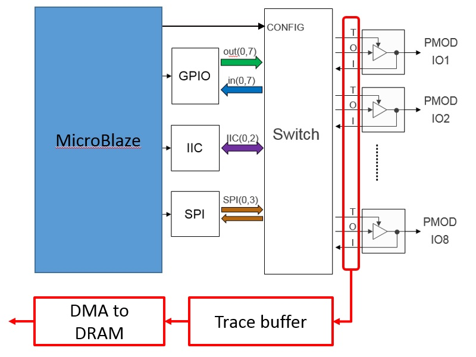

*******************************
Trace buffer
*******************************

.. contents:: Table of Contents
   :depth: 2
   
Introduction
==================

On-chip debug allows FPGA resources to be used to monitor internal or external signals in a design for debug. The debug circuitry taps into signals in a design under test, and saves the signal data as the system is operating. The debug data is saved to on-chip memory, and can be read out later for offline debug and analysis. One of the limitations of traditional on-chip debug is that amount of local memory usually available on chip is relatively small. This means only a limited amount of debug data can be captured (typically a few Kilobytes).

The on-chip debug concept has been extended to allow trace debug data to be saved to DDR memory. This allows more debug data to be captured. The data can then be analyzed using Python. 

Trace buffer 
==================
A trace buffer is included in the base overlay. It is connected to the pin connections of the Pmod ports and the Arduino ports. This allows it to monitor the signals to and from the FPGA pins. The trace buffer has a connection to DDR memory where captured data will be stored.

  
8MB of DDR memory is available for the trace buffer. The DDR memory is allocated from the kernel, and is fixed when the kernel is compiled. 

Trace IOBs
----------------------

The tracebuffer monitors the external PL Input/Output Blocks (IOBs) on the PMod and Arduino interfaces. The IOBs are tri-state. This means three internal signals are associated with each pin; an input (I), and output (O) and a tri-state signal (T). The Tri-state signal controls whether the pin is being used as a input or output. 

The trace buffer is connected to all 3 signals for each IOP (Pmod and Arduino).

This allows the trace buffer to read the tri-state, determine if the IOB is in input, or output mode, and read the appropriate trace data. 

Supported protocols
---------------------

The trace buffer uses the `sigrok Python package <https://sigrok.org>`_. It can recognise different bus protocols and highlight and format the data appropriately. 

Currently supported protocols are ``I2C`` and ``SPI``. 

Tracebuffer operation
======================

The trace buffer is instantiated with the interface, pins to monitor and labels, the data protocol, and sample rate defined. 
                      
When triggered or started, the trace buffer captures all data on the interface port.

The data can then be formatted based on the specified protocol and displayed in a notebook. 

Tracebuffer example
======================

To use the trace buffer, instantiate the trace buffer class, specifying the interface it is connected to, the pins to monitor, the protocol, and the sample rate. 

.. code-block:: Python

   from pynq.drivers import Trace_Buffer
      tr_buf = Trace_Buffer(PMODA,pins=[2,3],probes=['SCL','SDA'],
                      protocol="i2c",rate=1000000)
                      
The tracebuffer runs at 166MHz. The sample rate is the number of samples stored out of every sample captured. E.g. rate = 1 will store samples at 166 Msps. rate = 2 will store samples at 83 Msps etc.  

.. code-block :: console
    
    Samples captured = 166 MHz/rate

Once you are ready to start collecting data, start the trace buffer.
   
.. code-block:: Python
  
   # Start the trace buffer
   tr_buf.start()

Once you are finished collecting data, stop the trace buffer.

.. code-block:: Python

   # Stop the trace buffer
   tr_buf.stop()

The data is first parsed into a .csv file. The start and stop positions are provided to select the region of interest. The .csv file is then decoded into a .pd file 

.. code-block:: Python

   # Set up samples
   start = 500
   stop = 3500

   # Parsing and decoding samples
   tr_buf.parse("i2c_trace.csv",start,stop)
   tr_buf.decode("i2c_trace.pd")

The first sample is stored in location 1, so the starting sample to display must be equal to 1 or more. The end sample to display must be less than the total number of samples collected. 

The data can be displayed in a notebook. This is done using the Python WaveDrom package. 

.. code-block:: Python

    tr_buf.display()

Example notebooks
======================

There are two notebooks available in the example notebooks directory in the Jupyter home area showing how to use the trace buffer; `trace buffer_i2c.ipynb <https://github.com/Xilinx/PYNQ/blob/master/Pynq-Z1/notebooks/examples/tracebuffer_i2c.ipynb>`_ and `trace buffer_spi.ipynb <https://github.com/Xilinx/PYNQ/blob/master/Pynq-Z1/notebooks/examples/tracebuffer_spi.ipynb>`_. One shows an IIC example, and the other shows a SPI example. 

