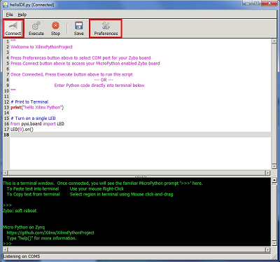

**********
Start here
**********

.. contents:: Table of Contents
   :depth: 2

MicroPython for ZYBO is an alpha-stage deliverable from the Xilinx Python Project team.  Each prototype is distributed as a kit that includes all the necessary hardware and software components to run your first Python scripts on Zynq.  

The main website for the project is located at `Xilinx Python Project <https://github.com/Xilinx/XilinxPythonProject>`_.  Documentation is provided at the github site's `wiki pages <https://github.com/Xilinx/XilinxPythonProject/wiki>`_.  If you need technical support, issues can be submitted via the github site's `issue tracker <https://github.com/Xilinx/XilinxPythonProject/issues>`_.

.. NOTE::
  1. This alpha deliverable of MicroPython for ZYBO primarily targets standard-issue, Xilinx Windows 7 PCs.  However since the core software for MicroPython for ZYBO runs on the Zynq device on ZYBO, it is possible to use MicroPython for ZYBO with both OSX and Linux machines.  As of now, however, the installation of drivers and terminal emulation packages for these platforms is not as fully tested.
  2. MicroPython on Zybo does not try to teach Python programming to first-time users. Programmers who are familiar with other languages, will pick up much of the fundamentals of Python quickly from the examples in these notes. Nonetheless, Python is a very comprehensive language with many advanced features that may require additional study.  For these reasons we have provided links to excellent `Python training material <https://github.com/Xilinx/XilinxPythonProject/wiki/9.-Useful-Reference-Links#useful-reference-links>`_

Three main steps
================

There are three main steps (each with several smaller steps) to getting started with MicroPython on ZYBO.  These are:

* **1. Configure and connect ZYBO to your host machine**

 * Set the board jumpers correctly 
 * Insert the provided micro SD card 
 * Connect your computer to ZYBO using the provided USB cable 
 * Power on ZYBO and verify that the status LEDs indicate successful boot-up

* **2. Install your host computer software**

 * Install the cable software driver so that your system can recognize ZYBO over the USB cable
 
 * Select a terminal emulator and configure for communicating with ZYBO.  Putty and an integrated XPP-IDE are both provided. 

* **3. Familiarize yourself with MicroPython's command-line interface**

 * The REPL prompts: ``>>>`` and ``...`` 

 * Execute simple MicroPython scripts interactively and from files on the SD flash card 

 * Explore modules with ``dir()`` and ``help()``

 * Interrupt programs and reset ZYBO 

Hardware installation
=====================

Prerequisites
-------------

* Windows PC
* Available USB port
* Xilinx Python Project kit

Xilinx Python Project Kit Contents
----------------------------------
+-----------------------------------------------------------+------------------------------------------------------------+
| 1x ZYBO                                                   | 1x Micro USB cable                                         |
+-----------------------------------------------------------+------------------------------------------------------------+
| 1x MicroSD card and SD adapter set                        |  1x USB Stick                                              |
+-----------------------------------------------------------+------------------------------------------------------------+
| 1x PmodDA4: 8-channel, 12-bit digital-to-analog converter |  1x PmodAD2: 4-channel, 12-bit analog-to-digital converter |
+-----------------------------------------------------------+------------------------------------------------------------+
| 1x PmodOLED: Organic LED display                          |  1x PmodTMP2: Temperature sensor                           |
+-----------------------------------------------------------+------------------------------------------------------------+
| 1x PmodALS: Ambient light sensor                          |  1x PmodBB: Breadboard                                     |
+-----------------------------------------------------------+------------------------------------------------------------+
| 1x PMod8LD: 8 high bright LEDs                            | 1x 6-pin pmod cable                                        |
+-----------------------------------------------------------+------------------------------------------------------------+
| 1x 12-pin pmod cable (straight)                           | 1x 12-pin pmod cable with red marker (Loopback)            |
+-----------------------------------------------------------+------------------------------------------------------------+
| 2x 6-pin male headers                                     | 2x 12-pin male headers                                     |
+-----------------------------------------------------------+------------------------------------------------------------+

|

.. image:: ./images/Kit_XPP_800.jpeg
   :height: 400px

Setup the ZYBO board
--------------------

.. image:: ./images/zybo_setup_config_600.jpeg
   :height: 600px

*If you received your Zybo board from the XPP team, all jumpers will be set correctly.*

You can view the `Zybo Setup Video <https://github.com/Xilinx/XilinxPythonProject/blob/master/micropython/docs/videos/setup_zybo.mp4?raw=true>`_ or follow the steps below.

1. Insert the *Micro SD* card into the ZYBO. (Micro SD slot is underneath the board)

2. Change the JP5 jumper  to **SD** (Set the board to boot from the Micro SD card)  

3. Set the JP7 jumper to *USB* (Power the board from the USB cable)

4. Plug the USB cable to your PC/Laptop, and connect to *PROG UART* (J11) on the board

5. *Turn on* the power switch on the board

When you power on the board, you should see a *RED LED* (PGOOD) and a *GREEN LED* (DONE) 
indicating the system has booted successfully.

Software installation
=====================
Windows serial USB driver
-------------------------
(Tested on Windows 7 and Windows 10)

You need to *install the ZYBO driver* on your host machine to communicate with ZYBO over USB.  
A standalone driver executable is included on the USB drive, ``host\CDM v2.12.10 WHQL Certified.exe``.
Double-click this executable to install the needed driver.

After installing, you need to identify the COM port which will be used with your terminal emulator (instructions below).

The Windows Device Manager can be used to find which COM port ZYBO has been assigned (eg COM4).  
The COM port will only show up in Device Manager if the ZYBO board is connected to the host and powered on, and will disappear each time the board is disconnected or powered off. 
Please watch the `Connecting to the board <https://github.com/Xilinx/XilinxPythonProject/blob/master/micropython/docs/videos/connecting_to_board.mp4?raw=true>`_ video (included on your USB drive) for a walk-through of finding the correct 
COM port (Windows 7). You should be able to follow the same instructions for other versions of Windows.

.. NOTE::
  On Windows 10, you will see two numbered COM ports when the board is  plugged in. You should connect to the highest of the two numbered COM   ports for the board.

Ubuntu
------
(Tested on 15.10)

When the board is connected, it should be recognised automatically.
USB serial devices are listed as ``/dev/ttyUSB*``

To find the correct device, type ``dmesg | grep tty`` in a Ubuntu terminal and look for the ``FDTI USB Serial Device``:

.. code-block:: console

  cathal@cathal-desktop:~$ dmesg | grep tty
  [    0.000000] console [tty0] enabled
  [    0.656616] 00:07: ttyS0 at I/O 0x3f8 (irq = 4, base_baud = 115200) is a 16550A
  [    1.859749] systemd[1]: Created slice system-getty.slice.
  [    2.226621] usb 3-1.2: FTDI USB Serial Device converter now attached to ttyUSB0
  [    2.232077] usb 3-1.2: FTDI USB Serial Device converter now attached to ttyUSB1

Similar to Windows 10, two devices will be displayed, in this case, ttyUSB0 and ttyUSB1. The *higher numbered ttyUSB device* is the one your will connect to using the instructions below.

The device will usually have root permissions:

.. code-block:: console

  cathal@cathal-desktop:~$ ls -alt /dev/ttyUSB*
  crw-rw---- 1 root dialout 188, 0 Dec 21 12:58 /dev/ttyUSB0
  crw-rw---- 1 root dialout 188, 1 Dec 21 12:58 /dev/ttyUSB1

You can change the permissions with *sudo chmod* or run the terminal emulator with sudo to gain read/write access to the device (see below).

Terminal Emulator software
--------------------------
You can view the `connecting to the board video guide  <https://github.com/Xilinx/XilinxPythonProject/blob/master/micropython/docs/videos/connecting_to_board.mp4?raw=true>`_, or read the instructions below.

Any terminal emulator program can be used to communicate with ZYBO.  The XPP-IDE (available on the USB stick) is a custom IDE for the Xilinx Python Project. It runs on Windows, and includes a terminal emulator
and integrated Python editor within a single GUI. No install is required, and the XPP-IDE can be run straight from the USB stick, or copied to your computer.

You can also use other terminal programs (e.g. PuTTY, 
Hyperterminal, Tera Term). The PuTTY executable for Windows is included in the USB drive at `host\putty.exe`. Again, no install is required, and it can be run direct from the USB stick.

Connecting a terminal 
---------------------
Once you have installed the driver and selected a terminal program, you are ready to connect to the board.  The required communication baudrate is *115200*.  XPP-IDE will automatically set the correct baudrate, but for other terminal programs, set the baudrate to *115200*.

To use XPP-IDE, simply double click ``xpp-ide.exe`` from the included USB drive to open the GUI.  Within the GUI, clicking the *Connect* button will, by default, select the highest available COM port, which typically is your ZYBO board.  

If your ZYBO board is at a lower numbered COM port, the Preferences button can be used to select a lower COM port.  Use the steps in Windows serial USB driver section above to find your COM port.

Once connected, the XPP-IDE sends a soft reboot to the board and will display a welcome prompt in the lower terminal window.  The Python editor window and terminal window both are preloaded with usage instructions.

Using PuTTY
^^^^^^^^^^^

(Windows and Ubuntu)

On Windows, you can open the putty.exe from the host directory of the USB stick.
On Linux, you may need to install PuTTY manually (*sudo apt-get install putty*). You can start PuTTY by typing *putty*, or *sudo putty* if the ttyUSB device has root permissions. 

Once PuTTY is open, click on ``Session`` in the left-hand panel, 
then click the ``Serial`` radio button on the right. Enter the appropriate COM port (e.g. COM7), or ttyUSB device (e.g. ttyUSB2) in the ``Serial Line`` box.  

.. image:: ./images/putty_600.jpeg
   :height: 600px

Finally, click the "Open" button.  If the PuTTY window is blank, or shows a square in the top level, press ENTER to bring up the 
familiar MicroPython prompt: ``>>>``.  If you need to power cycle the board, you may need to restart the terminal.

The MicroPython REPL
====================
The REPL prompts
----------------

The MicroPython ``REPL`` (Read Evaluate Print Loop) is the interactive command shell behind the MicroPython prompt on ZYBO.  Using the REPL is by far the easiest way to test out your code and run commands.

To get started with the REPL, you must establish a serial connection to ZYBO over its USB UART port.  With the board setup correctly as indicated by the red and green status lights both being on, we should see a blank screen with a flashing cursor.  Press Enter and we should be presented with the standard MicroPython prompt.::

  >>>

Executing scripts interactively
-------------------------------

Once we have the prompt, we can begin executing Python commands::

  >>> print("hello from ZYBO!")
  hello from ZYBO!

We can execute a simple loop to calculate and print the cumulative sum of the first 10 integers starting from 0, as follows:

**Indentation in MicroPython**::

  >>> sum = 0
  >>> for i in range(10):
  ...     sum += i             # (1)
  ...     print(i, sum)
  ...                          # (2)
  0 0
  1 1
  2 3
  3 6
  4 10
  5 15
  6 21
  7 28
  8 36
  9 45
  >>>                         # (3)

(1) The body of the ``for loop`` needs to be indented.  Python indicates this by changing the prompt from ``>>>`` to ``...``.  Here we have used 4 spaces for indentation.

(2) When we come to the end of the script, we must hit the ``Enter`` key twice to tell the REPL that script entry is complete and it is now time to execute it.

(3) Micropython indicates that the script has finished executing by displaying the ``>>>`` prompt again

.. TIP::

  Python demands consistent indentation within programs.  It     does not, however, mandate that 4 spaces are required for every  indent; this is simply a common best practice that is easily met  when programming within a powerful editor.  When entering scripts with one or more levels of indentation at the REPL, it  can be much more convenient to use only 2 spaces for  indentation.  There is much less to type and it is much easier  to keep levels of indentation consistent.

Executing Python scripts from files
-----------------------------------
Python scripts can be written anywhere, saved on the MicroPython SD card and transferred to ZYBO to be executed.  If we saved the previous script as ``cumulative_sum.py`` in a directory called user_scripts, we can execute it as follows::

  >>> execfile("user_scripts/cumulative_sum.py")

Let's now define a very simple Python function and invoke it::

  >>> def clear_screen(rows=40):    # (1)
  ...   print("\n"*rows)            # (2)
  ... 
  >>> clear_screen()                # (3)

(1) We define a function called ``clear_screen()`` with takes one argument ``rows``, with a default value of 40.

(2) The ``clear_screen()`` function prints as many new lines as specified by the variable ``rows``.  (Note how Python *overloads* the multiplication operator (``*``) so that the product of a string and an integer, ``n``, is the string repeated ``n`` times).  Note also that we use only 2 spaces for the indented code.

(3) We invoke the ``clear_screen()`` function with no argument so the ``rows`` parameter defaults to 40.  After execution, we are left with a single ``>>>`` prompt, typically on the last row of our screen.

Getting help
------------

MicroPython supports a limited version of the Python ``help()`` function.  ``help()`` works with modules but does not currently return the docstrings of functions or class methods.  This  *feature* is a consequence MicroPython's emphasis on maximizing memory efficiency.

**MicroPython dir() and help()**::

  >>> 
  PYB: soft reboot
    
  Micro Python on Zynq 
     https://github.com/Xilinx/XilinxPythonProject
     Type "help()" for more information.
  >>> dir()                                                                  # (1)
  ['__name__']
  >>> from pynq import board
  >>> dir()                                                                  # (2)
  ['__name__', 'board']
  >>> help(board)                                                            # (3)
  object <module 'pynq.board' from '/sd/pynq/board/__init__.py'> is of type module
    __path__ -- /sd/pynq/board
    _gpios -- <module 'pynq.board._gpios' from '/sd/pynq/board/_gpios.py'>
    __file__ -- /sd/pynq/board/__init__.py
    button -- <module 'pynq.board.button' from '/sd/pynq/board/button.py'>
    delay -- <function delay at 0x75b260>
    Button -- <class 'Button'>
    switch -- <module 'pynq.board.switch' from '/sd/pynq/board/switch.py'>
    led -- <module 'pynq.board.led' from '/sd/pynq/board/led.py'>
    ls -- <function ls at 0x75b290>
    Switch -- <class 'Switch'>
    utils -- <module 'pynq.board.utils' from '/sd/pynq/board/utils.py'>
    millis -- <function>
    __name__ -- pynq.board
    cat -- <function cat at 0x75b2b0>
    udelay -- <function udelay at 0x75b270>
    mmio -- <class 'mmio'>
    u_delay -- <function>
    LED -- <class 'LED'>
    ceil -- <function>
    listdir -- <function>
  >>> 

(1) Executing the ``dir()`` function after reset shows the contents of the Python namespace (basically what's in the current program scope)

(2) Let's import a package and explore its namespace.  Packages are directories consisting of modules, which in turn, are Python files containing code that was designed to be re-used. If we import the package ``board`` and execute ``dir()`` again, we see that the our namespace has now expanded to include the package name ``board``.

(3) With board in the current namespace we can execute ``help(board)`` and we see the names of the objects and attributes defined in the ``board`` package.  These include attributes such as the current file's path (``_path_``), functions ( eg ``delay``), classes (eg ``Button``) and other nested modules (eg ``utils``)

When we execute statements like ``from pynq.board import *``, we bring all of the objects in the ``board`` package into the current namespace.  In general, it is preferable only to import what is needed.  A statement like ``from pynq.board import LED, Button, Switch, delay`` is preferable to importing everything, if these four objects are indeed all we need from the  ``board`` package.

Command history
---------------
.. TIP::
  The REPL maintains a buffer of the previously-executed MicroPython commands. This is accessed using the   ``up arrow`` and ``down arrow`` keys to move backward and forward in the command history buffer.  Using this feature to recall earlier commands can save a lot of unnecessary typing.

Interrupting running scripts and resetting Zybo
-----------------------------------------------
If at any time something goes wrong, you can interrupt a running script by typing ``Ctrl-C``, or pressing the ``Stop`` button in the XPP-IDE menu bar.  If does not stop the running script, you can force a soft reset by entering ``CTRL-D`` on a new line in the terminal window.

**XPP-IDE soft reset of MicroPython**::
  
  >>> 
  PYB: soft reboot
  
  
  Micro Python on Zynq 
     https://github.com/Xilinx/XilinxPythonProject
     Type "help()" for more information.
  >>>   

You can 'hard' reboot Zybo by pressing the red ``PS-SRST`` button (above and to the left of the Xilinx logo on Zybo) or power-cycling the board. Either method will end the current REPL session and disconnect the terminal program that you were using to connect to ZYBO.  With the XPP_IDE, simply press the ``connect`` button on the menu bar to re-connect to Zybo.  Other terminal emulators typically need to be re-started.