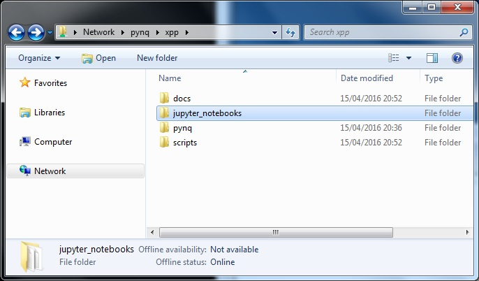

***************
Getting Started
***************

.. contents:: Table of Contents
   :depth: 2

Pynq for Zybo is a beta-stage deliverable from the Pynq team. The full build steps and Python packages will be available on the  `Pynq project GitHub <https://github.com/Xilinx/Pynq>`_ after the official beta release. 

Zybo is currently the supported Pynq platform. 

Any issues can be submitted via the github site's `issue tracker <https://github.com/Xilinx/Pynq/issues>`_ once the site is live.

.. NOTE::
  1. This beta deliverable of Pynq on Zybo runs natively on the Zynq ARM A9 CPUs.  The CPUs run a web server which host the main Pynq portal.  Any computing platform that is connected to the Internet and supports a mainstream web browser, (Chrome, Internet Explorer, Firefox, Safari etc.), can connect to the Pynq portal.  This should work all types of laptops, desktops and even phones and tablets, independent of whether they run Windows, OSX or Linux. 

  2. Pynq on Zybo does not try to teach Python programming to first-time users. Programmers who are familiar with other languages, will pick up much of the fundamentals of Python quickly from the examples in these notes. Nonetheless, Python is a very comprehensive language with many advanced features that may require additional study.  For these reasons we have provided links to excellent `Python training material <https://github.com/Xilinx/XilinxPythonProject/wiki/9.-Useful-Reference-Links#useful-reference-links>`_

Setup
================

There are four main steps to getting started with Pynq and the ZYBO.  These are:

1. **Get the image and prepare the micro-SD Card**

 * For now you will need to obtain the image, or a micro-SD card preloaded with the image directly from the Pynq team.
 * The image can be copied to a Micro-SD card using `Win32DiskImager <https://sourceforge.net/projects/win32diskimager/>`_

2. **Configure ZYBO and connect it to your host machine and network**

 * Set the board jumpers correctly
 
 * Insert the micro SD card 
 
 * Provide power to ZYBO by connecting the USB cable
 
 * Connect the board via an Ethernet cable to the same network that your host is connected to

 * Switch on ZYBO and verify that the status LEDs indicate successful boot-up

3. **Open a web browser and connect to Pynq Jupyter Notebooks web portal**

 * Using a web browser, open the address  `http://pynq:9090 <http://pynq:9090>`_

If you can't connect to the board, see the `Frequently asked questions <14_faqs.html>`_

4. **Familiarize yourself with Jupyter dashboard and notebooks**

 * From the Jupyter dashboard, explore the *Getting Started* and *Example* Notebooks to learn more about Pynq and how to use the overlays provided to control the peripherals on the Zybo itself as well as other peripherals that can be attached to it.

Hardware installation
=====================

Prerequisites
-------------

* Laptop or desktop with Internet browser (Windows, OSX or Linux)
* Available USB port or power source
* Zybo board

Additional external peripherals (PMods and Grove Peripherals) are optional and will be discussed later.

Setup the ZYBO 
---------------

.. image:: ./images/zybo_setup_config_600.jpeg
   :height: 600px
   :scale: 75%
   :align: center

*If you received a Zybo kit from the Pynq team, all jumpers will be set correctly.*

1. Insert the *Micro SD* card into the ZYBO. (The Micro-SD slot is underneath the board)

2. Change the *JP5* jumper to **SD** (Set the board to boot from the Micro SD card)  

3. Set the *JP7* jumper to **USB** (Power the board from the USB cable)

4. Plug the USB cable to your PC/Laptop, and connect to **PROG UART** (J11) on the board

5. **Turn on** the power switch on the board

When you power on the board, you should see a *RED LED* (PGOOD) and a *GREEN LED* (DONE) indicating the system has booted successfully.

Interacting with the Zynq Portal
================================

Getting an IP address
---------------------

DHCP is enabled by default, so when you first power on the board, it should obtain an IP address automatically if you connect it to a home router or network switch. 

See the `Frequently asked questions <14_faqs.html>`_ if you can't connect to the board, or if you need to configure the network settings.

Open the Pynq Portal
--------------------
Using a web browser, open the address  `pynq:9090 <http://pynq:9090>`_

.. image:: ./images/portal_login.jpg
   :height: 600px
   :scale: 75%
   :align: center

**pynq** is the default Ubuntu hostname of the board. 
(It is recommended to change Zybo hostnames if multiple boards are on the same network. e.g. classroom teaching.) 

When prompted enter the password `xpp` to launch the Jupyter dashboard. 

The Jupyter portal should now be open.

The Jupyter Dashboard
---------------------

.. image:: ./images/portal_homepage.jpg
   :height: 600px
   :scale: 75%
   :align: center

You can click on a notebook (.ipynb) to open it. 

   
Getting started notebooks
----------------------------

A powerful feature of Jupyter notebooks is the ability to render html webpages from the source docuemnts. Some of this documentation has been generated directly from notebooks. 

You can view the webpage for documentation, or if you have a board running pynq, you can view the documenation interactively and try out some exmaple code, by opening the corresponding notebook in the getting started folder in the jupyter notebooks folder. 
 
.. image:: ./images/pynq_getting_started.jpg
   :height: 600px
   :scale: 75%
   :align: center
   

There are also a number of example notebooks available showing examples of how to use different peripherals with the board. 

.. image:: ./images/pynq_examples.jpg
   :height: 600px
   :scale: 75%
   :align: center
   
   
Accessing files on the board
----------------------------
Samba is running on the board, and the home area is shared and can be accesed like a networked drive. You can navigate to **\\\\pynq\\** to access the home area from a host PC. 

Troubleshooting
--------------------
If you are having problems connecting to the board, see the `Frequently asked questions <14_faqs.html>`_
