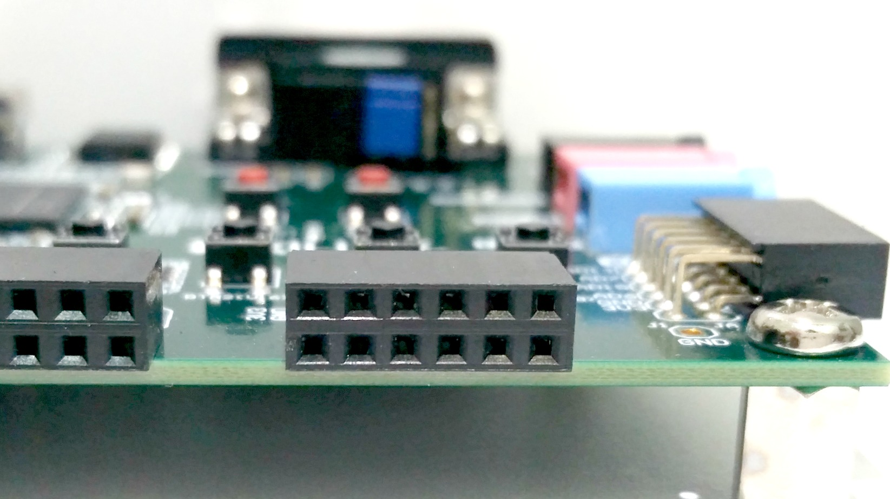
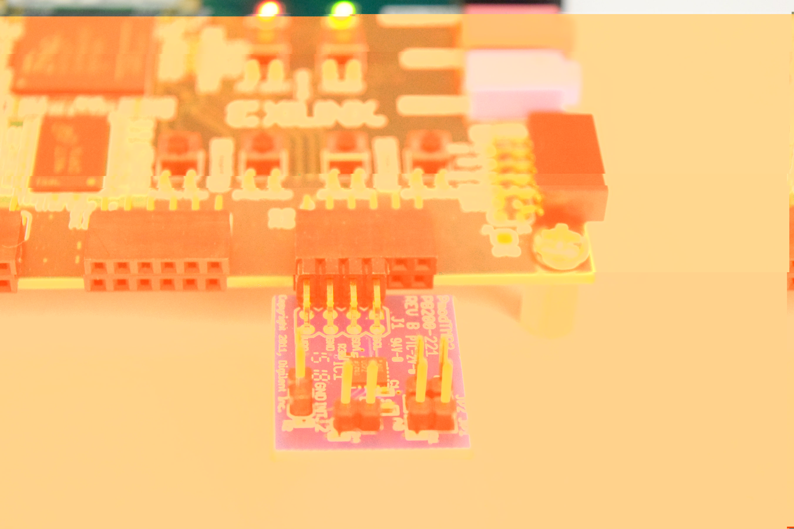
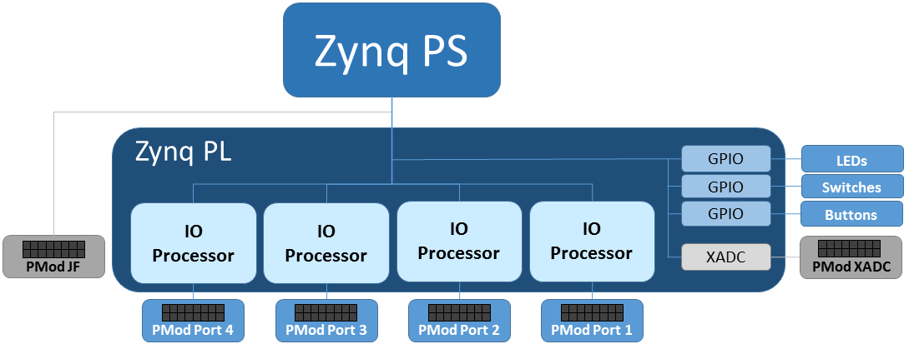
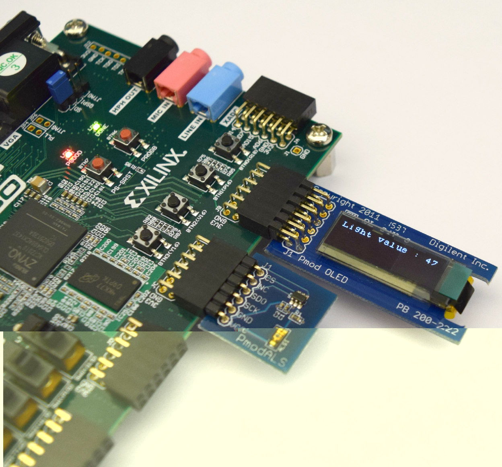
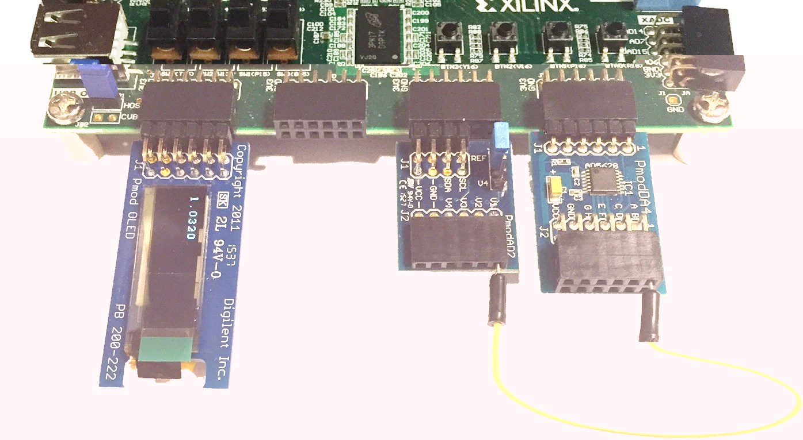

****************************
PMODs and the PModIO overlay
****************************

.. contents:: Table of Contents
   :depth: 2

PMods
=====
PMods (Peripheral Modules) are *Input/Output accessory boards* that can be used to extend the functionality of the system. For more details and a list of available PMods refer to the `Digilent website <http://www.digilentinc.com/Products/Catalog.cfm?NavPath=2,401&Cat=9>`_`

PMod Interface
==============
Each *PMod connector has 12 pins* (2 rows of 6 pins, where each row has VCC, GND and 4 data pins). Note that the data pins are labelled 0-7. (In the Digilent documentation the pins are labelled 1-12 and include the VCC and GND pins, but this should be ignored when programming and *0-7 should be used to reference data pins* from Python.)

   PMod Connectors

.. figure:: ./images/pmod_pins.png
   :width: 200
   
   PMod Pins

PMods have *different pin configurations* depending on the number of data pins required. PMods with only a single row of pins can be plugged into the top row or the bottom row of the PMod connector. 

Some PMods use both rows (2x4, 2x6 pins), and in general should be *aligned to the left* of the connector (to align with VCC and GND).

IO Processors
=============
For *overlays* to be useful, they *must provide sufficient functionality*, while also providing *flexibility* to suit a wide range of applications. 
Flexibility in the overlay is provided through *IO Processors (IOPs)*. 
An IO Processor is *implemented in the Programmable Logic* (PL or FPGA fabric) and consists of a MicroBlaze processor, Memory, IIC, SPI, GPIO, Debug logic and a configurable switch. 

.. image:: ./images/iop.png
   :width: 400

The IOP gives flexibility to connect to and control a range of different external accessories without requiring a redesign of the FPGA hardware. The IOP can be used to *control a PMod port*, or other interface, or to offload applications from the main ARM A9 processors in the Zynq PS. 

Each IOP has a *dedicated memory block* for the MicroBlaze instruction and data memory. This memory block is dual-port, with one port connected to the MicroBlaze, and the other connected to the Zynq A9 processors. This allows the *ARM A9 processors to access the MicroBlaze memory* and dynamically write a new program to the MicroBlaze instruction area. The *data area* can be used for *communication and data transfer* between the A9 processors and the IOP(s).  

Currently, one IOP can *support one PMod port*. Inside the IOP are dedicated interface blocks; IIC, SPI and GPIO (General Purpose Input/Output).  IIC and SPI are specialised interfaces used by many of the available PMods, and GPIO can be used to connect to custom interfaces or used as simple inputs and outputs. 
When a PMod or other peripheral is plugged in to a port, the *configurable switch* allows the PMod signals to be routed internally to the required interface block. 

ZYBO PMODIO Overlay
===================
The ZYBO has *6 PMod connectors*. Ports 1-4 as indicated below are connected the Zynq PL. XADC is connected to the Xilinx ADC on the Zynq, and JF is connected directly to the Zynq PS. XADC and JF are not supported in this release.

.. image:: ./images/zybopmods.jpeg
   :width: 400

The *PModIO overlay for the ZYBO contains 4 IOPs* each connected to one of the PL PMod ports. This allows control of the PMod from Python, via the IOP.

== Using a PMod
As with any other Python code, to use a PMod from Python, the *module* must be *imported* before it can be used. For PMod modules, the *port* that the PMod is plugged into must also be specified. 

Example: Using the OLED and ALS
===============================
Plug the *PModOLED* into Port 1, and *PModALS* (Ambient Light Sensor) into the top row of Port 2. (The PModALS can currently only be used in the top row of a port.)

The libraries can be found on the sd card in the pynq/pmods directory.

At the MicroPython prompt, *import the OLED* library by typing:

.. code-block:: python

   >>> from pynq.pmods import OLED

To *instantiate* the object, on port 1 type:

.. code-block:: python

   >>> oled = OLED(1)

Try *writing a message* to the OLED.

.. code-block:: python

   >>> oled.write("Hello World")
   >>> oled.clear_screen()

Import the ALS library, create an instance, and read the value from the sensor

.. code-block:: python

   >>> from pynq.pmods import ALS
   >>> als = ALS(2)
   # get a value from 0-255; 0 Darkest, 255 = Brightest
   >>> als.read_light() 

Write the value from the ALS to the OLED.

.. code-block:: python

   >>> oled.write("Light value : " + str(als.read_light()))

Using other PMods 
=================

ADC
---
Align the ADC to the left pins of the port. 

.. code-block:: python

   from pynq.pmods import ADC
   adc = ADC(1)
   # Get the raw data
   adc.read() 
   # Returns a float
   adc.value() 

DAC
---
The DAC can only be used in the *TOP row* of a port. 

.. code-block:: python

   from pynq.pmods import DAC
   dac = DAC(1)
   # Write a voltage between 0 and 1.2 V
   dac.write(0.9)            

POT (Digital Potentiometer)
---------------------------
The DPOT can only be used in the *TOP row* of a port. 

.. code-block:: python

   from pynq.pmods import DPOT
   dpot = DPOT(1)
   # Set the DPot from 0-255; Wiper voltage = (VCC*Value)/255
   dpot.write(value)  
   # Set a delay and step size to generate a Voltage "ramp"
   dpot.write(value,step_size,delay) 
 
MP2 (Temperature Sensor)
------------------------
Align the TMP2 to the left pins of a port. 

.. code-block:: python

   from pynq.pmods import TMP2
   temp = TMP2(1)
   # Read back the temperature in degrees C
   temp.read_temp() 
   # start logging values at intervals of delay
   temp.start_log([delay]) 
   temp.stop_log()
   temp.print_log() 
 
ALS (Ambient Light Sensor)
--------------------------
The ALS can only be used in the *TOP row* of a port. 

.. code-block:: python

   from pynq.pmods import ALS
   als = ALS(1)
   als.read_light() 
   # start logging values at intervals of delay
   als.start_log([delay]) 
   als.stop_log()
   als.print_log() 

Example: Using the ADC, DAC and OLED
====================================

This example connects the DAC to the ADC. You will write a value to the DAC which the ADC will measure, and write it to the OLED. 

(1) Set the jumper (JP1) on the PModAD2 to *Ref*

(2) Insert the following PMods:

* DAC to Port 1 (Top Row)

* ADC to Port 2 (Align to the left of the port)

* OLED to Port 4

(3) Connect a wire from PModA4 *Pin A* to PModAD2 *V1*

(4) Power on the board, and open a terminal

(5) Load the PMod classes from Python-Xilinx library (pynq.pmods)

.. code-block:: python

   from pynq.pmods import OLED, ADC, DAC

(6) instantiate the PMods

.. code-block:: python

   dac = DAC(1)
   adc = ADC(2)
   oled = OLED(4)

(7) Set DAC output voltage
 
.. code-block:: python

   dac.write(0.75)

(8) Measure output of DAC with ADC

.. code-block:: python

   value = adc.read()

(9) Display measured value on OLED

.. code-block:: python

   oled.write(value)

Going further
=============

There is a DAC_LOOP.py script in the examples directory on the SD card (see below for source code). 

The DAC_LOOP.py file contains a function dac_loop(). Load the file by typing:

.. code-block:: python

   execfile("pynq/examples/DAC_LOOP.py")

By default, this uses the previous configuration (*DAC* connected to *Port 1* (Top Row), *ADC* connected to *Port 2*, *OLED* connected to *Port 4* and a wire connecting the DAC to the ADC). The function reads *Switch 4*, and if the switch is on, it will run a loop that writes to the DAC, reads the value on the ADC and writes to the OLED. This is the same as the previous example, but this time executing from a script, and inside a loop controlled by a switch. 

Set *Switch 4*, and then run the function by typing:

.. code-block:: python

   dac_loop()

To exit the function, turn off Switch 4.

The function can also be called with the following parameters to change the configuration

.. code-block:: python

   dac_loop(dac_port, adc_port, oled_port, switch_number,
   delay_seconds_between_iterations)

*DAC_LOOP.py*

.. code-block:: python

   def dac_loop(DAC_Port = 1, ADC_Port = 2, OLED_Port = 4, 
                Switch_nmbr = 3, delay_secs = 1):
   '''
      DAC -> ADC -> OLED -- LOOP OVER 10 Values
   '''
       # Import PMOD classes from library PythonXilinx (pynq.pmods)
         from pynq.pmods import OLED, ADC, DAC
    
       from pynq.board import  LED, Switch
       from pynq.board.utils import delay
    
       # Match PMOD instances to PMOD Connectors
    
       # Instantiate OLED
       oled = OLED(OLED_Port)
    
       # Instantiate Digital to Analog Converter
       dac = DAC(DAC_Port)

       # Instantiate Analog to Digital Converter
       adc = ADC(ADC_Port)
  
       LED(Switch_nmbr).set(0)
       while Switch(Switch_nmbr).value():
           LED(Switch_nmbr).set(1)
           for i in range (1, 11):
               dac.write(i/10)
               measured = adc.read()
               delay(delay_secs)
               print('Measurement {} equals: {}'.format(i, measured))
               oled.write(measured)
       LED(Switch_nmbr).set(0)
