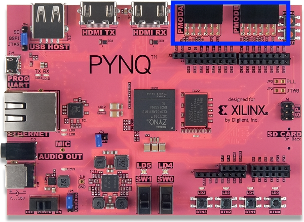
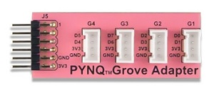
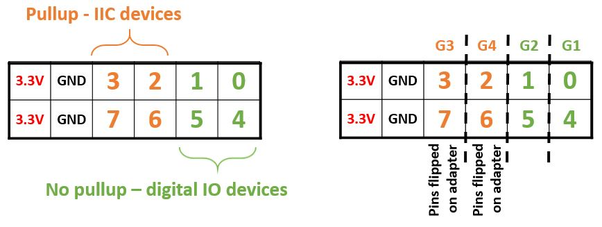

Hardware and Overlays
========================================

Overlay Concept
-------------------
The Xilinx Zynq All Programmable device is an SOC based on a dual-core ARM Cortex-A9 processor (referred to as the  *Processing System* or **PS**), which also includes FPGA fabric (referred to as  *Programmable Logic* or **PL**). The ARM SoC subsystem also includes a number of dedicated peripherals (memory controllers, USB, Uart, IIC, SPI etc). 

.. image:: ./images/zynq_block_diagram.jpg
   :align: center

The FPGA fabric is reconfigurable, and can be used to implement high performance functions in hardware. However, FPGA design is a specialized task which requires deep hardware engineering knowledge and expertise. 
Overlays, or hardware libraries, are programmable/configurable FPGA designs that extend the user application from the Processing System of the Zynq into the Programmable Logic. This allows software programmers to take advantage of the FPGA fabric to accelerate an application, or to use an overlay to customize the hardware platform for a particular application.

For example, image processing is a typical application where the FPGAs can provide acceleration. A software programmer can use a hardware library to run some of the image processing functions (e.g. edge detect, thresholding etc.) on the FPGA fabric. 
Hardware libraries can be loaded to the FPGA dynamically, as required, just like a software library.
Using Pynq, separate image processing functions could be implemented in different overlays and loaded from Python on demand.
 
To give another example, the PYNQ-Z1 has more pins/interfaces available than a typical embedded platform, and can implement multiple custom processors in the Programmable logic. 
Multiple sensor and actuator controllers, and multiple heterogeneous custom processors (real-time or non real-time), could be implemented in hardware in the new overlay, and connected to the available pins. A software programmer could use the controllers and processors in the overlay through a Pynq API.   

Base Overlay
---------------
The base overlay is a precompiled FPGA design that can be downloaded to the Programmable Logic. It is the default overlay included with the PYNQ-Z1 image, and is automatically loaded when the system boots. 

This overlay customizes the Programmable Logic to connect HDMI In and Out controllers, an audio controller (Mic In and Audio Out), and the Pmod and Arduino interfaces (through the IO Processors) to the PS. This allows the peripherals to be used from the Pynq environment. There is also a tracebuffer connected to the Pmod, and Arduino interfaces to allow for hardware debug. The user buttons, switches and LEDs are also connected to the PS in the base overlay. 

.. image:: ./images/pynqz1_base_overlay.png
   :align: center

The Pmod and Arduino interfaces have special custom IO Processors  that allow a range of peripherals with different IO standards to be connected to the system. This allows a software programmer to use a wide range of peripherals with different interfaces and protocols without needing to create a new FPGA design for each peripheral or set of peripherals.

Pmod Peripherals
-----------------
A Pmod interface is a 12-pin connector that can be used to connect peripherals. A range of Pmod peripherals are available from Digilent and third parties. Typical Pmod peripherals include sensors (voltage, light, temperature), communication interfaces (Ethernet, serial, wifi, bluetooth), and input and output interfaces (buttons, switches, LEDs).

There are two Pmod connectors on PYNQ-Z1.

Pmod Port
^^^^^^^^^^^^^^^^^^^^^^^^^^^
Each Pmod connector has 12 pins: 2 rows of 6 pins, where each row has 3.3V (VCC), ground (GND) and 4 data pins. This gives 8 data pins in total. Pmod data pins are labelled 0-7 in the image below. The pin number needs to be specified in Python when creating a new instance of a peripheral connected to a port.  

.. image:: images/pmod_closeup.JPG
   :align: center

Pmods come in different configurations depending on the number of data pins required. e.g. Full single row: 1x6 pins; full double row: 2x6 pins; and partially populated: 2x4 pins. 

.. image:: images/pmod_pins.png
   :align: center

Pmods that use both rows (e.g. 2x4 pins, 2x6 pins), should usually be aligned to the left of the connector (to align with VCC and GND).

.. image:: images/pmod_tmp2_8pin.JPG

Pmod peripherals with only a single row of pins can be physically plugged into the top row or the bottom row of a Pmod port (again, aligned to VCC/GND). However, if you are using an existing driver/overlay, you will need to check which pins/rows are supported for a given overlay, as not all options may be implemented. e.g. the Pmod ALS is currently only supported on the top row of a Pmod port, not the bottom row.  

Supported Peripherals
^^^^^^^^^^^^^^^^^^^^^^^^^^^

A number of peripherals are supported: 

 * Pmods can be plugged directly into the Pmod port. 
 * Grove peripherals can be connected to the Pmod port through a *PYNQ Grove Adapter*.
 * Other peripherals can be wired to a Pmod port.

PYNQ Grove Adapter
^^^^^^^^^^^^^^^^^^^^^^^^^^^^^^^^^^^^

A Grove connector has four pins, VCC and GND, and two data pins.

The PYNQ Grove Adapter has four connectors (G1 - G4), allowing four Grove devices to be connected to one Pmod port. 

All pins operate at 3.3V. Due to different pull-up/pull-down I/O requirements for different peripherals (e.g. IIC requires pull-up, and SPI requires pull-down), Grove peripherals must be plugged into the appropriate connector.

G1 and G2 pins are connected to pins with pull-down resistors, and G3 and G4 are connected to pins with pull-up resistors (IIC), as indicated in the image. 

Pmods already take this pull up/down convention into account in their pin layout, so no special attention is required to connect Pmods. 
   
Arduino Peripherals
--------------------

There is one Arduino connector on the board and can be used to connect to arduino compatible shields. 

.. image:: ./images/pynqz1_arduino_interface.jpg
   :align: center

Arduino Connector
^^^^^^^^^^^^^^^^^^^^^^^^^^^
Each Arduino connector has 6 analog pins (A0 - A5), 14 multi-purpose Digital pins (D0 - D13), 2 dedicated I2C pins (SCL, SDA), and 4 dedicated SPI pins. 

Supported Peripherals
^^^^^^^^^^^^^^^^^^^^^^^^^^^

Most Arduino compatible shields can be used with the PYNQ-Z1 board. However, the PYNQ-Z1 board has a limited analog range, so not all Arduino analog shields are supported. 

PYNQ Shield
^^^^^^^^^^^^^^^^^^^^^^^^^^^^^^^^^^^^
As mentioned previously, each Grove connector has 4 pins. The PYNQ Shield has 12 Grove connectors for digital IO (I2C, UART, G1 - G7) and 4 Grove connectors for analog IO (A1 - A4).

.. image:: ./images/arduino_shield.jpg
   :align: center

With the PYNQ shield jumper (JP1) set to 3.3V (as in the figure), all the pins operate at 3.3V. 

