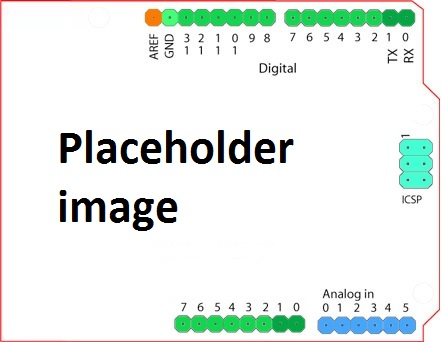

Arduino IO Processor
========================================
The Pynq-z1 board has an Arduino interface. 

   
An Arduino IOP is available to control this interface.

Arduino Interface
-------------------
The Arduino interface has 6 analog pins (A0-A5), and 14 Digital pins and (D0-D13), and 4 dedicated SPI pinns.

The analog pins can also be used as digital I/O.

A UART can be connected to D0 and D1.

I2C can be connected to A4 and A5.

SPI can be connected to the dedicated SPI pins. SPI can be connected to D10-D13.

PWM timers (6) are available on D3, D5, D6, D9, D10, D11.

Timer generate/capture can be connected to D3-D6 and D8-D11

Arduino shields have fixed possible configurations. For example, a shield with a UART and 5 Digital IO can connect the UART to pins D0, D1, and the Digital IO can be connected to pins D2 - D6.

Limitations:
The analog compare feature of the arduino is not supported on the Pynq-z1 board.

Arduino IOP 
--------------

The Arduino IOP is similar to the PMOD IOP with Microblaze and configurable switch. The Arduino IOP also has: 

* 2x I2x
* 2x SPI
* 1x UART
* 3x GPIO blocks
* 1x XADC
* 1 Interrupt Controller (32 channels)

.. image:: ./images/arduino_iop.jpg
   :align: center
   
The interrupt controller can be connected to all the Analog and Digital pins, each of the 6 timers, 2 I2C, 2 SPI, XADC, and UART. 

This means an external pin on the shiled interface can trigger the interrupt controller, and the internal peripherals can also trigger an interrupt.  

Arduino IO Switch
^^^^^^^^^^^^^^^^^^^^^^^^^^^

There are 6 Analog, 14 digital, and 4 SPI pins (24 in total). As described above, the following peripherals are available in the IOP: (3x GPIO, 6 timers, 2 I2C, 2 SPI, XADC, and UART). 

The switch can be configured by writinng to its connfiguration registers. 

The dedicated SPI pins are always connected to 1 SPI. 

The analog and digital pins can be configured by writing a 4 bit value to the corresponding place in the IOP Switch configuration registers. This can be done from the MicroBlaze code. 

The following function, part of the provided arduino_io_switch_v1_0 driver (``arduino.h``) can be used to configure the switch. 

.. code-block:: c

   void configureArduinoSwitch();

Switch mappings used for IOP Switch configuration:

========  =======  =======   =========  ======  =======  ==================  =======  =======  ==============

Pin Name  A/D IO   A_INT     Interrupt  UART    PWM      Timer               SPI      IIC      Input Capture

========  =======  =======   =========  ======  =======  ==================  =======  =======  ==============
A0        A_GPIO   A_INT                                   
A1        A_GPIO   A_INT                                   
A2        A_GPIO   A_INT                                   
A3        A_GPIO   A_INT                                   
A4        A_GPIO   A_INT                                                              IIC
A5        A_GPIO   A_INT                                                              IIC
D0        D_GPIO             D_INT      D_UART
D1        D_GPIO             D_INT      D_UART
D2        D_GPIO             D_INT                              
D3        D_GPIO             D_INT              D_PWM0   D_TIMER (Timer0)                      IC (Timer0)
D4        D_GPIO             D_INT                       D_TIMER (Timer0_6)               
D5        D_GPIO             D_INT              D_PWM1   D_TIMER (Timer1)                      IC (Timer1)
D6        D_GPIO             D_INT              D_PWM2   D_TIMER (Timer2)                      IC (Timer2)
D7        D_GPIO             D_INT                              
D8        D_GPIO             D_INT                       D_TIMER (Timer1_7)                    Input Capture
D9        D_GPIO             D_INT              D_PWM3   D_TIMER (Timer3)                      IC (Timer3)
D10       D_GPIO             D_INT              D_PWM4   D_TIMER (Timer4)    D_SS              IC (Timer4)
D11       D_GPIO             D_INT              D_PWM5   D_TIMER (Timer5)    D_MOSI            IC (Timer5)
D12       D_GPIO             D_INT                                           D_MISO          
D13       D_GPIO             D_INT                                           D_SPICLK          

========  =======  =======   =========  ======  =======  ==================  =======  =======  ==============

..COMMENT NEEDS TO BE UPDATED: For example, to connect the UART to D0 and D1, write D_UART to the configuration register for D0 and D1. 

..COMMENT NEEDS TO BE UPDATED: .. code-block:: c

..COMMENT NEEDS TO BE UPDATED:    configureSwitch(D_UART, D_UART);

..COMMENT NEEDS TO BE UPDATED: From Python all the constants and addresses for the IOP can be found in:

..COMMENT NEEDS TO BE UPDATED:     ``<Pynq GitHub Repository>/python/pynq/iop/pmod_const.py``

    
arduino_io_switch driver
--------------------------
``arduino_io_switch.h`` and ``arduino_io_switch.c`` are part of the *arduino_io_switch* driver, and contain an API, addresses, and constant definitions that can be used to write code for an IOP.

   ``<Pynq GitHub Repository>/Pynq/zybo/vivado/ip/arduino_io_switch_1.0/drivers/arduino_io_switch_1.0/src/``

This code this automatically compiled into the Board Support Package. Any application linking to the BSP can use the Pmod library by including the header file:

.. code-block:: c

   #include "arduino_io_switch.h"

