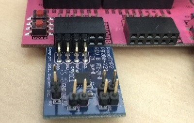

**************************
Peripherals and Interfaces
**************************

.. contents:: Table of Contents
   :depth: 2
   
Introduction
====================

The Zynq PL can support many types of protocols and interfaces for external peripherals. The Pynq-Z1 has two Pmod ports and one Arduino interface for connecting external peripherals directly to the Zynq PL. This allows peripherals to be controlled in hardware. Other peripherals can be connected to these ports via adapters, or with a breadboard. 

The USB port can also be used to connect standard USB peripherals to the Zynq PS. Linux drivers are required for connecting USB peripherals. The PYNQ image currently includes drivers for some webcams, and USB wifi peripherals.

Note that the Zynq PS has dedicated peripherals including Ethernet, USB, UART, IIC, SPI, CAN controllers and GPIO. Only the Ethernet, USB, and UART are connected externally on the board. It is possible to connect the other controllers internally to the Zynq PL. The peripherals could then be used internally inside the PL, or routed to PL pins. E.g. to Pmod, or Arduino pins. This would require an overlay design.

In the base overlay, each IOP has its only set of controllers, implemented in programmable logic, and does not need to use the Zynq PS peripherals. 

Pmod port
===================

A Pmod port is an open 12-pin interface that is supported by a range of Pmod peripherals from Digilent and third party manufacturers. 
Typical Pmod peripherals include sensors (voltage, light, temperature), communication interfaces (Ethernet, serial, wifi, bluetooth), and input and output interfaces (buttons, switches, LEDs).

There are two Pmod connectors on PYNQ-Z1.

.. image:: ./images/pynqz1_pmod_interface.jpg
   :align: center

Pmod pins
-----------------------

Each Pmod connector has 12 pins arranged in 2 rows of 6 pins. Each row has 3.3V (VCC), ground (GND) and 4 data pins. Using both rows gives 8 data pins in total. 

Pmods come in different configurations depending on the number of data pins required. e.g. Full single row: 1x6 pins; full double row: 2x6 pins; and partially populated: 2x4 pins. 

.. image:: images/pmod_pins.png
   :align: center

Pmods that use both rows (e.g. 2x4 pins, 2x6 pins), should usually be aligned to the left of the connector (to align with VCC and GND). VCC and GND are labelled on the PYNQ-Z1 board. 

Pmod peripherals with only a single row of pins can be connected to either the top row or the bottom row of a Pmod port (again, aligned to VCC/GND). If you are using an existing driver/overlay, you will need to check which pins/rows are supported for a given overlay, as not all options may be implemented. e.g. the Pmod ALS is currently only supported on the top row of a Pmod port, not the bottom row.  

Pmod IO standard
^^^^^^^^^^^^^^^^^^^^^^^^^^

All pins operate at 3.3V. Due to different pull-up/pull-down I/O requirements for different peripherals (e.g. IIC requires pull-up, and SPI requires pull-down) the Pmod data pins have different IO standards. 

0,1 and 4,5 are connected to pins with pull-down resistors. This can support the SPI interface, and most peripherals. 2,3 and 6,7 are connected to pins with pull-up resistors. This can support the IIC interface. 

Pmods already take this pull up/down convention into account in their pin layout, so no special attention is required when using Pmods. 
   

Other Peripherals
-----------------------------

Pmod ports are design for use with Pmods. The 8 data pins of a Pmod port can be used to connect to a breadboard, or directly to other peripherals. 

Grove peripherals which use a four wire interface can also be connected to the Pmod port through a *PYNQ Grove Adapter*.

PYNQ Grove Adapter
^^^^^^^^^^^^^^^^^^^

A Grove connector has four pins, VCC and GND, and two data pins.

The PYNQ Grove Adapter has four connectors (G1 - G4), allowing up to four Grove devices to be connected to one Pmod port. Remember that an IOP application will be required to support the configuration of connected peripherals.

.. image:: ./images/pmod_grove_adapter.jpg
   :align: center

Pmod IO standard for Grove
^^^^^^^^^^^^^^^^^^^^^^^^^^^

On the grove adapter G1 and G2 map to Pmod pins [0,4] and [1,5], which are connected to pins with pull-down resistors (supports SPI interface, and most peripherals). G3 and G4 map to pins [2,6], [3,7], which are connected to pins with pull-up resistors (IIC), as indicated in the image. 

.. image:: ./images/adapter_mapping.JPG
   :align: center
   

Arduino connector
============================

There is one Arduino connector on the board and can be used to connect to Arduino compatible shields. 

.. image:: ./images/pynqz1_arduino_interface.jpg
   :align: center

Arduino pins
-----------------------

Each Arduino connector has 6 analog pins (A0 - A5), 14 multi-purpose Digital pins (D0 - D13), 2 dedicated I2C pins (SCL, SDA), and 4 dedicated SPI pins. 

ChipKit pins
----------------

There are also *ChipKit* pins beside the Arduino interface on the PYNQ-Z1 board. These pins are connected to the Zynq PL, but are not enabled in the base overlay. 

Supported Peripherals
-----------------------------

Most Arduino compatible shields can be used with the PYNQ-Z1 board. However, the PYNQ-Z1 board has a limited analog range, so not all Arduino analog shields are supported. 

PYNQ Shield
--------------------

Each Grove connector has 4 pins. The PYNQ Shield connects to the Arduino and ChipKit pins on the PYNQ-Z1 board. The PYNQ shield has 12 Grove connectors for digital IO (I2C, UART, G1 - G7) and 4 Grove connectors for analog IO (A1 - A4).

.. image:: ./images/arduino_shield.jpg
   :align: center

With the PYNQ shield jumper (JP1) set to 3.3V (as in the figure), all the pins operate at 3.3V. With JP1 set to 5V, G4 - G7 operated at VDD = 5V. 

The Arduino pins, and ChipKit pins are also passed to the top of the board to allow additional shields to be attached. 

Using Peripherals
=====================

Pynq introduces IOPs (Input Output Processors) which are covered in the next section. An IOP consists of a MicroBlaze processor with dedicated peripherals which can be selected and routed to the physical interface at runtime. An IOP provides flexibility allowing peripherals with different protocols and interfaces to be used with the same overlay. 
A peripheral will have an IOP driver application, and a Python wrapper. The next sections will cover the IOP architecture, and how to write driver applications and the corresponding Python wrapper for a peripheral. 