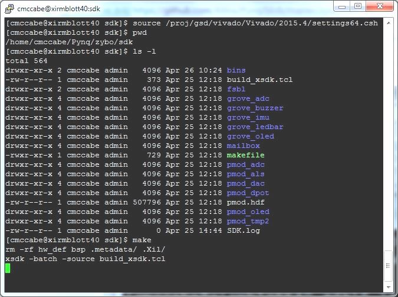
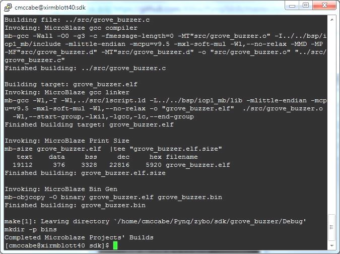

IO Processors: Writing Software
===============================

IO Processors (IOPs) contain a soft `Xilinx MicroBlaze processor <https://en.wikipedia.org/wiki/MicroBlaze>`_, peripherals `AXI Timer <http://www.xilinx.com/support/documentation/ip_documentation/axi_timer/v2_0/pg079-axi-timer.pdf>`_, `AXI IIC <http://www.xilinx.com/support/documentation/ip_documentation/axi_iic/v2_0/pg090-axi-iic.pdf>`_, `AXI SPI <http://www.xilinx.com/support/documentation/ip_documentation/axi_quad_spi/v3_2/pg153-axi-quad-spi.pdf>`_, `AXI GPIO <http://www.xilinx.com/support/documentation/ip_documentation/axi_gpio/v2_0/pg144-axi-gpio.pdf>`_ a configurable switch and an interface port to a Pmod. An IOP can be used as a flexible controller for different types of peripherals.

.. image:: ./images/iop.jpg
   :scale: 75%
   :align: center
   
For external peripheral control or real-time processing, the IOP is the best microcontroller in Pynq for this computation.  By contrast, the ARM Cortex-A9 is an application processor and will be running Linux, not well-suited for real time applications. 

The IOP switch can be configured to route signals between the physical Pmod interface (external pins), and the available internal peripherals. In this way, an IIC, SPI, or custom external peripheral can be supported on the same physical port using a single overlay. i.e. there is no need to create a new FPGA to interface to different external peripherals. 

IOPs can also be used standalone to offload some processing from the main processer. However, note that the IOPs are running at 100MHz, compared to the Dual-Core ARM Cortex-A9 running at 650MHz. This should be taken into account when offloading application code.

Xilinx Software installation
----------------------------

A Microblaze cross-compiler is necessary to build Microblaze software.  Xilinx SDK contains that cross-compiler and was used to build all PMOD device drivers released with Pynq.  It should be noted that Pynq ships with precompiled drivers for many devices - Xilinx software is only needed if you intend to build your own drivers.

The current Pynq release is built using SDK 2015.4. You should use the same version to rebuild existing Vivado and SDK projects.  

`Download Xilinx Vivado and SDK 2015.4 <http://www.xilinx.com/support/download/index.html/content/xilinx/en/downloadNav/vivado-design-tools/2015-4.html>`_

You can use the Vivado HLx Web Install Client and select SDK and/or Vivado during the installation.

Building IOP projects
--------------------------

Code for the MicroBlaze processor inside the IOP can be written in C or C++. 

The Xilinx SDK (Software Development Kit) can be installed on a host computer and used to create a software project to build Application Projects for the MicroBlaze inside the IOP. This is the standard way of developing software for a MicroBlaze.

Hardware Description File
-------------------------

To create a project in SDK for the IOP, the .hdf hardware definition file from a Xilinx Vivado project that includes an IOP is required. 

A precompiled pmod.hdf for the pmod overlay is available here:

   Pynq/zybo/sdk

This hdf file was generated from a Vivado project and does not need to recreated.  If you do need to build the pmod.hdf file again, the pmod overlay can be rebuilt using the supplied makefile at:

   Pynq/zybo/vivado/pmod/makefile  

Build the SDK Hardware Platform and BSP 
---------------------------------------

Using makefiles
^^^^^^^^^^^^^^^^

The SDK projects in the GitHub contain makefiles to build the SDK Hardware Platform project, the Board Support Package, and the application projects. These step requires that you have SDK installed on the host machine.

The SDK application project, and source code for each peripheral can be found here:

    Pynq/zybo/sdk/
    
As described above, the pmod.hdf file also exists here. 

SDK requires a Hardware platform, and Board Support Package, which are needed to build the application projects. The Board Support Package contains libraries for peripherals in the system. This includes internal peripherals and IP, and external peripherals. Some libraries are included in Vivado/SDK, and other libraries are user defined. e.g. custom driver for a peripheral. The source files for custom peripherals in the Overlay can be found in the Vivado project directory for an overlay. The source files also contain the drivers, which will be a compiled into a library and included in the BSP. 

The Hardware Platform, BSP, and all application projects can be built by running make from:

    Pynq/zybo/sdk/

This will build all the projects set in the variable MBBINS at the top of the makefile.

   

   
Individual projects can be build by navigating to the *<project directory>/Debug* and running make.

Using the SDK GUI
^^^^^^^^^^^^^^^^^

In the SDK GUI, you can also manually create a *New Hardware Platform Specification* project, and link it to the .hdf file. 

.. image:: ./images/new_hardware_platform_specification.jpg
   :scale: 75%
   :align: center

You can then, import the BSP from `the Pynq GitHub repository <https://github.com/Xilinx/Pynq/tree/master/zybo/sdk>`_. 

.. image:: ./images/sdk_import_existing_bsp.jpg
   :scale: 75%
   :align: center

.. image:: ./images/sdk_bsp_imported.jpg
   :scale: 75%
   :align: center
   
A new Application Project can then be created in the GUI.   

Use existing project
^^^^^^^^^^^^^^^^^^^^^^

Rather than create your own project, you can use an existing project as a starting point for your code. This step requires that you have SDK installed on the host machine.

To do this, copy the project directory and rename it. 

Modify or replace the .c file in the src/ with your C code. The .bin file generated will have the same base name as your C file. 

e.g. if your C code is my_peripheral.c, the generated .elf and .bin will be my_peripheral.elf or my_peripheral.bin.

We encourage the following naming convention for drivers <pmod|grove>_<peripheral>

You will need to updates references from the old project name to your new project name in *<project directory>/Debug/makefile* and *<project directory>/Debug/src/subdir.mk*

If you want your project to build as part of the main Pynq build (i.e. your project will get built with the same makefile as all the other peripherals), you should also append the bin name of your project to the MBBINS variable at the top of the makefile in:

    Pynq/zybo/sdk

Binary files
^^^^^^^^^^^^^

Compiling code results in an .elf executable file. A .bin file (binary file) is required to download to the IOP memory. 

A .bin file can be generated from an elf by running:

    mb-objcopy -O binary input_file.elf outputfile.bin

This is done by the makefile for existing peripheral projects. The makefile will additionally copy all Microblaze bin files into the Pynq/python/pynq/pmods folder.

IOP Memory
----------

The IOP instruction and data memory is implemented in a dual port Block RAM, with one port connected to the IOP, and the other to the ARM processor. This allows an executable to be written from the ARM (i.e. the Pynq environment) to the IOP instruction memory. The IOP can also be reset from Pynq, allowing the IOP to start executing the new program. The IOP data memory is also used to communicate between the Pynq environment and the IOP.

Memory map
----------

The IOP memory is 32KB (0x8000) of shared data and instruction memory. Instruction memory for the IOP starts at address 0x0.
Pynq and the application running on the IOP can write to anywhere in the shared memory space.  

When building the MicroBlaze project, the compiler will only ensure that the application and allocated stack and heap fit into the BRAM. For communication between the ARM and the MicroBlaze, an additional shared memory space must also be reserved within the MicroBlaze address space. 

There is no memory management in the IOP. You must ensure the application, including stack and heap, do not overflow into the defined data area. Remember that declaring a stack and heap size only allocates space to the stack and heap. No boundary is created, so if sufficient space was not allocated, the stack and heap may overflow.

It is recommended to follow the convention for data communication between the two processors. These MAILBOX values are defined in the pmod.h file.  

| Instruction and data memory start = 0x0
| Instruction and data memory size  = 0x6fff

| Shared mailbox memory start       = 0x7000
| Shared mailbox memory size        = 0x1000
| Shared mailbox Command Address    = 0x7ffc
|

A common scenario would be that Python wants to read a value from a PMOD attached device.  Below is a simple scenario where the Microblaze does that read on behalf of Python.  

* Python writes address A to the mailbox command address (0x7ffc).
* Microblaze sees that non-zero address and performs the read to address A.
* Microblaze places the data at the mailbox base address (0x7000).
* Micboblaze writes a zero to the mailbox command address (0x7ffc) to confirm transaction is complete.
* Python polling on the command address (0x7ffc), sees that the Microblaze has written a zero, signifying read is complete.
* Python reads the data held at the mailbox base address (0x7000), completing the read.

IOP Switch
^^^^^^^^^^^^^^^^^^^^^^^^^^^

There are 8 data pins on a Pmod port, that can be connected to any of 16 internal peripheral signals (GPIO, SPI, IIC, Timer). 

Each pin can be configured by writing a 4 bit value to the corresponding place in the IOP Switch configuration register. 
The following function, part of the provided SDK BSP (pmod.h/.c) can be used to configure the switch. 

.. code-block:: c

   void configureSwitch(char pin0, char pin1, char pin2, char pin3, char pin4, char pin5, char pin6, char pin7);

While each parameter is a "char" only the lower 4-bits are currently used to configure each pin.

Switch mappings used for IOP Switch configuration:

========  ======= 
 Pin      Value  
========  =======
 GPIO_0   0x0  
 GPIO_1   0x1  
 GPIO_2   0x2  
 GPIO_3   0x3  
 GPIO_4   0x4  
 GPIO_5   0x5  
 GPIO_6   0x6  
 GPIO_7   0x7  
 SCL      0x8  
 SDA      0x9  
 SPICLK   0xa  
 MISO     0xb  
 MOSI     0xc  
 SS       0xd  
 BLANK    0xe  
========  =======

If two or more pins are connected to the same signal, the pins are OR'd together. 

For example, to connect the physical pins GPIO 0-7 to the internal GPIO_0 - GPIO_7:

.. code-block:: c

   configureSwitch(GPIO_0, GPIO_1, GPIO_2, GPIO_3, GPIO_4, GPIO_5, GPIO_6, GPIO_7)

From Python all the constants and addresses for the IOP can be found in:

    Pynq/python/pmods/pmod_const.py

Pmod driver
-----------
pmod.h and pmod.c driver contains an API, addresses, and constant definitions that can be used to write code for an IOP.

   Pynq/zybo/vivado/ip/pmod_io_switch_1.0/drivers/pmod_io_switch_v1_0/src/

This code this automatically compiled into the Board Support Package. Any application linking to the BSP can use the Pmod library by including the header file:

.. code-block:: c

   #include "pmod.h"

Any application that uses the Pmod driver should also call pmod_init() at the beginning of the application. 

Running code on different IOPs
------------------------------------------

The shared memory is the only connection between the ARM and the IOPs. That shared memory of a Microblaze is mapped to the ARM address space.  Some example mappings are shown below to highlight the address translation between Microblaze and ARM's memory spaces.  

=================   =========================   ============================
IOP Base Address    Microblaze Address Space    ARM Equivalent Address Space
=================   =========================   ============================
0x4000_0000         0x0000_0000 - 0x0000_7fff   0x4000_0000 - 0x4000_7fff
0x4200_0000         0x0000_0000 - 0x0000_7fff   0x4200_0000 - 0x4200_7fff
0x4400_0000         0x0000_0000 - 0x0000_7fff   0x4400_0000 - 0x4400_7fff
0x4600_0000         0x0000_0000 - 0x0000_7fff   0x4600_0000 - 0x4600_7fff
=================   =========================   ============================

Note that each Microblaze has the same address space, allowing any binary compiled for one Microblaze to run on any IOP in the overlay.

Example IOP Driver
------------------

Taking PMOD ALS as an example IOP driver used to talk to the PMOD light sensor, first open the pmod_als.c file:

    Pynq/zybo/sdk/pmodals/src/pmod_als.c

Note that the pmod.h header file is included.

Some COMMANDS are defined by the user. These values can be chosen to be any value, but must correspond with the Python part of the driver. 

By convention, 0x0 is reserved for no command/idle/acknowledge, and IOP commands can be any non-zero value.

The ALS peripheral has as SPI interface. Note the user defined function get_sample() which calls an SPI function spi_transfer() call defined in pmod.h.  

In main() notice configureSwitch() is called to initialize the switch with a static configuration. This means that if you want to use this code with a different pin configuration, the c code must be changed and recompiled. 

Next, the while(1) loop is entered. In this loop the IOP continually checks the MAILBOX_CMD_ADDR for a non-zero command. Once a command is received from Python, the command is decoded, and executed. 

Taking the first case, reading a value:

.. code-block:: c

    case READ_SINGLE_VALUE:
        MAILBOX_DATA(0) = get_sample();
        MAILBOX_CMD_ADDR = 0x0;

get_sample() is called and a value returned to the first position (0) of the MAILBOX_DATA.

MAILBOX_CMD_ADDR is reset to zero to acknowledge to the ARM processors that the operation is complete and data is available in the mailbox. 

Examine Python Code
^^^^^^^^^^^^^^^^^^^^

With the IOP Driver written, the Python class can be built that will communicate with that IOP. 
 
   Pynq/tree/master/python/pynq/pmods/pmod_als.py
   
First the _iop, pmod_const and MMIO are imported and the Microblaze executable defined. 

.. code-block:: python

   from . import _iop
   from . import pmod_const
   from pynq import MMIO

   ALS_PROGRAM = "als.bin"

The IOP module is imported, along with the Pmod constant definitions (pin mappings) and the MMIO (interface to shared memory).

The Microblaze binary for the IOP is also declared. This is the application executable, and will be loaded into the IOP instruction memory. 

The ALS class and an initialization method are defined:

.. code-block:: python

   class PMOD_ALS(object):
      def __init__(self, pmod_id):

The initialization function for the module requires a IOP index. For Grove peripherals and the StickIt connector, the StickIt port number is also used for initialization.  The __init__ is called when a module is instantiated. e.g. from Python:

.. code-block:: python

    from pynq.pmods import PMOD_ALS
    als = PMOD_ALS(1)

Looking further into the initialization method, the _iop.request_iop() call instantiates an instance of an IOP on the specified pmod_id and loads the Microblaze executable (ALS_PROGRAM) into the instruction memory of the appropriate Microblaze.

.. code-block:: python

    self.iop = _iop.request_iop(pmod_id, ALS_PROGRAM)

An MMIO class is also instantiated to enable read and writes to the shared memory.  

.. code-block:: python

    self.mmio = self.iop.mmio

Finally, the iop.start() call pulls the IOP out of reset. After this, the IOP will be running the als.bin executable.    

.. code-block:: python

    self.iop.start()

Example of Python Class Runtime Methods
^^^^^^^^^^^^^^^^^^^^^^^^^^^^^^^^^^^^^^^^

The read method in the PMOD_ALS class will simply read an ALS sample and return that value to the caller.  The following steps demonstrate a Python to Microblaze read transaction specfic to the ALS class.

.. code-block:: python

    def read(self):

First, the comand is written to the Microblaze driver using mmio.write() calls to the shared memory, in this case "3". This value is user defined in the Python code, and must match the value the C program running on the IOP expects for the same function.

.. code-block:: python

    self.mmio.write(pmod_const.MAILBOX_OFFSET+
                        pmod_const.MAILBOX_PY2IOP_CMD_OFFSET, 3)     

When the IOP is finished, it will write 0x0 to the command area. The Python code now uses mmio.read() to check if the command is still pending (in this case, when the 3 value is still present at the CMD_OFFSET).  While the command is pending, the Python class blocks.  

.. code-block:: python

    while (self.mmio.read(pmod_const.MAILBOX_OFFSET+
                                pmod_const.MAILBOX_PY2IOP_CMD_OFFSET) == 3):
        pass
            
Once the command is no longer 3, i.e. the acknowledge has been received, the result is read from the DATA area of the shared memory MAILBOX_OFFSET. Using mmio.read()

.. code-block:: python

    return self.mmio.read(pmod_const.MAILBOX_OFFSET)

Notice the pmod_const values are used in these function calls, values that are predefined in pmod_const.py. 
