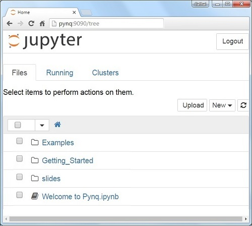
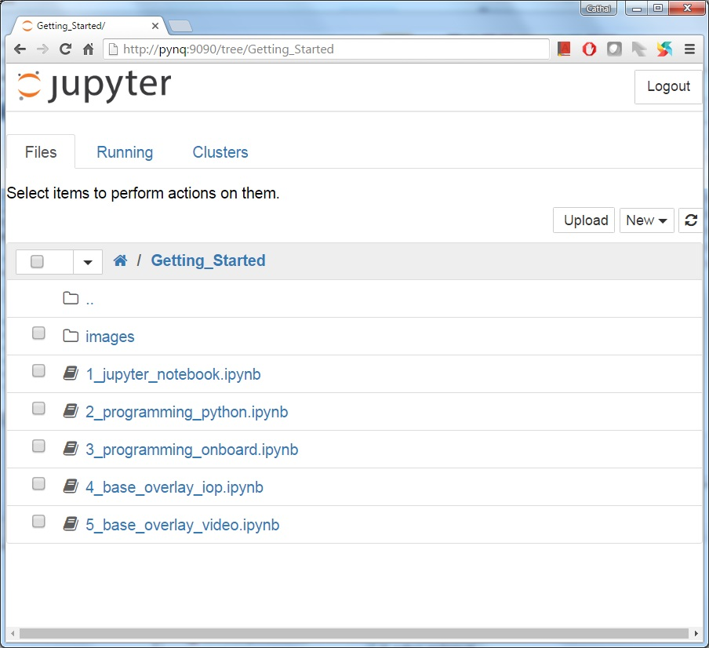
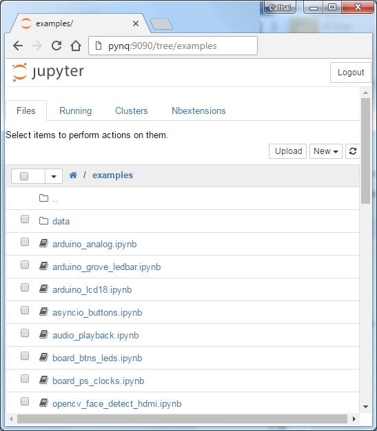
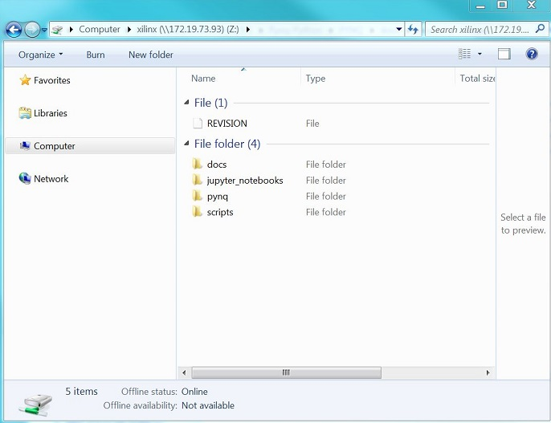
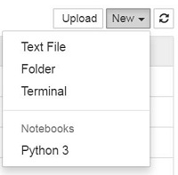

***************
Getting Started
***************

This guide will show you how to setup your computer and PYNQ-Z1 board to get
started using PYNQ.  Any issues can be posted to `the PYNQ support forum
<https://groups.google.com/forum/#!forum/pynq_project>`_.

PYNQ-Z1 Setup Guide
===================
     
Prerequisites
-------------

  * PYNQ-Z1 board
  * Computer with compatible browser (`Supported Browsers
    <http://jupyter-notebook.readthedocs.org/en/latest/notebook.html#browser-compatibility>`_)
  * Ethernet cable
  * Micro USB cable 
  * Micro-SD card with preloaded image, or blank card (Minimum 8GB recommended)
  
Getting Started Video
---------------------

You can watch the getting started video guide, or follow the instructions in
:ref:`board-setup`.

.. raw:: html

    <embed>
         <iframe width="560" height="315" src="https://www.youtube.com/embed/K5okTyjKr5U" frameborder="0" allowfullscreen></iframe>
          
          
    </embed>

MicroSD Card Setup
------------------

Preloaded Micro SD cards are available from Digilent. If you already have a
Micro SD card preloaded with the PYNQ-Z1 image, you can skip this step.

To make your own PYNQ Micro-SD card:

  1. `Download the PYNQ-Z1 image
     <https://files.digilent.com/Products/PYNQ/pynq_z1_v2.0.img.zip>`_
  2. Unzip the image 
  3. Write the image to a blank Micro SD card (minimum 8GB recommended)
   
For detailed instructions on writing the SD card using different operating
systems, see :ref:`writing-the-sd-card`.
   
.. _board-setup:

Board Setup
-----------

   .. image:: images/pynqz1_setup.jpg
      :align: center

  1. Set the **JP4 / Boot** jumper to the *SD* position by
     placing the jumper over the top two pins of JP4 as shown in the image.
     (This sets the board to boot from the Micro-SD card)
   
  2. To power the PYNQ-Z1 from the micro USB cable, set the **JP5 / Power**
     jumper to the *USB* position by placing the jumper over the top two pins as
     shown in the image. (You can also power the board from an external 12V
     power regulator by setting the jumper to *REG*.)

  3. Insert the Micro SD card loaded with the PYNQ-Z1 image into the **Micro
     SD** card slot underneath the board.

  4. Connect the USB cable to your PC/Laptop, and to the **PROG - UART / J14**
     MicroUSB port on the board

  5. Connect the board to Ethernet by following the instructions in
     :ref:`ethernet-setup`

  6. Turn on the PYNQ-Z1 by following the instructions in
     :ref:`turning-on-the-PYNQ-Z1`

.. _ethernet-setup:

Ethernet Setup
--------------

You can connect the Ethernet port of the PYNQ-Z1 Ethernet in the following ways:

  * :ref:`connect-to-a-network-router`

  * :ref:`connect-to-a-computer`

If available, you should connect your board to a network or router with Ethernet
access. This will allow you to update your board and install new packages.

.. _connect-to-a-network-router:

Connect to a Network Router
^^^^^^^^^^^^^^^^^^^^^^^^^^^

If you connect to a router, or a network with a DHCP server, your board will
automatically get an IP address. You must make sure you have permission to
connect a device to your network, otherwise the board may not connect properly.

Connect to a Router/Network (DHCP):

  1. Connect PYNQ-Z1 to Ethernet port on router/switch
  2. Connect your computer to Ethernet or WiFi on router/switch
  3. Browse to http://pynq:9090
  4. Optional: :ref:`change-the-hostname`
  5. Optional: :ref:`configure-proxy-settings`
   
.. _connect-to-a-computer:
	
Connect to a Computer
^^^^^^^^^^^^^^^^^^^^^

You will need to have an Ethernet port available on your computer, and you will
need to have permissions to configure your network interface. With a direct
connection, you will be able to use PYNQ, but unless you can bridge the Ethernet
connection to the board to an Internet connection on your computer, your board
will not have Internet access. You will be unable to update or load new packages
without Internet access.

Connect directly to a computer (Static IP):

  1. :ref:`assign-your-computer-a-static-IP`
  2. Connect the PYNQ-Z1 to your computer's ethernet port
  3. Browse to http://192.168.2.99:9090

.. _turning-on-the-pynq-z1:
	
Turning On the PYNQ-Z1
----------------------

As indicated in step 6 of :ref:`board-setup`, slide the power switch to the *ON*
position to turn on the board. The **Red LD13** LED will come on immediately to
confirm that the board has power.  After a few seconds, the **Yellow/Green LD12
/ Done** LED will light up to show that the Zynq® device is operational.

After a minute you should see two **Blue LD4 & LD5** LEDs and four
**Yellow/Green LD0-LD3** LEDs flash simultaneously. The **Blue LD4-LD5** LEDs
will then turn on and off while the **Yellow/Green LD0-LD3** LEDs remain on. The
system is now booted and ready for use.
  
Connecting to Jupyter Notebooks
===============================

To connect to Jupyter Notebooks open a web browser and navigate to:

  * http://pynq:9090 if your PYNQ-Z1 board is connected to a router or network
  * http://192.168.2.99:9090 If your PYNQ-Z1 board is connected to a computer

If your board is configured correctly you will be presented with a login
screen. The username is **xilinx** and the password is also **xilinx**.

After logging in, you will recieve the following screen:

The default hostname is **pynq** and the default static IP address is
**192.168.2.99**. If you changed the hostname or static IP of the board, you
will need to change the address you browse to.

The first time you connect, it may take a few seconds for your computer to
resolve the hostname/IP address.

Example Notebooks
-----------------

PYNQ uses the Jupyter Notebook environment to provide examples and documentation.
Using your broswer you can view and run the notebook documentation interactively.

We have provided a few introductory notebooks in the Getting_Started folder of
the Jupyter home area.
 

There are also a number of example notebooks available showing how to use
various peripherals with the board.

The example notebooks have been divided into categories

  * common: examples that are not overlay specific
  * base: related to the PYNQ-Z1 base overlay
  * logictools: related to the PYNQ-Z1 logictools overlay

When you open a notebook and make any changes, or execute cells, the notebook
document will be modified. It is recommended that you "Save a copy" when you
open a new notebook. If you want to restore the original versions, you can
download all the example notebooks from `GitHub
<https://www.github.com/xilinx/pynq>`_.

Accessing Files on The Board
----------------------------

`Samba <https://www.samba.org/>`_, a file sharing service, is running on the
board. This allws you to access the Pynq home area as a network drive, to
transfer files to and from the board.

.. note:: In the examples below change the hostname or IP address to match your
          board settings.

To access the Pynq home area in Windows Explorer type one of the following in
the navigation bar.

.. code-block:: console
    
   \\pynq\xilinx                # If connected to a Network/Router with DHCP

   \\192.168.2.99\xilinx        # If connected to a Computer with a Static IP

When prompted, the username is **xilinx** and the password is **xilinx**. The
following screen should appear:

To access the home area in Ubuntu, open a file broswer, click Go -> Enter
Location and type one of the following in the box:

.. code-block:: console
    
  smb://pynq/xilinx             # If connected to a Network/Router with DHCP

  smb://192.168.2.99/xilinx     # If connected to a Computer with a Static IP

When prompted, the username is **xilinx** and the password is **xilinx**  

Configuring PYNQ
================

.. _change-the-hostname:

Change the Hostname
-------------------

If you are on a network where other pynq boards may be connected, you should
change your hostname immediately. This is a common requirement in a work or
university environment. You can change the hostname from a terminal. You can use
the USB cable to connect a terminal. A terminal is also available in the Jupyter
environment and can be used from an internet browser.

To access the Jupyter terminal, in the Jupyter portal home area, select **New >>
Terminal**.

       
This will open a terminal inside the browser as root.

Use the preloaded pynq_hostname.sh script to change your board's hostname.

.. code-block:: console
    
    pynq_hostname.sh <NEW HOSTNAME>

The board must be restarted for the changes to be applied.

.. code-block:: console
    
    shutdown -r now

Note that as you are logged in as root, sudo is not required. If you connect a
terminal from the USB connection, you will be logged in as the *xilinx* user and
sudo must be added to these commands.

When the board reboots, reconnect using the new hostname. 

If you can't connect to your board, see the step below to open a terminal using
the micro USB cable.

Opening a USB Serial Terminal
-----------------------------

If you can't access the terminal from Jupyter, you can connect the micro-USB
cable from your computer to the board and open a terminal. You can use the
terminal to check the network connection of the board. You will need to have
terminal emulator software installed on your computer. `PuTTY
<http://www.putty.org/>`_ is one application that can be used, and is available
for free on Windows. To open a terminal, you will need to know the COM port for
the board.

On Windows, you can find this in the Windows *Device Manager* in the control panel. 
   
  1. Open the Device Manager, expand the *Ports* menu
  2. Find the COM port for the *USB Serial Port*.  e.g. COM5
  3. Open PuTTY

Once PuTTY is open, enter the following settings:
    
  4. Select serial
  5. Enter the COM port number
  6. Enter the serial terminal settings (below)
  7. Click *Open*

Full terminal Settings:
    
  * 115200 baud
  * 8 data bits
  * 1 stop bit
  * No Parity
  * No Flow Control
  
Hit *Enter* in the terminal window to make sure you can see the command prompt:

.. code-block:: console
    
    xilinnx@pynq:/home/xilinx#

You can then run the same commands listed above to change the hostname, or configure a proxy. 

You can also check the hostname of the board by running the *hostname* command:

.. code-block:: console
    
    hostname

You can also check the IP address of the board using *ifconfig*:

.. code-block:: console
    
    ifconfig

.. _configure-proxy-settings:
    
Configure Proxy Settings
------------------------

If your board is connected to a network that uses a proxy, you need to set the
proxy variables on the board. Open a terminal as above and enter the following
where you should replace "my_http_proxy:8080" and "my_https_proxy:8080" with
your settings.

.. code-block:: console
    
    set http_proxy=my_http_proxy:8080
    set https_proxy=my_https_proxy:8080

Troubleshooting
===============

If you are having problems, please see the Troubleshooting section in
:ref:`faqs` or go the `PYNQ support forum <http://www.pynq.io/support.html>`_

