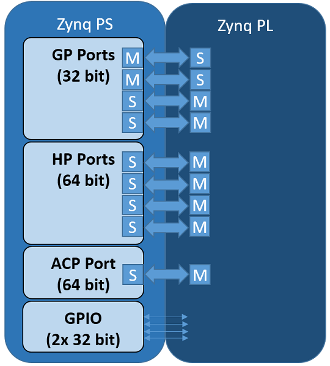

.. _pspl_interfaces:

PS/PL Interfaces
================

The Zynq has 9 AXI interfaces between the PS and the PL. On the PL side, there
are 4x AXI Master HP (High Performance) ports, 2x AXI GP (General Purpose) 
ports, 2x AXI Slave GP ports and 1x AXI Master ACP port. There are also GPIO 
controllers in the PS that are connected to the PL.

There are four ``pynq`` classes that are used to manage data movement between 
the Zynq PS (including the PS DRAM) and PL interfaces.

* GPIO - General Purpose Input/Output
* MMIO - Memory Mapped IO
* allocate - Memory allocation
* DMA  - Direct Memory Access

The class used depends on the Zynq PS interface the IP is connected to, and the
interface of the IP. 

Python code running on PYNQ can access IP connected to an AXI Slave connected 
to a GP port. *MMIO* can be used to do this. 

IP connected to an AXI Master port is not under direct control of the PS. The 
AXI Master port allows the IP to access DRAM directly. Before doing this, 
memory should be allocated for the IP to use. The *allocate* function can be
used to do this. 
For higher performance data transfer between PS DRAM and an IP, DMAs can be 
used. PYNQ provides a DMA class. 

When designing your own overlay, you need to consider the type of IP you need, 
and how it will connect to the PS. You should then be able to determine which 
classes you need to use the IP. 

PS GPIO
-------

There are 64 GPIO (wires) from the Zynq PS to PL. 

PS GPIO wires from the PS can be used as a very simple way to communicate between
PS and PL. For example, GPIO can be used as control signals for resets, or
interrupts.

IP does not have to be mapped into the system memory map to be connected to GPIO. 

More information about using PS GPIO can be found in the :ref:`pynq-libraries-psgpio` section.

MMIO
----

Any IP connected to the AXI Slave GP port will be mapped into the system memory
map. 
MMIO can be used read/write a memory mapped location. A MMIO read or write
command is a single transaction to transfer 32 bits of data to or from a memory
location. As burst instructions are not supported, MMIO is most appropriate for
reading and writing small amounts of data to/from IP connect to the AXI Slave 
GP ports. 

More information about using MMIO can be found in the :ref:`pynq-libraries-mmio` section.

allocate
--------

Memory must be allocated before it can be accessed by the IP. ``allocate`` allows
memory buffers to be allocated. The ``allocate`` function allocates a contiguous memory buffer which
allows efficient transfers of data between PS and PL. Python or other code
running in Linux on the PS can access the memory buffer directly.

As PYNQ is running Linux, the buffer will exist in the Linux virtual memory. The
Zynq AXI Slave ports allow an AXI-master IP in an overlay to access physical
memory. The numpy array returned can also provide the physical memory pointer to the buffer which
can be sent to an IP in the overlay. The physical address is stored in the
``device_address`` property of the allocated memory buffer instance. An IP in
an overlay can then access the same buffer using the physical address.

More information about using allocate can be found in the :ref:`pynq-libraries-allocate` section.

DMA
---

AXI stream interfaces are commonly used for high performance streaming applications. 
AXI streams can be used with Zynq AXI HP ports via a DMA. 

The ``pynq`` DMA class supports the `AXI Direct Memory Access IP
<https://www.xilinx.com/support/documentation/ip_documentation/axi_dma/v7_1/pg021_axi_dma.pdf>`_.
This allows data to be read from DRAM, and sent to an AXI stream, or received
from a stream and written to DRAM.

More information about using DMA can be found in the :ref:`pynq-libraries-dma` section.

Interrupt
---------

There are dedicated interrupts which are linked with asyncio events in
the python environment. To integrate into the PYNQ framework Dedicated
interrupts must be attached to an AXI Interrupt controller which is in turn
attached to the first interrupt line to the processing system. If more than 32
interrupts are required then AXI interrupt controllers can be cascaded. This
arrangement leaves the other interrupts free for IP not controlled by PYNQ
directly such as SDSoC accelerators.

Interrupts are managed by the Interrupt class, and the implementation is built
on top of *asyncio*, part of the Python standard library. 

More information about using the Interrupt class can be found in the 
:ref:`pynq-libraries-interrupt` section.

For more details on *asyncio*, how it can be used with PYNQ see
the :ref:`pynq-and-asyncio` section.

