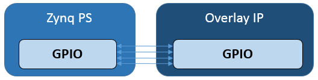

PS/PL Interfaces
================

There are four ``pynq`` classes that are used to manage data movement between the
Zynq PS (including the PS DRAM) and PL.

* MMIO - Memory Mapped IO
* Xlnk - Memory allocation
* DMA  - Direct Memory Access
* GPIO - General Purpose Input/Output

The class used depends on the Zynq PS interface the IP is connected to, and the
interface of the IP. Fore more information on these classes, please refer to
:ref:`pynq-libraries`.

GPIO
----

There are also GPIO, which are simple wires between PS and PL.  

GPIO wires from the PS can be used as a very simple way to communicate between
PS and PL. For example, GPIO can be used as control signals for resets, or
interrupts.

MMIO
----

MMIO can be used read/write a memory mapped location. A MMIO read or write
command can transfer 32 bits of data. MMIO is most appropriate for reading and
writing small amounts of data.

The following example sets up an MMIO instance to access memory location from
the ``IP_BASE_ADDRESS`` (0x40000000) to the ``IP_BASE_ADDRESS + ADDRESS RANGE``
(0x40001000).

Some data (e.g. ``0xdeadbeef``) is sent to location ``ADDRESS_OFFSET``
(0x10). ``ADDRESS_OFFSET`` is offset from the IP base address 
``IP_BASE_ADDRESS``. This means ``0xdeadbeef`` will be written to 
``0x40000010``.

The same location is then read and stored in ``result``. 

.. code-block:: Python

   IP_BASE_ADDRESS = 0x40000000
   ADDRESS_RANGE = 0x1000
   ADDRESS_OFFSET = 0x10
   
   from pynq import MMIO   
   mmio = MMIO(IP_BASE_ADDRESS, ADDRESS_RANGE) 

   data = 0xdeadbeef
   self.mmio.write(ADDRESS_OFFSET, data)
   result = self.mmio.read(ADDRESS_OFFSET)

This example assumes the memory mapped area defined for the MMIO, 
from ``0x40000000`` to ``0x40001000``, is accessible to the PS.

Xlnk
----

Memory must be allocated before it can be accessed by the IP. ``Xlnk`` allows
memory buffers to be allocated. Xlnk allocates a contiguous memory buffer which
allows efficient transfers of data between PS and PL. Python or other code
running in Linux on the PS can access the memory buffer directly.

As PYNQ is running Linux, the buffer will exist in the Linux virtual memory. The
Zynq AXI Slave ports allow an AXI-master IP in an overlay to access physical
memory. Xlnk can also provide the physical memory pointer to the buffer which
can be sent to an IP in the overlay. The physical address is stored in the
``physical_address`` property of the allocated memory buffer instance. An IP in
an overlay can then access the same buffer using the physical address.

For example, a program running on a MicroBlaze processor in an overlay may need
to write data to main memory so that it could be read in Python. First, the
memory can be allocated in Linux using Xlnk. Then the physical pointer is sent
to the MicroBlaze, and finally the MicroBlaze program and write data to the
memory buffer using the pointer.

Xlnk can allocate arrays using the Python ``NumPy`` package. This allows the data
type, and size/shape of the array to be specified using NumPy.

Xlnk is also used implicitly by the DMA class to allocate memory. 

Create an Xlnk instance and use ``cma_array()`` to allocate a *unsigned
32-bit int* contiguous block of memory of 5 elements:

Allocating the memory buffer:

   .. code-block:: Python

      from pynq import Xlnk
      import numpy as np

      xlnk = Xlnk()
      input_buffer = xlnk.cma_array(shape=(5,), dtype=np.uint32)

``physical_address`` property of the memory buffer:

   .. code-block:: Python
   
      input_buffer.physical_address

Writing data to the buffer:

   .. code-block:: Python
   
      for i in range(5):
          input_buffer[i] = i
          
      # Input buffer:  [0 1 2 3 4]

DMA
---

The ``pynq`` DMA class supports the `AXI Direct Memory Access IP
<https://www.xilinx.com/support/documentation/ip_documentation/axi_dma/v7_1/pg021_axi_dma.pdf>`_.
This allows data to be read from DRAM, and sent to an AXI stream, or received
from a stream and written to DRAM.

This example assumes the overlay contains two AXI Direct Memory Access IP, one
with a read channel from DRAM, and an AXI Master stream interface (for an output
stream), and the other with a write channel to DRAM, and an AXI Slave stream
interface (for an input stream). The two DMAs are connected in a loopback
configuration through an AXI FIFO.

In the Python code, two DMA instances are created, one for sending data, and the
other for receiving.

Two memory buffers, one for input, and the other for output are allocated. 

   .. code-block:: Python

      import pynq.lib.dma
      from pynq import Xlnk
      import numpy as np

      xlnk = Xlnk()

      dma_send = ol.axi_dma_from_ps_to_pl 
      dma_recv = ol.axi_dma_from_pl_to_ps 

      input_buffer = xlnk.cma_array(shape=(5,), dtype=np.uint32)
      output_buffer = xlnk.cma_array(shape=(5,), dtype=np.uint32)

Write some data to the array:

   .. code-block:: Python
   
      for i in range(5):
          input_buffer[i] = i 
      # Input buffer:  [0 1 2 3 4]

Transfer the input_buffer to the *send* DMA, and read back from the *recv* DMA
to the output buffer. The ``wait()`` method ensures the DMA transactions have
complete.

   .. code-block:: Python
      
      dma_send.sendchannel.transfer(input_buffer)
      dma_recv.recvchannel.transfer(output_buffer)
      dma_send.sendchannel.wait()
      dma_recv.recvchannel.wait()
      
      # Output buffer:  [0 1 2 3 4]

Interrupt
---------

Finally there are dedicated interrupts which are linked with asyncio events in
the python environment. To integrate into the PYNQ framework Dedicated
interrupts must be attached to an AXI Interrupt controller which is in turn
attached to the first interrupt line to the processing system. If more than 32
interrupts are required then AXI interrupt controllers can be cascaded. This
arrangement leaves the other interrupts free for IP not controlled by PYNQ
directly such as SDSoC accelerators.

The ``Interrupt`` class represents a single interrupt pin in the block
design. It mimics a python ``Event`` by having a single ``wait`` function that
blocks until the interrupt is raised. The event will be cleared automatically
when the interrupt is cleared. To construct an event, pass in fully qualified
path to the pin in the block diagram, e.g. ``'my_ip/interrupt'`` as the only
argument.

An interrupt is only enabled for as long there is a thread or coroutine wating
on the corresponding event. The recommended approach to using interrupts is to
wait in a loop, checking and clearing the interrupt registers in the IP before
resuming the wait. As an example, the AxiGPIO class uses this approach to wait
for a desired value to be present.

   .. code-block:: Python

      class AxiGPIO(DefaultIP):
          # Rest of class definition

          def wait_for_level(self, value):
              while self.read() != value:
                  self._interrupt.wait()
                  # Clear interrupt
                  self._mmio.write(IP_ISR, 0x1)

The implementation is built on top of asyncio, a newly added part of the python
standard library. For more details on asyncio, how it can be used with PYNQ see
the asyncio section of this documentation.

