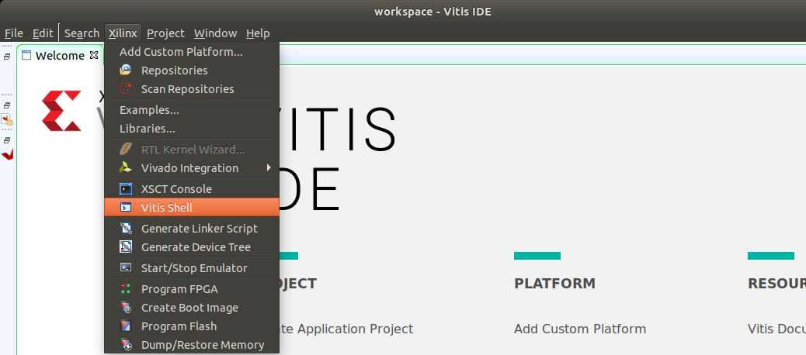
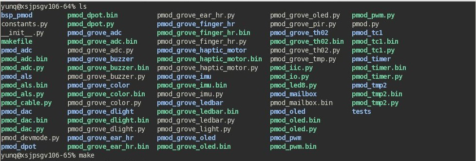
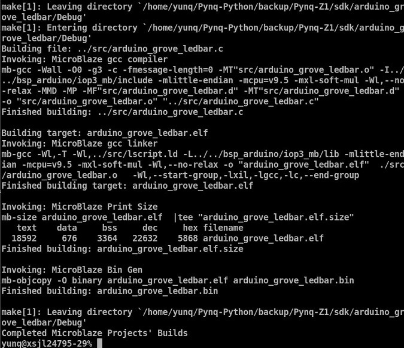
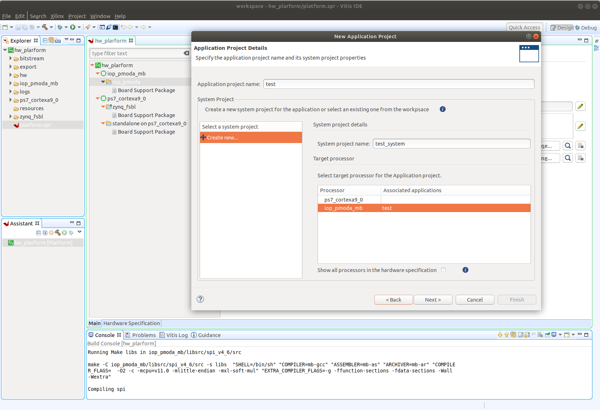

**************************
PYNQ MicroBlaze Subsystem
**************************

The PYNQ MicroBlaze subsystem gives flexibility to support a wide
range of hardware peripherals from Python. The PYNQ MicroBlaze is
intended as an offload processor, and can deal with the low level communication
protocols and data processing and provides data from a sensor that can be
accessed from Python. The subsystem is deterministic, and is suitable for
real-time control.

MicroBlaze applications will typically be developed in C or C++, and will run
bare-metal.

The following sections show how to develop applications for the MicroBlaze soft
processors running inside an overlay.

Memory Architecture
===================

Each PYNQ MicroBlaze has local memory (implemented in Xilinx BRAMs) and a 
connection to the PS DDR memory.

The PYNQ MicroBlaze instruction and data memory is implemented in a dual port 
Block RAM, with one port connected to the PYNQ MicroBlaze, and the other to 
the ARM processor. This allows an executable binary file to be written from 
the ARM to the PYNQ MicroBlaze instruction memory. The PYNQ MicroBlaze can 
also be reset by the ARM, allowing the PYNQ MicroBlaze to start executing 
the new program.

The PYNQ MicroBlaze data memory, either in local memory, or in DDR memory, 
can be used as a mailbox for communication and data exchanges between the 
ARM processor and the PYNQ MicroBlaze.

DDR memory is managed by the Linux kernel running on the Cortex-A9s.  Therefore,
the PYNQ MicroBlaze must first be allocated memory regions to access DRAM. The 
PYNQ  ``allocate`` function is used to allocate memory in Linux. It also provides
the  physical address of the memory. A PYNQ applications can send the physical 
address to a PYNQ MicroBlaze, and the PYNQ MicroBlaze can then access the 
buffer.

DDR Memory
----------

The PYNQ MicroBlazes are connected to the DDR memory via the General Purpose 
AXI slave port. This is a direct connection, so it is only suitable for simple 
data transfers from the PYNQ MicroBlaze. The MicroBlaze can attempt to read
or write the DDR as quickly as possible in a loop, but there is no support for
bursts, or streaming data.

PYNQ MicroBlaze Memory Map
--------------------------

The local PYNQ MicroBlaze memory is 64KB of shared data and instruction 
memory. Instruction memory for the PYNQ MicroBlaze starts at address 0x0.

PYNQ and the application running on the PYNQ MicroBlaze can write to anywhere 
in the shared memory space. You should be careful not to write to the 
instruction memory unintentionally as this will corrupt the running application.

When building the MicroBlaze project, the compiler will only ensure that 
*allocated* stack and heap of the application fit into the BRAM and DDR if
used. For communication between the ARM and the MicroBlaze, a part of the 
shared memory space must also be reserved within the MicroBlaze address space.

There is no memory management in the PYNQ MicroBlaze. You must ensure the 
application, including stack and heap, do not overflow into the defined data 
area. Remember that declaring a stack and heap size only allocates space to 
the stack and heap. No boundary is created, so if sufficient space was not 
allocated, the stack and heap may overflow and corrupt your application.

If you need to modify the stack and heap for an application, the linker script
can be found in the ``<project_directory>/src/`` directory.

It is recommended to follow the same convention for data communication between
the two processors via a MAILBOX.

   ================================= ========
   Instruction and data memory start 0x0
   Instruction and data memory size  0xf000
   Shared mailbox memory start       0xf000
   Shared mailbox memory size        0x1000
   Shared mailbox Command Address    0xfffc
   ================================= ========
   
These MAILBOX values for a PYNQ MicroBlaze application are defined here:

.. code-block:: console

   <PYNQ repository>/boards/sw_repo/pynqmb/src/circular_buffer.h
   
The corresponding Python constants are defined here:
   
.. code-block:: console

   <PYNQ repository>/pynq/lib/pmod/constants.py
   <PYNQ repository>/pynq/lib/arduino/constants.py
   <PYNQ repository>/pynq/lib/rpi/constants.py

The following example explains how Python could initiate a read from a 
peripheral connected to a PYNQ MicroBlaze. 

1. Python writes a read command (e.g. 0x3) to the mailbox command address
   (0xfffc).
2. MicroBlaze application checks the command address, and reads and decodes the
   command.
3. MicroBlaze performs a read from the peripheral and places the data at the
   mailbox base address (0xf000).
4. MicroBlaze writes 0x0 to the mailbox command address (0xfffc) to confirm
   transaction is complete.
5. Python checks the command address (0xfffc), and sees that the MicroBlaze has
   written 0x0, indicating the read is complete, and data is available.
6. Python reads the data in the mailbox base address (0xf000), completing the
   read.

Running Code on Different MicroBlazes
-------------------------------------

The MicroBlaze local BRAM memory is mapped into the MicroBlaze address space,
and also to the ARM address space.  These address spaces are independent, so 
the local memory will be located at different addresses in each memory space. 
Some example mappings are shown below to highlight the address translation 
between MicroBlaze and ARM's memory spaces.

=======================   =========================   ============================
MicroBlaze Base Address    MicroBlaze Address Space    ARM Equivalent Address Space
=======================   =========================   ============================
0x4000_0000               0x0000_0000 - 0x0000_ffff   0x4000_0000 - 0x4000_ffff
0x4200_0000               0x0000_0000 - 0x0000_ffff   0x4200_0000 - 0x4200_ffff
0x4400_0000               0x0000_0000 - 0x0000_ffff   0x4400_0000 - 0x4400_ffff
=======================   =========================   ============================

Note that each MicroBlaze has the same range for its address space. However, 
the location of the address space in the ARM memory map is different for each
PYNQ MicroBlaze. As the MicroBlaze address space is the same for each PYNQ 
MicroBlaze, any binary compiled for one PYNQ MicroBlaze will work on another 
PYNQ MicroBlaze.

For example, suppose a PYNQ MicroBlaze exists at 0x4000_0000, and a second 
PYNQ MicroBlaze exists at 0x4200_0000. The same binary can run on the first
PYNQ MicroBlaze by writing the binary from python to the address space 
``0x4000_0000``, and on the second PYNQ MicroBlaze by writing to 
``0x4200_0000``.

Building Applications
=====================

   
There are a number of steps required before you can start writing your own
software for a PYNQ MicroBlaze. This document will describe the PYNQ MicroBlaze
architecture, and how to set up and build the required software projects to
allow you to write your own application for the MicroBlaze inside an
PYNQ MicroBlaze. 

Vitis projects can be created manually using the Vitis 
GUI, or software can be built using a Makefile flow. Starting from image v2.1, 
users can also directly use the Jupyter notebook to program the PYNQ 
MicroBlaze; more examples can be found in

.. code-block:: console

   <PYNQ dashboard>/base/microblaze

MicroBlaze Processors
---------------------

As described in the previous section, a PYNQ MicroBlaze can be used as a 
flexible controller for different types of external peripherals. The 
ARM® Cortex®-A9 is an application processor, which runs PYNQ and Jupyter 
notebook on a Linux OS. This scenario is not well suited to real-time 
applications, which is a common requirement for an embedded systems. 
In the base overlay there are three PYNQ MicroBlazes. As well as acting as a 
flexible controller, a PYNQ MicroBlaze can be used as dedicated real-time 
controller.

PYNQ MicroBlazes can also be used standalone to offload some processing from 
the main processor. However, note that the MicroBlaze processor inside a PYNQ 
MicroBlaze in the base overlay is running at 100 MHz, compared to the Dual-Core 
ARM Cortex-A9 running at 650 MHz. The clock speed, and different processor 
architectures and features should be taken into account when offloading pure 
application code. e.g. Vector processing on the ARM Cortex-A9 Neon processing 
unit will be much more efficient than running on the MicroBlaze. The MicroBlaze 
is most appropriate for low-level, background, or real-time applications.

     
Software Requirements
---------------------

`Xilinx Vitis Unified Software Platform
<https://www.xilinx.com/products/design-tools/vitis/vitis-platform.html>`_
contains the MicroBlaze cross-compiler which can be used to build software for
the MicroBlaze inside a PYNQ MicroBlaze. `Vitis Unified Software Platform
<https://www.xilinx.com/products/design-tools/vitis/vitis-platform.html>`_ is 
available for free and includes Vivado.

The full source code for all supported PYNQ MicroBlaze peripherals is available 
from the project GitHub. PYNQ ships with precompiled PYNQ MicroBlaze 
executables to support various peripherals (see :ref:`pynq-libraries`), 
so Xilinx software is only needed if you intend to modify existing code, or 
build your own PYNQ MicroBlaze applications/peripheral drivers.

PYNQ releases are built using:

================  ================
Release version    Vivado and SDK
================  ================
v1.4               2015.4
v2.0               2016.1
v2.1               2017.4
v2.5               2019.1
v2.6               2020.1 (Vitis)
================  ================

It is recommended
to use the same version to rebuild existing Vivado and Vitis projects. Note that 
for older PYNQ versions Vivado and SDK are required. Since 2019.2, SDK was integrated
in Vitis. The Vitis installation provides Vivado as well.

Compiling Projects
------------------

Software executables run on the MicroBlaze inside a PYNQ MicroBlaze. Code for 
the MicroBlaze can be written in C or C++ and compiled using Vitis.

You can pull or clone the PYNQ repository, and all the driver source and
project files can be found in 
``<PYNQ repository>\pynq\lib\<driver_group_name>\<project_directory>``.

Vitis Application, Board Support Package, Hardware Platform
^^^^^^^^^^^^^^^^^^^^^^^^^^^^^^^^^^^^^^^^^^^^^^^^^^^^^^^^^^^

Each Vitis application project requires a BSP project (Board Support Package), 
and a hardware platform project. The application project will include the user 
code (C/C++). The Application project is linked to a BSP. The BSP (Board 
Support Package) contains software libraries and drivers to support the 
underlying peripherals in the system.

Internally, the BSP is linked to a Hardware Platform. A Hardware Platform 
defines the peripherals in the PYNQ MicroBlaze subsystem, and the memory map of 
the system. It is used by the BSP to build software libraries to support the 
underlying hardware.

All *Application* projects can be compiled from the command line using 
makefiles, or imported into the Vitis GUI.

You can also use existing projects as a starting point to create your own
project.

Board Support Package
^^^^^^^^^^^^^^^^^^^^^

A Board Support Package (BSP) includes software libraries for peripherals in 
the system. For example, the Vitis projects for Pmod and Arduino peripherals 
require the following 2 BSPs:

BSP for the Arduino PYNQ MicroBlaze:

    ``<PYNQ repository>/pynq/lib/arduino/bsp_iop_arduino/``
    
BSP for the Pmod PYNQ MicroBlaze:

    ``<PYNQ repository>/pynq/lib/pmod/bsp_iop_pmod``

A BSP is specific to a processor subsystem. There can be many BSPs associated
with an overlay, depending on the types of processors available in the
system.

An application for the Pmod PYNQ MicroBlaze will be linked to the Pmod PYNQ 
MicroBlaze BSP. As the two Pmod PYNQ MicroBlazes are identical, an application 
written for one Pmod PYNQ MicroBlaze can run on the other Pmod PYNQ MicroBlaze. 

An Arduino application will be linked to the Arduino PYNQ MicroBlaze BSP.

Building the Projects
^^^^^^^^^^^^^^^^^^^^^

To build all the software projects, for example,
you can run the corresponding makefile:

    ``<PYNQ repository>/pynq/lib/arduino/makefile``
    
    ``<PYNQ repository>/pynq/lib/pmod/makefile``

Application projects for peripherals that ship with PYNQ (e.g. Pmod and Arduino
peripherals) can also be found in the same location. Each project is contained
in a separate folder.
   
The makefile compiles the application projects based on the BSP provided 
in the correct location.

The makefile requires Vitis to be installed, and can be run from Windows, or
Linux.

To run ``make`` from Windows, open Vitis, and choose a temporary workspace (make
sure this path is external to the downloaded PYNQ repository). From the
*Xilinx* menu, select *Vitis Shell*.

In Linux, open a terminal, and source the Vitis tools.

From either the Windows Shell, or the Linux terminal, navigate to the sdk 
folder in your local copy of the PYNQ repository:

The following example shows how to run ``make`` in 
``<PYNQ repository>/pynq/lib/pmod/``:

This will clean all the existing compiled binaries (bin files), and rebuild all
the application projects.

   

If you examine the makefile, you can see that *BIN_PMOD* variable at the top 
of the makefile includes all the bin files required by Pmod peripherals. 
If you want to add your own custom project to the build process, you need to 
add the project name to the *BIN_PMOD* variable, and save the project in the 
same location as the other application projects.

Similarly, you have to follow the same steps to build Arduino application 
projects.

In addition, individual projects can be built by navigating to the 
``<project_directory>/Debug`` and running ``make``.

Binary Files
^^^^^^^^^^^^

Compiling code produces an executable file (.elf) along with its 
binary format (.bin) to be downloaded to a PYNQ MicroBlaze.

A .bin file can be generated from a .elf by running the following command from
the Vitis shell:

    ``mb-objcopy -O binary <input_file>.elf <output_file>.bin``

This is done automatically by the makefile for the existing application
projects. The makefile will also copy all .bin files into the 
``<PYNQ repository>/pynq/lib/<driver_group_name>/`` folder.

Creating Your Own Project
^^^^^^^^^^^^^^^^^^^^^^^^^

Using the makefile flow, you can use an existing project as a starting point 
for your own project.

Copy and rename the project, and modify or replace the .c file in the src/ with
your C code. The generated .bin file will have the same base name as your C
file.

For example, if your C code is ``my_peripheral.c``, the generated .elf and .bin 
will be ``my_peripheral.elf`` and ``my_peripheral.bin``.

The naming convention recommended for peripheral applications is
``<pmod|arduino>_<peripheral>``.

You will need to update references from the old project name to your new 
project name in ``<project_directory>/Debug/makefile`` and 
``<project_directory>/Debug/src/subdir.mk``.

If you want your project to build in the main makefile, you should also append
the .bin name of your project to the *BIN_PMOD* (or *BIN_ARDUINO*) variable at 
the top of the makefile.

If you are using the Vitis GUI, you can import the fixed Hardware Platform, BSP, and 
any application projects into your Vitis workspace. Select MicroBlaze as the target 
processor in the when creating the application.

The Vitis GUI can be used to build and debug your code.  

Writing Applications
====================

The previous section described the software architecture and the software build
process. This section will cover how to write the PYNQ MicroBlaze application 
and also the corresponding Python interface.

The section assumes that the hardware platform and the BSPs have already been
generated as detailed in the previous section.

Header Files and Libraries
--------------------------

A library is provided for the PYNQ MicroBlaze which includes an API for local 
peripherals (IIC, SPI, Timer, UART, GPIO), the configurable switch, links to 
the peripheral addresses, and mappings for the mailbox used in the existing 
PYNQ MicroBlaze peripheral applications provided with PYNQ. This library can be 
used to write custom PYNQ MicroBlaze applications.

The PYNQ MicroBlaze can deploy a configurable IO switch.
It allows the IO pins to be connected to various types of controllers.
The header files associated with the corresponding configurable 
switch can be found:

:: 
   
   <PYNQ repository>/boards/ip/io_switch_1.1/drivers/io_switch_v1_0/src

The PYNQ MicroBlaze has a dedicated library `pynqmb`. It wraps 
up low-level functions for ease of use. The header files can be found

:: 
   
   <PYNQ repository>/boards/sw_repo/pynqmb/src

To use these files in a PYNQ MicroBlaze application, include these header 
file(s) in the C program.

For example:

.. code-block:: c

   #include "xio_switch.h"
   #include "circular_buffer.h"
   #include "gpio.h"

   
Controlling the IO Switch
-------------------------

The IO switch needs to be configured by the PYNQ MicroBlaze 
application before any peripherals can be used. This can be done statically 
from within the application, or the application can allow Python to write a 
switch configuration to shared memory, which can be used to configure the 
switch.

For Pmod, there are 8 data pins that can be connected to GPIO, SPI, IIC, 
or Timer. For Arduino, there are 20 shared data pins that can be connected to 
GPIO, UART, SPI, or Timer. For RPi, there are 28 shared data pins that can be
connected to GPIO, UART, SPI, or Timer.

The following function, part of the provided IO switch driver (`xio_switch.h`),
can be used to configure the switch from a PYNQ MicroBlaze 
application.

.. code-block:: c

   void init_io_switch(void);
   void set_pin(int pin_number, u8 pin_type);

The function `init_io_switch()` will just set all the pins to GPIO by default.
Then users can call `set_pin()` to configure each individual pin.
The valid values for the parameter `pin_type` are defined as:

============  ======= 
 Pin          Value  
============  =======
 GPIO          0x00
 UART0_TX      0x02
 UART0_RX      0x03   
 SPICLK0       0x04   
 MISO0         0x05   
 MOSI0         0x06   
 SS0           0x07   
 SPICLK1       0x08   
 MISO1         0x09   
 MOSI1         0x0A   
 SS1           0x0B   
 SDA0          0x0C   
 SCL0          0x0D   
 SDA1          0x0E   
 SCL1          0x0F   
 PWM0          0x10   
 PWM1          0x11   
 PWM2          0x12   
 PWM3          0x13   
 PWM4          0x14   
 PWM5          0x15   
 TIMER_G0      0x18   
 TIMER_G1      0x19   
 TIMER_G2      0x1A   
 TIMER_G3      0x1B   
 TIMER_G4      0x1C   
 TIMER_G5      0x1D   
 TIMER_G6      0x1E   
 TIMER_G7      0x1F   
 UART1_TX      0x22   
 UART1_RX      0x23   
 TIMER_IC0     0x38   
 TIMER_IC1     0x39   
 TIMER_IC2     0x3A   
 TIMER_IC3     0x3B   
 TIMER_IC4     0x3C   
 TIMER_IC5     0x3D   
 TIMER_IC6     0x3E   
 TIMER_IC7     0x3F   
============  =======

For example:

.. code-block:: c

   init_io_switch();
   set_pin(0, SS0);
   set_pin(1, MOSI0);
   set_pin(3, SPICLK0);
   
This would connect a SPI interface:

* Pin 0: SS0
* Pin 1: MOSI0
* Pin 2: GPIO
* Pin 3: SPICLK0
* Pin 4: GPIO
* Pin 5: GPIO
* Pin 6: GPIO
* Pin 7: GPIO

IO Switch Modes and Pin Mapping
-------------------------------
Note that the IO switch IP is a customizable IP can be configured by users 
inside a Vivado project (by double clicking the IP icon of the IO switch). 
There are 4 pre-defined modes (`pmod`, `dual pmod`, `arduino`, `raspberrypi`) 
and 1 fully-customizable mode (`custom`) for users to choose. 
In the base overlay, we have only used `pmod` and `arduino` as the IO switch 
modes.

Switch mappings used for Pmod:

=======  ======  ============  ======  ============  ========  ====  =============
                                                                            
Pin      GPIO     UART          PWM     Timer         SPI       IIC   Input-Capture  
                                                                             
=======  ======  ============  ======  ============  ========  ====  =============
D0       GPIO    UART0_RX/TX   PWM0     TIMER_G0      SS0              TIMER_IC0
D1       GPIO    UART0_RX/TX   PWM0     TIMER_G0      MOSI0            TIMER_IC0
D2       GPIO    UART0_RX/TX   PWM0     TIMER_G0      MISO0    SCL0    TIMER_IC0   
D3       GPIO    UART0_RX/TX   PWM0     TIMER_G0      SPICLK0  SDA0    TIMER_IC0
D4       GPIO    UART0_RX/TX   PWM0     TIMER_G0      SS0              TIMER_IC0
D5       GPIO    UART0_RX/TX   PWM0     TIMER_G0      MOSI0            TIMER_IC0
D6       GPIO    UART0_RX/TX   PWM0     TIMER_G0      MISO0    SCL0    TIMER_IC0 
D7       GPIO    UART0_RX/TX   PWM0     TIMER_G0      SPICLK0  SDA0    TIMER_IC0                
=======  ======  ============  ======  ============  ========  ====  =============

Note:

- PWM0, TIMER_G0, TIMER_IC0 can only be used once on any pin.
- UART0_TX/RX is supported by Pmod, but not implemented in the base overlay.
- SS0, MOSI0, MISO0, SPICLK0 can either be used on top-row (pins D0 - D3) or 
  bottom-row (D4 - D7) but not both.
- SCL0, SDA0 can either be used on to-row (pins D2 - D3) or 
  bottom-row (D6 - D7) but not both.

Switch mappings used for Arduino:

=======  ======  ============  ======  ============  ========  ====  =============
                                                                     
Pin      GPIO     UART          PWM     Timer         SPI       IIC   Input-Capture  
                                                                     
=======  ======  ============  ======  ============  ========  ====  =============
D0       GPIO    UART0_RX                                                         
D1       GPIO    UART0_TX                                                         
D2       GPIO                                                                  
D3       GPIO                  PWM0    TIMER_G0                      TIMER_IC0
D4       GPIO                          TIMER_G6                      TIMER_IC6
D5       GPIO                  PWM1    TIMER_G1                      TIMER_IC1
D6       GPIO                  PWM2    TIMER_G2                      TIMER_IC2 
D7       GPIO                                                                   
D8       GPIO                          TIMER_G7                      TIMER_IC7
D9       GPIO                  PWM3    TIMER_G3                      TIMER_IC3
D10      GPIO                  PWM4    TIMER_G4      SS0             TIMER_IC4
D11      GPIO                  PWM5    TIMER_G5      MOSI0           TIMER_IC5
D12      GPIO                                        MISO0                       
D13      GPIO                                        SPICLK0                     
D14/A0   GPIO                                                               
D15/A1   GPIO                                                               
D16/A2   GPIO                                                               
D17/A3   GPIO                                                               
D18/A4   GPIO                                                               
D19/A5   GPIO     
=======  ======  ============  ======  ============  ========  ====  =============

Note:

- On Arduino, a dedicated pair of pins are connected to IIC
  (not going through the IO switch).

  
Switch mappings used for dual Pmod:

=======  ======  ============  ======  ============  ========  ====  =============
                                                                                           
Pin      GPIO     UART          PWM     Timer         SPI       IIC   Input-Capture  
                                                                            
=======  ======  ============  ======  ============  ========  ====  =============
D0       GPIO    UART0_RX/TX   PWM0    TIMER_G0      SS0               TIMER_IC0 
D1       GPIO    UART0_RX/TX   PWM0    TIMER_G0      MOSI0             TIMER_IC0
D2       GPIO    UART0_RX/TX   PWM0    TIMER_G0      MISO0     SCL0    TIMER_IC0     
D3       GPIO    UART0_RX/TX   PWM0    TIMER_G0      SPLCLK0   SDA0    TIMER_IC0
D4       GPIO    UART0_RX/TX   PWM0    TIMER_G0      SS0               TIMER_IC0
D5       GPIO    UART0_RX/TX   PWM0    TIMER_G0      MOSI0             TIMER_IC0
D6       GPIO    UART0_RX/TX   PWM0    TIMER_G0      MISO0     SCL0    TIMER_IC0
D7       GPIO    UART0_RX/TX   PWM0    TIMER_G0      SPICLK0   SDA0    TIMER_IC0
=======  ======  ============  ======  ============  ========  ====  =============

=======  ======  ============  ======  ============  ========  ====  =============
                                                                                           
Pin      GPIO     UART          PWM     Timer         SPI       IIC   Input-Capture  
                                                                            
=======  ======  ============  ======  ============  ========  ====  =============
D0       GPIO    UART0_RX/TX   PWM0    TIMER_G1      SS1               TIMER_IC1
D1       GPIO    UART0_RX/TX   PWM0    TIMER_G1      MOSI1             TIMER_IC1
D2       GPIO    UART0_RX/TX   PWM0    TIMER_G1      MISO1     SCL1    TIMER_IC1
D3       GPIO    UART0_RX/TX   PWM0    TIMER_G1      SPICLK1   SDA1    TIMER_IC1
D4       GPIO    UART0_RX/TX   PWM0    TIMER_G1      SS1               TIMER_IC1
D5       GPIO    UART0_RX/TX   PWM0    TIMER_G1      MOSI1             TIMER_IC1
D6       GPIO    UART0_RX/TX   PWM0    TIMER_G1      MISO1     SCL1    TIMER_IC1
D7       GPIO    UART0_RX/TX   PWM0    TIMER_G1      SPICLK1   SDA1    TIMER_IC1
=======  ======  ============  ======  ============  ========  ====  =============

Note:

- PWM0, TIMER_G0, TIMER_IC0 can only be used once on any pin of D0 - D7.
- PWM0, TIMER_G1, TIMER_IC1 can only be used once on any pin of D8 - D15.
- SS0, MOSI0, MISO0, SPICLK0 can either be used on top-row (pins D0 - D3) or 
  bottom-row (D4 - D7) but not both.
- SS1, MOSI1, MISO1, SPICLK1 can either be used on top-row (pins D8 - D11) or 
  bottom-row (D12 - D15) but not both.
- SCL0, SDA0 can either be used on to-row (pins D2 - D3) or 
  bottom-row (D6 - D7) but not both.
- SCL1, SDA1 can either be used on to-row (pins D10 - D11) or 
  bottom-row (D14-D15) but not both.

Switch mappings used for Raspberry Pi:

=======  ======  ========  ======  ============  ========  ====  =============
                                                                                               
Pin      GPIO     UART      PWM     Timer         SPI       IIC   Input-Capture  
                                                                                         
=======  ======  ========  ======  ============  ========  ====  =============
GPIO0     GPIO                                             SDA0 
GPIO1     GPIO                                             SCL0
GPIO2     GPIO                                             SDA1
GPIO3     GPIO                                             SCL1
GPIO4     GPIO                                                    
GPIO5     GPIO                                                    
GPIO6     GPIO                                                    
GPIO7     GPIO                                    SS0             
GPIO8     GPIO                                    SS0             
GPIO9     GPIO                                    MISO0           
GPIO10    GPIO                                    MOSI0           
GPIO11    GPIO                                    SPICLK0         
GPIO12    GPIO              PWM0
GPIO13    GPIO              PWM1
GPIO14    GPIO   UART0_TX
GPIO15    GPIO   UART0_RX
GPIO16    GPIO                                    SS1
GPIO17    GPIO
GPIO18    GPIO
GPIO19    GPIO                                    MISO1
GPIO20    GPIO                                    MOSI1
GPIO21    GPIO                                    SPICLK1
GPIO22    GPIO
GPIO23    GPIO
GPIO24    GPIO
GPIO25    GPIO
=======  ======  ========  ======  ============  ========  ====  =============

Note:

- SPI0 can have up to two Slave Selects (SS's). SS0 can be used to program the
  functionality for the IO switch.

PYNQ MicroBlaze Example
-----------------------

MicroBlaze C Code
^^^^^^^^^^^^^^^^^

Taking Pmod ALS as an example PYNQ MicroBlaze driver (used to control the 
Pmod light sensor):

``<PYNQ repository>/pynq/lib/pmod/pmod_als/src/pmod_als.c``

First note that the `pynqmb` header files are included.

.. code-block:: c

   #include "spi.h"
   #include "timer.h"
   #include "circular_buffer.h"
   
Next, some constants for commands are defined. These values can be chosen 
properly. The corresponding Python code will send the appropriate command 
values to control the PYNQ MicroBlaze application.

By convention, 0x0 is reserved for no command (idle, or acknowledged); then 
PYNQ MicroBlaze commands can be any non-zero value.

   
.. code-block:: c

   // MAILBOX_WRITE_CMD
   #define READ_SINGLE_VALUE 0x3
   #define READ_AND_LOG      0x7
   // Log constants
   #define LOG_BASE_ADDRESS (MAILBOX_DATA_PTR(4))
   #define LOG_ITEM_SIZE sizeof(u32)
   #define LOG_CAPACITY  (4000/LOG_ITEM_SIZE)

The ALS peripheral has as SPI interface. An SPI variable is defined and 
accessible to the remaining part of the program.

.. code-block:: c

   spi device;

The user defined function `get_sample()` calls `spi_transfer()`
to read data from the device.

  
.. code-block:: c

   u32 get_sample(){
      /* 
      ALS data is 8-bit in the middle of 16-bit stream. 
      Two bytes need to be read, and data extracted.
      */
      u8 raw_data[2];
      spi_transfer(device, NULL, (char*)raw_data, 2);
      return ( ((raw_data[1] & 0xf0) >> 4) + ((raw_data[0] & 0x0f) << 4) );
   }

In ``main()`` notice that no IO switch related functions are called; this is
because those functions are performed under the hood automatically by 
`spi_open()`. Also notice this application does not allow the switch
configuration to be modified from Python. This means that if you want to use
this code with a different pin configuration, the C code must be modified and
recompiled.
   
.. code-block:: c

   int main(void)
   {
      int cmd;
      u16 als_data;
      u32 delay;

      device = spi_open(3, 2, 1, 0);

      // to initialize the device
      get_sample();

      
Next, the ``while(1)`` loop continually checks the ``MAILBOX_CMD_ADDR`` for a
non-zero command. Once a command is received from Python, the command is
decoded, and executed.

.. code-block:: c

      // Run application
      while(1){

         // wait and store valid command
         while((MAILBOX_CMD_ADDR & 0x01)==0);
         cmd = MAILBOX_CMD_ADDR;

Taking the first case, reading a single value; ``get_sample()`` is called and a
value returned to the first position (0) of the ``MAILBOX_DATA``.

``MAILBOX_CMD_ADDR`` is reset to zero to acknowledge to the ARM processor that
the operation is complete and data is available in the mailbox.

Remaining code:

.. code-block:: c
         
      switch(cmd){
       
        case READ_SINGLE_VALUE:
      // write out reading, reset mailbox
      MAILBOX_DATA(0) = get_sample();
      MAILBOX_CMD_ADDR = 0x0;

      break;

         case READ_AND_LOG:
       // initialize logging variables, reset cmd
       cb_init(&circular_log, 
         LOG_BASE_ADDRESS, LOG_CAPACITY, LOG_ITEM_SIZE, 1);
       delay = MAILBOX_DATA(1);
       MAILBOX_CMD_ADDR = 0x0; 

            do{
               als_data = get_sample();
           cb_push_back(&circular_log, &als_data);
           delay_ms(delay);

            } while((MAILBOX_CMD_ADDR & 0x1)== 0);

            break;

         default:
            // reset command
            MAILBOX_CMD_ADDR = 0x0;
            break;
      }
   }
   return(0);
 }

Python Code
^^^^^^^^^^^

With the PYNQ MicroBlaze Driver written, the Python class can be built to 
communicate with that PYNQ MicroBlaze.
 
``<PYNQ repository>/pynq/lib/pmod/pmod_als.py``
  
First the Pmod package is imported:

.. code-block:: python

   from . import Pmod

Then some other constants are defined:
   
.. code-block:: python

    PMOD_ALS_PROGRAM = "pmod_als.bin"
    PMOD_ALS_LOG_START = MAILBOX_OFFSET+16
    PMOD_ALS_LOG_END = PMOD_ALS_LOG_START+(1000*4)
    RESET = 0x1
    READ_SINGLE_VALUE = 0x3
    READ_AND_LOG = 0x7

The MicroBlaze binary file for the PYNQ MicroBlaze is defined. This is the 
application executable, and will be loaded into the PYNQ MicroBlaze instruction 
memory.

The ALS class and an initialization method are defined:

.. code-block:: python

   class Pmod_ALS(object):
   
      def __init__(self, mb_info):

The initialization function for the module requires the MicroBlaze information.
The ``__init__`` is called when a module is initialized. For example, 
from Python:

.. code-block:: python

    from pynq.lib.pmod import Pmod_ALS
    from pynq.lib.pmod import PMODA
    als = Pmod_ALS(PMODA)

This will create a ``Pmod_ALS`` instance, and load the MicroBlaze executable
(``PMOD_ALS_PROGRAM``) into the instruction memory of the specified PYNQ 
MicroBlaze.

Since the MicroBlaze information, imported as Pmod constants, can also be 
extracted as an attribute of the overlay, the following code also works:

.. code-block:: python

    from pynq.overlays.base import BaseOverlay
    base = BaseOverlay("base.bit")
    als = Pmod_ALS(base.PMODA)

In the initialization method, an instance of the ``Pmod`` class is
created. This ``Pmod`` class controls the basic functionalities of the 
MicroBlaze processor, including reading commands/data, and writing 
commands/data.

Internally, when the ``Pmod`` class is initialized, the ``run()`` call pulls 
the PYNQ MicroBlaze out of reset. After this, the PYNQ MicroBlaze will be 
running the ``pmod_als.bin`` executable.

The ``read()`` method in the ``Pmod_ALS`` class will read an ALS sample and 
return that value to the caller. The following steps demonstrate a Python to
MicroBlaze read transaction specific to the ``Pmod_ALS`` class.

.. code-block:: python

    def read(self):

First, the command is written to the MicroBlaze shared memory. In this case 
the value ``READ_SINGLE_VALUE`` represents a command value. This value
is user defined in the Python code, and must match the value the C program
expects for the same function.

.. code-block:: python

    self.microblaze.write_blocking_command(READ_SINGLE_VALUE)

The command is blocking so that Python code will not proceed unless an 
acknowledgment has been received from the  MicroBlaze. Internally, after the 
PYNQ MicroBlaze has finished its task, it will write ``0x0`` to clear the 
command area. The Python code checks this command area (in this case, the Python code 
constantly checks whether the ``0x3`` value is still present at the 
``CMD_OFFSET``).
            
Once the command is no longer ``0x3`` (the acknowledge has been received), the
result is read from the data area of the shared memory ``MAILBOX_OFFSET``.

.. code-block:: python

    data = self.microblaze.read_mailbox(0)
    return data

