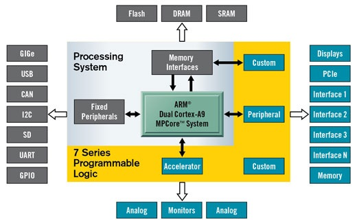

Introduction to Overlays
============================
   
Overlay Concept
---------------------

The Xilinx® Zynq® All Programmable device is an SOC based on a dual-core ARM® Cortex®-A9 processor (referred to as the *Processing System* or **PS**), integrated with FPGA fabric (referred to as  *Programmable Logic* or **PL**). The *PS* subsystem includes a number of dedicated peripherals (memory controllers, USB, Uart, IIC, SPI etc) and can be extended with additional hardware IP in a *PL* Overlay. 

Overlays, or hardware libraries, are programmable/configurable FPGA designs that extend the user application from the Processing System of the Zynq into the Programmable Logic. Overlays can be used to accelerate a software application, or to customize the hardware platform for a particular application.

For example, image processing is a typical application where the FPGAs can provide acceleration. A software programmer can use an overlay in a similar way to a software library to run some of the image processing functions (e.g. edge detect, thresholding etc.) on the FPGA fabric. 
Overlays can be loaded to the FPGA dynamically, as required, just like a software library. In this example, separate image processing functions could be implemented in different overlays and loaded from Python on demand.

PYNQ provides a Python interface to allow overlays in the *PL* to be controlled from Python running in the *PS*. FPGA design is a specialized task which requires hardware engineering knowledge and expertise. PYNQ overlays are created by hardware designers, and wrapped with this PYNQ Python API. Software developers can then use the Python interface to program and control specialized hardware overlays without needing to design an overlay themselves. This is analogous to software libraries created by expert developers which are then used by many other software developers working at the application level. 
