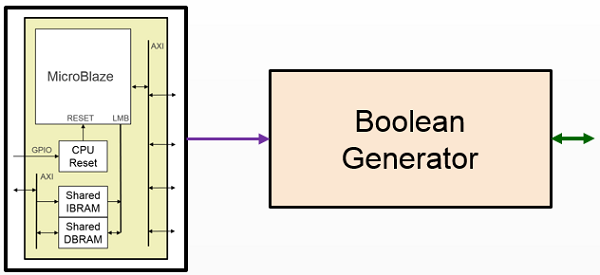
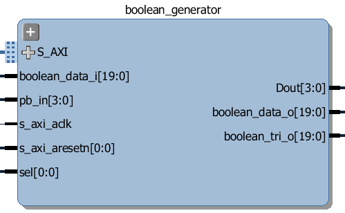

Boolean Generator
============================

The Boolean Generator can generate combinatorial Boolean logic functions from custom hardware. Functions of up to 5 inputs with 1 output are supported. External IO and internal signals can be used as inputs/outputs. 

The Boolean Generator is controlled from a MicroBlaze subsystem which loads the configuration to implement the logic functions. AND, OR, NOT, XOR are supported. 

Supports up to 24 5-input CFGLUTs, one for each output pin. The 24 outputs can be connected to 20 Arduino pins and 4 LEDs. A particular pin may not output in which case corresponding CFGLUT is not connected. Each CFGLUT can have 5 inputs from 24 input pins; 20 Arduino and 4 Push buttons. The 4 push-buttons are debounced before connected to the engine. A pin/PB is connected to a CFGLUT input through writing 5-bit value between 0 and 23. If a CFGLUT does not use all five inputs then they can be tied to logic 0 by programming 0x1f as the input selector in the corresponding position of the CFGLUT. When the overlay is loaded and the logictools is instantiated, all CFGLUTs are programmed to have Y=D4 & D3 & D2 & D1 & D0 function (Dx is input to CFGLUT). Note output is not routed to pins as all machines are in RESET state when instantiated. They are driven only when engines are in RUN state.

Usage
--------------

The Boolean Generator class is instantiated by importing it from the logictools subpackage: 

.. code-block:: Python

   from pynq.lib.logictools import BooleanGenerator

   bg = BooleadGenerator(Arduino)

The Boolean Generator module includes the following methods:

.. code-block:: Python

   ???

Ports
------------

The ports for the Boolean Generator can be seen on the following image:

* s_axi - axi connection to MicroBlaze subsystem that controls this block
* s_axi_clk - clock for s_axi interface
* s_axi_resetn - reset for s_axi interface

* boolean_data_i - input wires from external IO
* pb_in - ??? Additional input wires
* sel - ??? Enables the block 
* Dout - ??? Additional output wires

* boolean_data_o - output wires to external IO
* boolean_data_tri_o - tri state control for external IO

   
Examples
--------------

??? Link to notebooks

