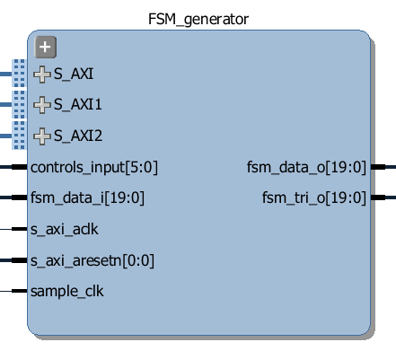

FSM Generator
============================

The FSM Generator can generate a finite state machine in programmable hardware from a Python description. 

The size of the FSM internal memory will dictate the number of states that can be supported. 

.. image:: ../../images/fsm_generator.png
   :align: center

The FSM generator has an internal Block Memory which implements the finite state machine. The Trace Analyzer is controlled by a MicroBlaze subsystem. It is connected to a DMA, also controlled by the MicroBlaze subsystem which is used to load configuration information, including the Block Memory configuration to implement the FSM. 

The FSM memory is 8K words.  Each word consists of 5 NS bits (4:0], 4 internal feedback bits [8:5], 4 external input bits [12:9], and 19 output bits [31:13]. 

External input bits can be connected to any of the 20 Arduino pins. 

Bits (external or internal feedback) not used can be programmed with input select as 0x1f. To select between external and internal input, program bit 7 of that corresponding pin as 1 otherwise it will use internal feedback. With 4 external and 4 internal bits, one can have 256 states machine.

Usage
--------------

The FSM Generator class is instantiated by importing it from the logictools subpackage: 

.. code-block:: Python

   from pynq.lib.logictools import FSMGenerator

   fsm = FSMGenerator(Arduino)

The FSM Generator module includes the following methods:

.. code-block:: Python

   ???
   
Ports
------------

The ports for the FSM Generator can be seen on the following image:

* S_AXI - axi connection to MicroBlaze subsystem that controls this block
* S_AXI1 - axi connection to MicroBlaze subsystem that controls this block
* S_AXI2 - axi connection to MicroBlaze subsystem that controls this block
* s_axi_clk - clock for s_axi interfaces
* s_axi_resetn - reset for s_axi interfaces

* controls_input ???
* sample_clk - ??? clock to allow single stepping of the FSM?

* fsm_data_i - input signals to the FSM
* fsm_data_o - output signals from the FSM (may be "state" data, or FSM outputs)
* fsm_data_tri_o - tri-state control signals for output data

Examples
--------------

