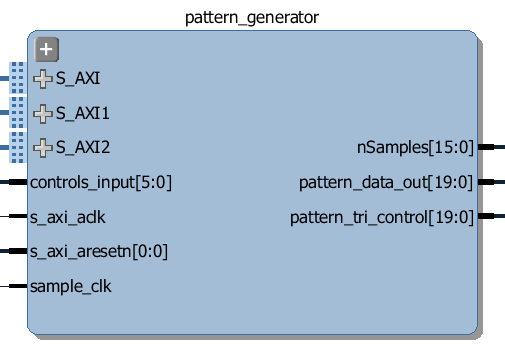

Pattern Generator
============================

The Pattern Generator can generate arbitrary digital patterns that are programmable from Python. 

.. image:: ../../images/pattern_generator.png
   :align: center

The Pattern Generator supports upto 64K pattern words. Though the memory is 32-bits wide, only least significant 20 bits are used which are routed to the Arduino pins. A data word is generated once every rising edge of the sample clock. 

The sample clock is programmable. The minimum sample clock speed is 252 KHz, and the maximum speed is ???.

Usage
--------------

The Pattern Generator class is instantiated by importing it from the logictools subpackage: 

.. code-block:: Python

   from pynq.lib.logictools import PatternGenerator

   pg = PatternGenerator(Arduino)

The Pattern Generator module includes the following methods:

.. code-block:: Python

   ???
   
Ports
------------

The ports for the Pattern Generator can be seen on the following image:

   
* S_AXI - axi connection to MicroBlaze subsystem that controls this block
* S_AXI1 - axi connection to MicroBlaze subsystem that controls this block
* S_AXI2 - axi connection to MicroBlaze subsystem that controls this block
* s_axi_clk - clock for s_axi interfaces
* s_axi_resetn - reset for s_axi interfaces

* controls_input ???
* sample_clk - ??? clock to control output rate of the generated pattern

* nSamples - ???
* pattern_data_o - output data port
* pattern_tri_control - tri-state control signals for output data

Examples
-------------------

