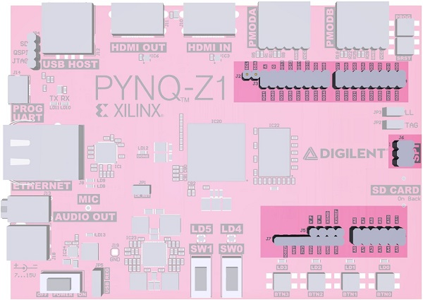
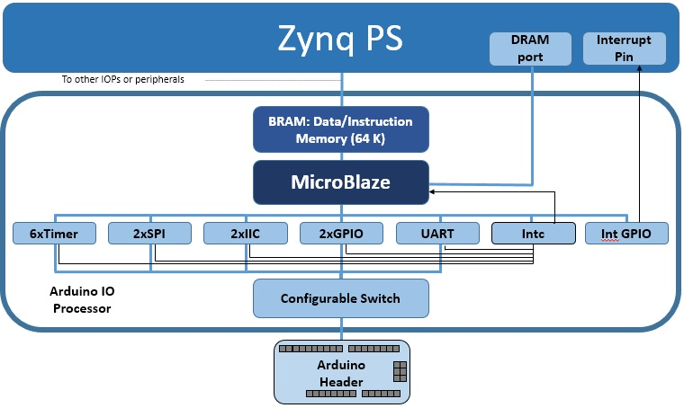

.. _arduino:

Arduino
=======

The Arduino subpackage is a collection of drivers for controlling
peripherals attached to a Arduino port.

An Arduino connector can be used to connect to Arduino compatible shields to
PL pins. Remember that appropriate controllers must be implemented in an
overlay and connected to the corresponding pins before a shield can be
used. Arduino pins can also be used as general purpose pins to connect to custom
hardware using wires.

Block Diagram
-------------

An Arduino PYNQ MicroBlaze is available to control the Arduino interface, 
if provided. The Arduino PYNQ MicroBlaze is similar to the Pmod PYNQ MicroBlaze, 
with more AXI Controllers.

As indicated in the diagram, the Arduino PYNQ MicroBlaze has a PYNQ MicroBlaze 
Subsystem, a configurable switch, and the following AXI controllers:

* 2x AXI I2C

  * Frequency: 100KHz
  * Address mode: 7 bit

* 2x AXI SPI

  * Master mode
  * Transaction Width: 8
  * SCK Frequency: 6.25 MHz
  * FIFO Depth: 16

.. note:: One SPI controller is connected to the Arduino interface dedicated SPI pins.
   
	      
* 3x AXI GPIO

  * 16 Input/Output pins total

* 6x AXI Timer

  * 32 bits    
  * 1 Generate Output
  * 1 PWM Output

* 1x AXI UART

  * 9600 Baud

* 1x AXI XADC

  * 1V peak-to-peak *
  
.. warning::
   Analog inputs are supported via the internal Xilinx XADC. This supports inputs
   of 1V peak-to-peak. Note that the Arduino interface supports 0-5V analog inputs
   which is not supported by Zynq without external circuitry.

==========   =========================
Peripheral   Pins
==========   =========================
UART         D0, D1
I2C          A4, A5
SPI*         D10 - D13
PWM          D3, D5, D6, D9, D10, D11
Timer        D3 - D6 and D8 - D11
==========   =========================

Examples
--------

In the :ref:`base-overlay`, one Arduino PYNQ MicroBlaze instance is available. 
After the overlay is loaded this instance can be accessed as follows:

.. code-block:: Python

   from pynq.overlays.base import BaseOverlay
   from pynq.lib.arduino import Arduino_LCD18

   lcd = Arduino_LCD18(base.ARDUINO)
   lcd.clear()

More information about the Arduino subpackage, its components, and its API can be
found in the :ref:`pynq-lib-arduino` section.

For more examples, see the notebooks in the following directory on the PYNQ-Z1 
board: 

.. code-block:: console

   <Jupyter Dashboard>/base/arduino/

