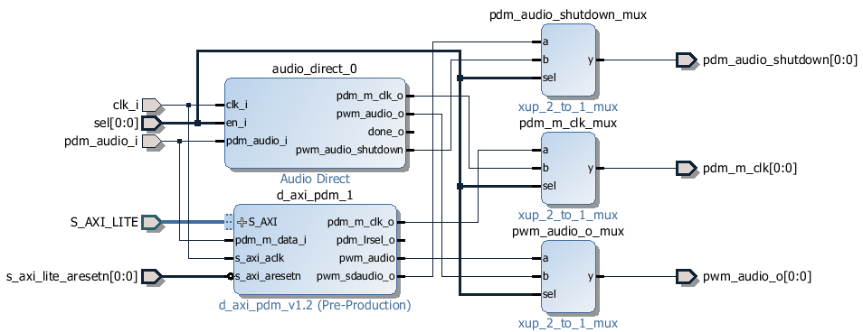

Audio
=====

The Audio module provides methods to read audio from the input microphone, play
audio to the output speaker, or read and write audio files. The audio module
talks to the audio IP subsystem in the :ref:`base-overlay` to drive the Pulse
Width Modulation (PWM) mono output, and another block to read the Pulse Density
Modulated (PDM) input from the microphone.

Block Diagram
-------------

Examples
--------

In the :ref:`base-overlay`, a single Audio instance is available: audio.  After
the overlay is loaded this instance can be accessed as follows:

.. code-block:: Python

   from pynq.overlays.base import BaseOverlay
   base = BaseOverlay("base.bit")
   pAudio = base.audio
		
   pAudio.load("/home/xilinx/pynq/lib/tests/pynq_welcome.pdm")
   pAudio.play()

More information about the Audio module and the API for reading and writing
audio interfaces, or loading and saving audio files can be found in the
:ref:`pynq-lib-audio` section.

For more examples see the "Welcome to Pynq Audio" notebook on the PYNQ-Z1 board
at:

.. code-block:: console

   <Jupyter Home>/base/audio/audio_playback.ipynb

