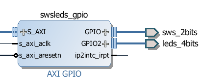
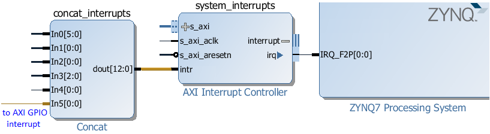

AxiGPIO: LEDs, Buttons & Switches
=================================

The AxiGPIO module provides methods to read, write, and receive interrupts from
external general purpose peripherals such as LEDs, buttons, switches connected
to the PL using AXI GPIO controller IP.

Block Diagram
-------------

The AxiGPIO module talks to instances of the AXI GPIO controller in the
PL. Each AXI GPIO can have up to two channels each with up to 32 pins. 

   
The interrupt signal, *ip2intc_irpt* from the AXI GPIO can be connected directly
to an AXI interrupt controller to cause interrupts in the PS. More information
about AsyncIO and Interrupts can be found in the :ref:`pynq-and-asyncio`
section.

Examples
--------

In the :ref:`base-overlay`, three AxiGPIO instances are available: btns_gpio,
rgbleds_gpio, and swsleds_gpio. After the overlay is loaded these can be
accessed as follows:

.. code-block:: Python

   from pynq import Overlay
   base = Overlay("base.bit")
   
   base.btns_gpio.read()
   
   base.rgbleds_gpio.write(0, 0x3)

More information about the AxiGPIO module and the API for reading, writing
and waiting for interrupts can be found in the :ref:`pynq-lib-axigpio` sections

For more examples see the "Buttons and LEDs demonstration" notebook on the
PYNQ-Z1 board at:

.. code-block:: console

   <Jupyter Home>/base/board/board_btns_leds.ipynb
