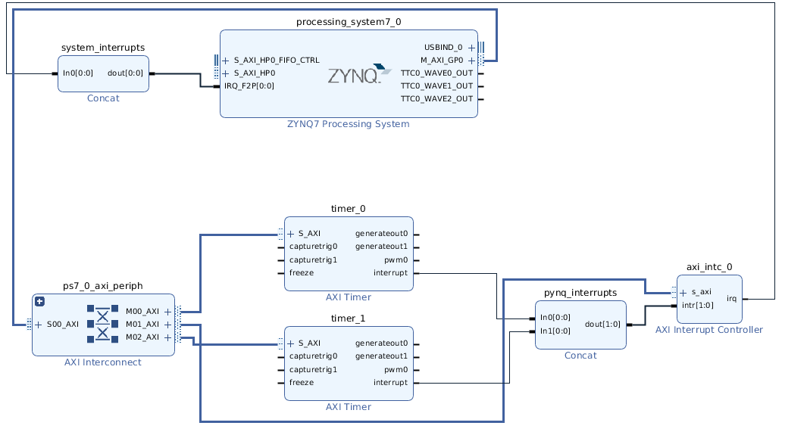
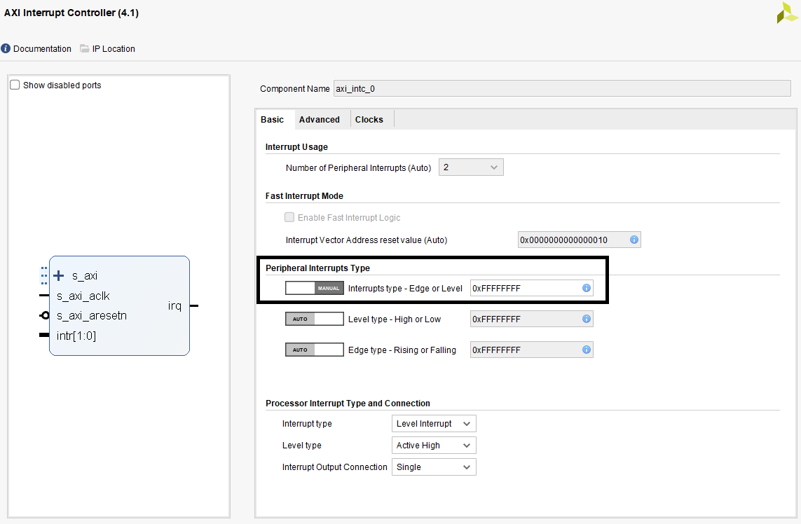

.. _pynq-libraries-interrupt:

Interrupt
=========

The ``Interrupt`` class represents a single interrupt pin in the block
design. It mimics a python ``Event`` by having a single ``wait`` function that
blocks until the interrupt is raised. The event will be cleared automatically
when the interrupt is cleared. To construct an event, pass in fully qualified
path to the pin in the block diagram, e.g. ``'my_ip/interrupt'`` as the only
argument.

An interrupt is only enabled for as long there is a thread or coroutine waiting
on the corresponding event. The recommended approach to using interrupts is to
wait in a loop, checking and clearing the interrupt registers in the IP before
resuming the wait. As an example, the AxiGPIO class uses this approach to wait
for a desired value to be present.

   .. code-block:: Python

      class AxiGPIO(DefaultIP):
          # Rest of class definition

          def wait_for_level(self, value):
              while self.read() != value:
                  self._interrupt.wait()
                  # Clear interrupt
                  self._mmio.write(IP_ISR, 0x1)

Interrupt Controller
--------------------

To integrate into the PYNQ framework Dedicated interrupts must be attached to an
`AXI Interrupt Controller <https://www.xilinx.com/products/intellectual-property/axi_intc.html#documentation>`_
which is in turn attached to the first interrupt line to the processing system.

The AXI Interrupt Controller can be avoided for overlays with only one
interrupt, in such overlays the interrupt pin must be connected to the
first interrupt line of the processing system.

PYNQ only support interrupts that are ultimately connected to IRQ_F2P[0].

An Example for the PYNQ Interrupt Subsystem
-------------------------------------------

The PYNQ ``Interrupt`` class is an asyncio-compatible interface to handling
interrupts from the fabric. This example aims to:

* Show how to create a block design compatible with PYNQ
* Introduce the ``asyncio`` interface and how to call it from other contexts
* Provide an example of the of the recommended way to write a driver
  for existing IP

Hardware Design
^^^^^^^^^^^^^^^

In this example we are using two independent instances of the
`AXI Timer IP <https://www.xilinx.com/products/intellectual-property/axi_timer.html#documentation>`_
from the Xilinx IP library.

The PYNQ interrupt software layer is dependent on the hardware design
meeting the following restrictions

* All interrupts must ultimately be connected to the first interrupt
  line of the ZYNQ block
* Multiple interrupts must be combined using AXI Interrupt controllers

This block design below shows the pattern of using a concat IP block to combine
all of the single interrupts into a single interrupt bus that then passed
into the input of both the interrupt controller and the processing system.

The default Peripheral Interrupt Type, set by the block automation, is Level. This causes that not all interrupts can be caught in Pynq.
Change the Peripheral Interrupt Type in the AXI Interrupt Controller block from Level to Edge, by setting the Interrupt Type - Edge or Level to Manual. Then enter value 0xFFFFFFFF.

Exploring Interrupts in Software
^^^^^^^^^^^^^^^^^^^^^^^^^^^^^^^^

With the hardware design complete we can start exploring the software
architecture. To do this first we load the new overlay

   .. code-block:: Python

      import pynq

      ol = pynq.Overlay('timer_interrupts.bit')

We can get access to instances of the interrupt class by navigating the
overlay object. Each IP instances has a ``_interrupts`` dictionary which lists
the names of the interrupts

   .. code-block:: Python

      timer1 = ol.timer_1
      timer1._interrupts

   .. code-block:: Python

      {'interrupt': {'controller': 'axi_intc_0', 'fullpath': 'timer_1/interrupt', 'index': 1}}

And the interrupts object can then be accessed by its name

   .. code-block:: Python

      interrupt = timer1.interrupt

The ``Interrupt`` class provides a single function wait which is an asyncio
coroutine that returns when the interrupt is signalled. To demonstrate this
we first need to look at the documentation for the timer and see how to get
it to fire after a specific period of time. We can also look at the register
map of the IP in Python to assist

   .. code-block:: Python

      timer1.register_map

   .. code-block:: Python

      RegisterMap {
        TCSR0 = Register(MDT0=0, UDT0=1, GENT0=0, CAPT0=0, ARHT0=0, LOAD0=0, ENIT0=1, ENT0=1, T0INT=0, PWMA0=0, ENALL=0, CASC=0),
        TLR0 = Register(TCLR0=500000000),
        TCR0 = Register(TCR0=4294967295),
        TCSR1 = Register(MDT1=0, UDT1=0, GENT1=0, CAPT1=0, ARHT1=0, LOAD1=0, ENIT1=0, ENT1=0, T1INT=0, PWMA1=0, ENALL=0),
        TLR1 = Register(TCLR1=0),
        TCR1 = Register(TCR1=0)
      }

The programming steps for the timer are to do the following:

1. Load the value to count from in the TLR0 register
2. Set then clear the LOAD0 bit to trigger the load
3. Set the ENIT0 bit to enable the interrupt output
4. Set the UDT0 bit to get the timer to count down
5. Set the ENT0 bit start the timer

Once the interrupt is signalled we then need to write to the ``T0INT`` bit
to clear the interrupt.

We can package all of this into a coroutine as follows

   .. code-block:: Python

      async def wait_for_timer1(cycles):
          timer1.register_map.TLR0 = cycles
          timer1.register_map.TCSR0.LOAD0 = 1
          timer1.register_map.TCSR0.LOAD0 = 0
          timer1.register_map.TCSR0.ENIT0 = 1
          timer1.register_map.TCSR0.ENT0 = 1
          timer1.register_map.TCSR0.UDT0 = 1
          await timer1.interrupt.wait()
          timer1.register_map.TCSR0.T0INT = 1

To test this we need to use the `asyncio <https://docs.python.org/3/library/asyncio.html>`_
library to schedule our new coroutine. ``asyncio`` uses event loops to
execute coroutines. When python starts it will create a default event loop
which is what the PYNQ interrupt subsystem uses to handle interrupts.

   .. code-block:: Python

      import asyncio
      loop = asyncio.get_event_loop()

   .. code-block:: Python

      task = loop.create_task(wait_for_timer1(500000000))
      loop.run_until_complete(task)

The low-level details
^^^^^^^^^^^^^^^^^^^^^

To see what interrupts are in the system we can look at the ``interrupt_pins``
dictionary. Each entry is a mapping from the name of a pin in the block
diagram to the interrupt controller that manages it.

   .. code-block:: Python

      ol.interrupt_pins

   .. code-block:: Python

      {'pynq_interrupts/In0': {'controller': 'axi_intc_0', 'fullpath': 'pynq_interrupts/In0', 'index': 0},
       'pynq_interrupts/In1': {'controller': 'axi_intc_0', 'fullpath': 'pynq_interrupts/In1', 'index': 1},
       'timer_0/interrupt': {'controller': 'axi_intc_0', 'fullpath': 'timer_0/interrupt', 'index': 0},
       'timer_1/interrupt': {'controller': 'axi_intc_0', 'fullpath': 'timer_1/interrupt', 'index': 1}}

This is a low level description of what’s going on but can be useful to
make sure that interrupts are being detected as intended.
At a slightly higher level, each entry in the IP dictionary contains
the subset of the complete dictionary applicable only to that IP.

   .. code-block:: Python

      ol.ip_dict['timer_0']['interrupts']

   .. code-block:: Python

      {'interrupt': {'controller': 'axi_intc_0', 'fullpath': 'timer_0/interrupt', 'index': 0}}
