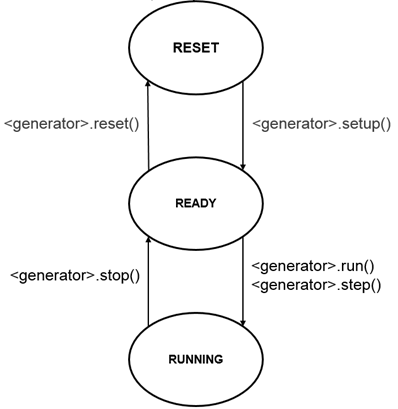
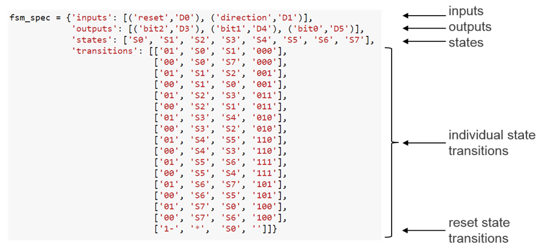
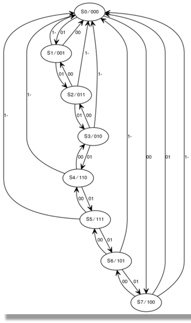

Logictools
**********

The *logictools* python library is the python interface for hardware generators
and the trace analyzer.

It contains three generation packages: The Boolean Generator, which creates
combination boolean functions that read input pins and drive output pins; The
Pattern Generator which drives digital patterns on the output pins; and the
Finite State Machine (FSM) Generator which creates sequential logic that reads
inputs pins and drives output pins.

Along with the three generators, we provide a Trace Analyzer library which can
be used to capture and display waveforms

The FSM, Boolean, and Pattern generators operate in a similar way, and will be
conisdered together. The Trace Analyzer will be considered seperately.

Each generator has the following methods:

* ``setup()`` - configure the block and prepare Interface Switch configuration
* ``run()`` - connect IO and start the block running
* ``stop()`` - disconnect IO and stop the block running
* ``reset()`` - clear the block configuration
* ``trace()`` - enable/disable trace

The state diagram is shown below:

Any one of these generators, or any combination can be configured and run
synchronously.

Initial State
-------------

The interface switch is attached to the external IO pins. Initially, all IO
accessible to the logictools overlay are configured as inputs. This prevents the
inadvertent driving of any external circuitry that is connected to the board.

The Pattern Generator contains BRAM to store the pattern to be generated. The
BRAM is configured with zeros initially.

Similarly, the FSM Generator configuration is stored in a BRAM which is also
configured with zeros initially.

The Boolean Generator is initially set to all inputs. 

Setup
-----

Each block must be configured using the ``setup()`` method before it can be
used. This defines a configuration for the block, and the configuration for the
Interface Switch to connect the external IO to the builder. Note that the
configuration is defined, but the IO are not connected during setup.

Running
-------

Once a block has been setup, it can be run. The external IO are connected to the
block though the interface switch, and the hardware block will start operating.

Running will start the block running in continuous mode by default. This is the
only mode for the Boolead Generator.

In continuous mode, the Pattern Generator generates its pattern continuously,
looping back to the start when it reaches the end of the pattern. The FSM
Generator will continue to run until it is stopped.

The Pattern Generator can also be run in single-shot mode. In this mode, it will
generate its pattern once.

Stepping
--------

Instead of running, the Pattern Generator and FSM Generator can also be single
stepped.

When stepping the Pattern Generator, it will step until the end of the
configured pattern. It will not loop back to the beginning.

The FSM Generator can be single stepped indefinitely. 

Stopping
--------

If a block is running, it must be stopped before running or stepping it
again. Once a builder is stopped, its outputs are disconnected from the IO.

Trace
-----

Trace is enabled by default for each block. i.e. the Trace Analyzer will capture
trace data for all connected blocks by default. The ``trace()`` method
enables/disables the Trace Analyzer for that block.

Boolean Generator
=================

The Boolean Generator supports up to Boolean functions of up to five inputs on
each output pin. AND, OR, NOT, and XOR operators are supported.

On the PYNQ-Z1 the 20 digital pins of the Arduino shield interface (D0 - D19)
can be used as inputs or outputs. The 4 pushbuttons (PB0 - PB3) can be used as
additional inputs, and the 4 user LEDs (LD0 - LD3) can be used as additional
ouputs. This gives a maximum of 24 inputs and outputs available to the Boolean
Generator, supporting up to 24 Boolean functions.

Boolean functions are specified, as strings.  

For example the following specifies that the values of pushbuttons 1 and 0 are
XORed to produce the value on LED0:

.. code-block:: Python

   'LD0 = PB0 ^ PB1'

Combinatorial Boolean expressions can be defined in a Python list using the
expressions & (AND), | (OR), ! (NOT), ^ (XOR).

The expression defines if a pin is used as an input or output. 

Example
-------
 
The following list defines four combinatorial functions on pins D8-11, which are
built using combinatorial functions made up of inputs from pins D0-D3. Any pin
assigned a value is an output, and any pin used as a parameter in the expression
is an input. If a pin is defined as an output, it cannot be used as an input.

.. code-block:: Python

   from logictools import BoolGenerator

   bg = BoolGenerator
   function_specs = ['D3 = D0 ^ D1 ^ D2']
                   
   function_specs.append('D6 = D4 & D5')

The function configurations can also be labelled:

.. code-block:: Python

   function_specs = {'f1': 'D3 = D0 ^ D1 ^ D2',
                     'f2': 'D6 = D4 & D5'}

Once the expressions have been defined, they can be passed to the
BooleanGenerator function.

.. code-block:: Python

   bg.setup(function_specs)

.. code-block:: Python

   bg.run() # run continuously

To reconfigure the Boolean Generator, or to disconnect the IO pins, stop it. 

.. code-block:: Python

   bg.stop()
   
   
Pattern Generator
=================

The Pattern Generator allows arbitrary digital patterns to be streamed to
IO. This can be used to test or control external circuits or devices.

Block Diagram
-------------

.. image:: ../images/pattern_generator.png
   :align: center

The Pattern Generator supports upto 64K pattern words. Though the memory is
32-bits wide, only least significant 20 bits are used which are routed to the
Arduino pins. A data word is generated once every rising edge of the sample
clock.

The sample clock is programmable. The minimum sample clock speed is 252 KHz, and
the maximum speed is 10 MHz.

Operation
---------

The Pattern Generator class is instantiated by importing it from the logictools subpackage: 

.. code-block:: Python

   from pynq.overlays.logictools import LogicToolsOverlay

   logictools = LogicToolsOverlay('logictools.bit')

   pg = logictools.pattern_generator

The Pattern Generator includes the following methods:

.. code-block:: Python

   setup() # Configure the pattern generator with a single bit pattern
   connect() # Method to configure the IO switch, called by run()
   run() # Run the pattern generation
   disconnect() # Method to disconnect the IO switch
   reset() # Reset the pattern generator
   
   clear_wave() # Clear the waveform object so new patterns can be accepted
   analyze() # Update the captured samples

Finite State Machine (FSM) Generator
====================================

The FSM Generator can generate a finite state machine in programmable hardware
from a Python description.

The FSM generator has an internal Block Memory which implements the finite state
machine. The 20 pins on the Arduino shield header are available. The FSM must
have a minimum of 1 input, allowing a maximum of 19 outputs. The maximum number
of inputs is 8. For example, based on the number of inputs, the following
configurations are available:

============== ============== ===============
 # Inputs       Max # States   Max # Outputs 
============== ============== ===============
 8              32             12
 7              64             13
 6              128            14
 5              256            15
 4              512            16
============== ============== ===============

The Trace Analyzer is controlled by a MicroBlaze subsystem. It is
connected to a DMA, also controlled by the MicroBlaze subsystem which is used to
load configuration information, including the Block Memory configuration to
implement the FSM.

Operation
---------

The configuration for the FSM, Input pins, output pins, internal states, and
state transitions, can be specified in a text format.

E.g.

The FSM Generator includes the following methods, and can be used in a similar
way to the other generators.

.. code-block:: Python

   setup() # Configure the pattern generator with a single bit pattern
   connect() # Method to configure the IO switch, called by run()
   run() # Run the pattern generation
   step() # Single step the FSM
   disconnect() # Method to disconnect the IO switch
   reset() # Reset the pattern generator
   

The FSM is passed to the ``setup()``. The ``run()`` method can then be used to
start the FSM.

Two additional methods are available to show the FSM state diagram in a
notebook, and to display the waveform from the FSM.

.. code-block:: Python

   show_state_diagram()
   show_waveform()

Example of a state diagram:

Trace Analyzer
==============

Traditional on-chip debug allows FPGA resources to be used to monitor internal
or external signals in a design for debug. The debug circuitry taps into signals
in a design under test, and saves the signal data as the system is
operating. The debug data is saved to on-chip memory, and can be read out later
for offline debug and analysis. One of the limitations of traditional on-chip
debug is that amount of local memory usually available on chip is relatively
small. This means only a limited amount of debug data can be captured (typically
a few Kilobytes).

The on-chip debug concept has been extended to allow trace debug data to be
saved to DDR memory. This allows more debug data to be captured. The data can
then be analyzed using Python.

Block Diagram
-------------

The trace analyzer monitors the external PL Input/Output Blocks (IOBs) on the
PMod and Arduino interfaces. The IOBs are tri-state. This means three internal
signals are associated with each pin; an input (I), and output (O) and a
tri-state signal (T). The Tri-state signal controls whether the pin is being
used as a input or output.

The trace analyzer is connected to all 3 signals for each IOP (Pmod and
Arduino).

.. image:: ../images/trace_analyzer.png
   :align: center

This allows the trace analyzer to read the tri-state, determine if the IOB is in
input, or output mode, and read the appropriate trace data.

Examples
========

Example notebooks on how to use the logictools overlay can be found in the
*logictools* directory in the Jupyter home area on the board.
