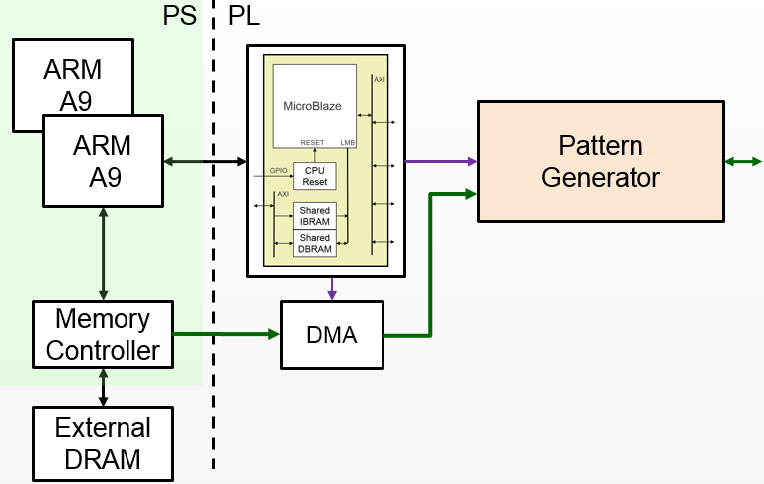
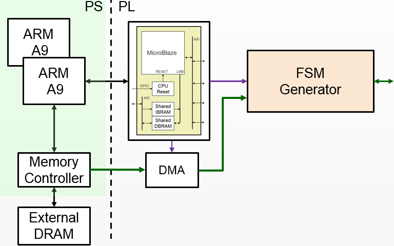
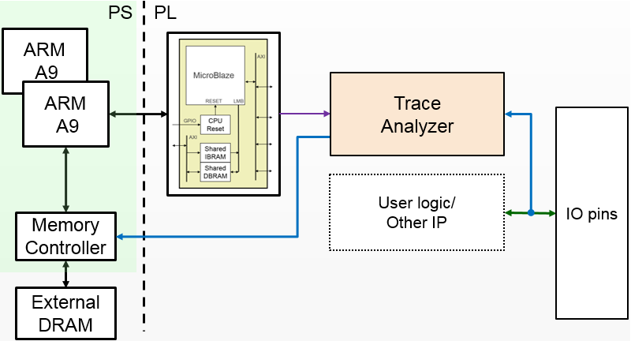

Logictools
**********

(Okay, no joke, we need an intro here)

Lorem ipsum dolor sit amet, consectetur adipiscing elit, sed do eiusmod tempor
incididunt ut labore et dolore magna aliqua. Ut enim ad minim veniam, quis
nostrud exercitation ullamco laboris nisi ut aliquip ex ea commodo
consequat. Duis aute irure dolor in reprehenderit in voluptate velit esse cillum
dolore eu fugiat nulla pariatur. Excepteur sint occaecat cupidatat non proident,
sunt in culpa qui officia deserunt mollit anim id est laborum.

Boolean Generator
=================

Block Diagram
-------------

Examples
--------

Pattern Generator
=================

The Pattern Generator can generate arbitrary digital patterns that are programmable from Python.

Block Diagram
-------------

The Pattern Generator supports upto 64K pattern words. Though the memory is 32-bits wide, only least significant 20 bits are used which are routed to the Arduino pins. A data word is generated once every rising edge of the sample clock. 

The sample clock is programmable. The minimum sample clock speed is 252 KHz, and the maximum speed is ???.

Examples
--------
The Pattern Generator class is instantiated by importing it from the logictools subpackage: 

.. code-block:: Python

   from pynq.lib.logictools import PatternGenerator

   pg = PatternGenerator(Arduino)

The Pattern Generator module includes the following methods:

.. code-block:: Python

   ???

Finite State Machine (FSM) Generator
====================================

The FSM Generator can generate a finite state machine in programmable hardware
from a Python description.

The size of the FSM internal memory will dictate the number of states that can
be supported.

The FSM generator has an internal Block Memory which implements the finite state
machine. The Trace Analyzer is controlled by a MicroBlaze subsystem. It is
connected to a DMA, also controlled by the MicroBlaze subsystem which is used to
load configuration information, including the Block Memory configuration to
implement the FSM.

The FSM memory is 8K words.  Each word consists of 5 NS bits (4:0], 4 internal
feedback bits [8:5], 4 external input bits [12:9], and 19 output bits [31:13].

External input bits can be connected to any of the 20 Arduino pins.

Bits (external or internal feedback) not used can be programmed with input
select as 0x1f. To select between external and internal input, program bit 7 of
that corresponding pin as 1 otherwise it will use internal feedback. With 4
external and 4 internal bits, one can have 256 states machine.

Block Diagram
-------------

Examples
--------
The FSM Generator class is instantiated by importing it from the logictools subpackage: 

.. code-block:: Python

   from pynq.lib.logictools import FSMGenerator

   fsm = FSMGenerator(Arduino)

The FSM Generator module includes the following methods:

.. code-block:: Python

   ???

Trace Analyzer
=================

Traditional on-chip debug allows FPGA resources to be used to monitor internal
or external signals in a design for debug. The debug circuitry taps into signals
in a design under test, and saves the signal data as the system is
operating. The debug data is saved to on-chip memory, and can be read out later
for offline debug and analysis. One of the limitations of traditional on-chip
debug is that amount of local memory usually available on chip is relatively
small. This means only a limited amount of debug data can be captured (typically
a few Kilobytes).

The on-chip debug concept has been extended to allow trace debug data to be
saved to DDR memory. This allows more debug data to be captured. The data can
then be analyzed using Python.

Block Diagram
-------------

The trace analyzer monitors the external PL Input/Output Blocks (IOBs) on the
PMod and Arduino interfaces. The IOBs are tri-state. This means three internal
signals are associated with each pin; an input (I), and output (O) and a
tri-state signal (T). The Tri-state signal controls whether the pin is being
used as a input or output.

The trace analyzer is connected to all 3 signals for each IOP (Pmod and
Arduino).

This allows the trace analyzer to read the tri-state, determine if the IOB is in
input, or output mode, and read the appropriate trace data.

Examples
--------
To use the trace analyzer, instantiate the TraceAnalyzer class, specifying the interface it is connected to, the pins to monitor, the protocol, and the sample rate. 

.. code-block:: Python

   from pynq.drivers import TraceAnalyzer
      tr_buf = TraceAnalyzer(PMODA,pins=[2,3],probes=['SCL','SDA'],
                      protocol="i2c",rate=1000000)
                      
The trace analyzer runs at 100 MHz. The sample rate is the number of samples stored out of every sample captured. E.g. rate = 1 will store samples at 100 Msps. rate = 2 will store samples at 83 Msps etc.  

.. code-block :: console
    
    Samples captured = 100 MHz/rate

Once you are ready to start collecting data, start the trace analyzer.
   
.. code-block:: Python
  
   # Start the trace analyzer
   tr_buf.start()

Once you are finished collecting data, stop the trace analyzer.

.. code-block:: Python

   # Stop the trace analyzer
   tr_buf.stop()

The data is first parsed into a .csv file. The start and stop positions are provided to select the region of interest. The .csv file is then decoded into a .pd file 

.. code-block:: Python

   # Set up samples
   start = 500
   stop = 3500

   # Parsing and decoding samples
   tr_buf.parse("i2c_trace.csv",start,stop)
   tr_buf.decode("i2c_trace.pd")

The first sample is stored in location 1, so the starting sample to display must be equal to 1 or more. The end sample to display must be less than the total number of samples collected. 

The data can be displayed in a notebook. This is done using the Python WaveDrom package. 

.. code-block:: Python

    tr_buf.display()
