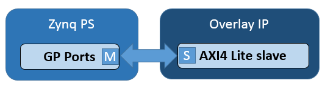

.. _pynq-libraries-mmio:

MMIO
====

The *MMIO* class allows a Python object to access addresses in the system 
memory mapped. In particular, registers and address space of peripherals in the
PL can be accessed. 

   
AXI GP ports
------------

In an overlay, peripherals connected to the AXI General Purpose ports will have
their registers or address space mapped into the system memory map. 
With PYNQ, the register, or address space of an IP can be accessed from Python 
using the *MMIO* class. 

MMIO provides a simple but powerful way to access and control peripherals. For 
simple peripherals with a small number of memory accesses, or where performance 
is not critical, MMIO is usually sufficient for most developers. If performance 
is critical, or large amounts of data need to be transferred between PS and PL, 
using the Zynq HP interfaces with DMA IP and the PYNQ DMA class may be more 
appropriate. 

Example
-------

In this example, data is written to an IP and read back from the same address.

.. code-block:: Python

   IP_BASE_ADDRESS = 0x40000000
   ADDRESS_RANGE = 0x1000
   ADDRESS_OFFSET = 0x10

   from pynq import MMIO
   mmio = MMIO(IP_BASE_ADDRESS, ADDRESS_RANGE)

   data = 0xdeadbeef
   mmio.write(ADDRESS_OFFSET, data)
   result = mmio.read(ADDRESS_OFFSET)

This example assumes the memory mapped area defined for the MMIO, 
from ``0x40000000`` to ``0x40001000``, is accessible to the PS.

More information about the MMIO module can be found in the :ref:`pynq-mmio` sections
