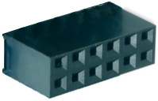
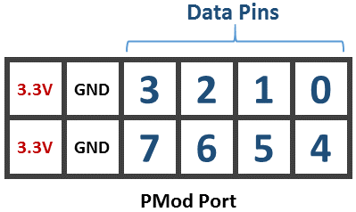
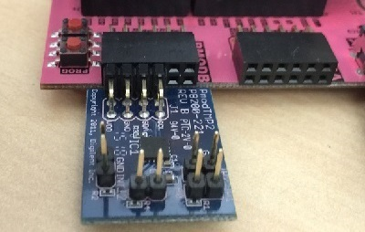
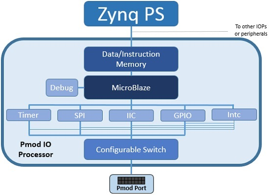

.. _pmod:

Pmod
====

The Pmod subpackage is a collection of drivers for controlling
peripherals attached to a Pmod port.

A Pmod port is an open 12-pin interface that is supported by a range of Pmod
peripherals from Digilent and third party manufacturers.  Typical Pmod
peripherals include sensors (voltage, light, temperature), communication
interfaces (Ethernet, serial, WiFi, Bluetooth), and input and output interfaces
(buttons, switches, LEDs).

	
Each Pmod connector has 12 pins arranged in 2 rows of 6 pins. Each row has 3.3V
(VCC), ground (GND) and 4 data pins. Using both rows gives 8 data pins in total.

Pmods come in different configurations depending on the number of data pins
required. E.g. Full single row: 1x6 pins; full double row: 2x6 pins; and
partially populated: 2x4 pins.

Pmods that use both rows (e.g. 2x4 pins, 2x6 pins), should usually be aligned to
the left of the connector (to align with VCC and GND).

	
Pmod peripherals with only a single row of pins can be connected to either the
top row or the bottom row of a Pmod port (again, aligned to VCC/GND). If you are
using an existing driver/overlay, you will need to check which pins/rows are
supported for a given overlay, as not all options may be implemented. e.g. the
Pmod ALS is currently only supported on the top row of a Pmod port, not the
bottom row.

All pins operate at 3.3V. Due to different pull-up/pull-down I/O requirements
for different peripherals (e.g. IIC requires pull-up, and SPI requires
pull-down) the Pmod data pins have different IO standards.

Pins 0,1 and 4,5 are connected to pins with pull-down resistors. This can
support the SPI interface, and most peripherals. Pins 2,3 and 6,7 are connected
to pins with pull-up resistors. This can support the IIC interface.

Pmods already take this pull up/down convention into account in their pin
layout, so no special attention is required when using Pmods.

Block Diagram
-------------

Pmod PYNQ MicroBlazes control the Pmod interfaces present on a board,
if provided. As indicated in the diagram, each Pmod PYNQ MicroBlaze has a
:ref:`pynq-microblaze-subsystem` a configurable switch, and the following AXI
controllers:

* AXI I2C
  
  * SCL Frequency 100 KHz
  * Address Mode: 7 bits
  
* AXI SPI
      
  * Master mode
  * Transaction Width: 8
  * SCK Frequency: 6.25 MHz
  * FIFO Depth: 16

* AXI GPIO

  * 8 Input/Output pins

* AXI Timer

  * 32 bits    
  * 1 Generate Output
  * 1 PWM Output

A list of drivers provided for Pmod peripherals can be found in the
:ref:`pynq-lib-pmod` section.

Examples
--------

In the :ref:`base-overlay`, two Pmod instances are available: PMODA and
PMODB. After the overlay is loaded theses instances can be accessed as
follows:

.. code-block:: Python

   from pynq.overlays.base import BaseOverlay
   from pynq.lib import Pmod_Timer

   base = BaseOverlay("base.bit")

   pt = Pmod_Timer(base.PMODA,0)
   pt.stop()

More information about the Pmod subpackage, its components, and its API can be
found in the :ref:`pynq-lib-pmod` section.

For more examples, see the notebooks in the following directory on the 
PYNQ-Z1 board:

.. code-block:: console

   <Jupyter Dashboard>/base/pmod/

