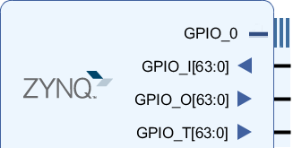

.. _pynq-libraries-psgpio:

PS GPIO
=======

The Zynq device has up to 64 GPIO from PS to PL. These can be used for simple control type operations. For example, in the base overlay, the PS GPIO wires are used as the reset signals for the IOPs. 
The PS GPIO are a very simple interface and there is no IP required in the PL to use them. 

The *GPIO* class is used to control the GPIO.

Block Diagram
-------------

Linux GPIO
----------

The PS GPIO use a Linux kernel module to control the GPIO. 
This means that the operating systems assign a number to the GPIO at 
run time. Before using the PS GPIO, the Linux pin number must be mapped 
to the Python GPIO instance. 

The ``get_gpio_pin()`` function which is part of the GPIO class is used 
to map the PS pin number to the Linux pin number. See the example below 
on how it can be used.

Examples
--------

.. code-block:: Python

   from pynq import GPIO

   ps_led = GPIO(GPIO.get_gpio_pin(0), 'out')
   ps_switch = GPIO(GPIO.get_gpio_pin(1), 'in')

   ps_led.write(0)
   ps_switch.read(1)

More information about the GPIO module and the API for reading, writing
and waiting for interrupts can be found in the :ref:`pynq-gpio` sections
