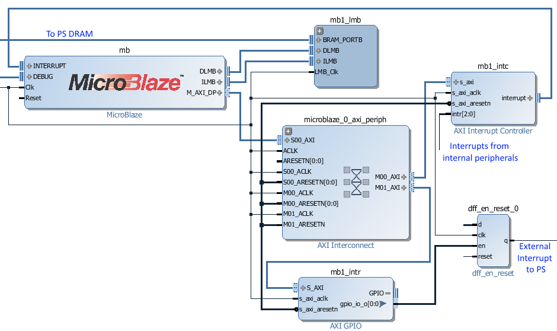

.. _pynq-microblaze-subsystem:

PYNQ MicroBlaze Subsystem
=========================

The PYNQ MicroBlaze subsystem can be controlled by the PynqMicroblaze class. This
allows loading of programs from Python, controlling executing by triggering the
processor reset signal, reading and writing to shared data memory, and managing
interrupts received from the subsystem.

Each PYNQ MicroBlaze subsystem is contained within an IO Processor (IOP). An IOP
defines a set of communication and behavioral controllers that are controlled by
Python. There are currently three IOPs provided with PYNQ: Arduino, PMOD, and
Logictools.

Block Diagram
-------------

A PYNQ MicroBlaze subsystem consists of a MicroBlaze processor, AXI
interconnect, Interrupt controller, an Interrupt Requester, and External System
Interface, and Block RAM and memory controllers.

The AXI interconnect connects the MicroBlaze to the interrupt controller,
interrupt requester, and external interface.

* The Interrupt Controller is the interface for other communication or
  behavioral controllers connected to the MicroBlaze Processor.
* The Interrupt Requester sends interrupt requests to the Zynq Processing System.
* The External Interface allows the MicroBlaze subsystem to communicate with
  other communication, behavioral controllers, or DDR Memory.
* The Block RAM holds MicroBlaze Instructions and Data.

The Block RAM is dual-ported: One port connected to the MicroBlaze Instruction
and Data ports; The other port is connected to the ARM® Cortex®-A9 processor for
communication.

If the External Interface is connected to DDR Memory, DDR can be used to
transfer large data segments between the PS (Python) and the Subsystem.

Examples
--------  

In the :ref:`base-overlay`, three IOP instances with PYNQ Microblaze Subsystems
are available: iop1 (PMODA), iop2 (PMODB), and iop3 (Arduino). After the overlay
is loaded these can be accessed as follows:

.. code-block:: Python

   from pynq.overlays.base import BaseOverlay
   from pynq.lib import PynqMicroblaze

   base = BaseOverlay('base.bit')

   mb = PynqMicroblaze(base.iop1.mb_info, "/home/xilinx/pynq/lib/pmod/pmod_timer.bin")
   mb.reset()

More information about the PynqMicroblaze class, and its API can be found in the
:ref:`pynq-lib-pynqmicroblaze` section.

:ref:`pmod`, :ref:`Arduino`, and :ref:`Grove` classes are subclasses of the
PynqMicroBlaze class, and further example notebooks can be found in those
sections.

   
