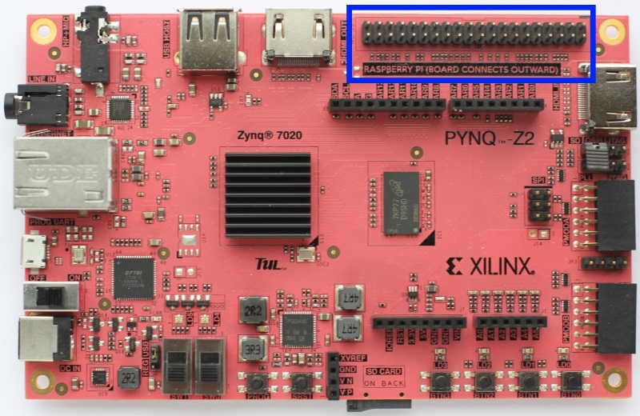
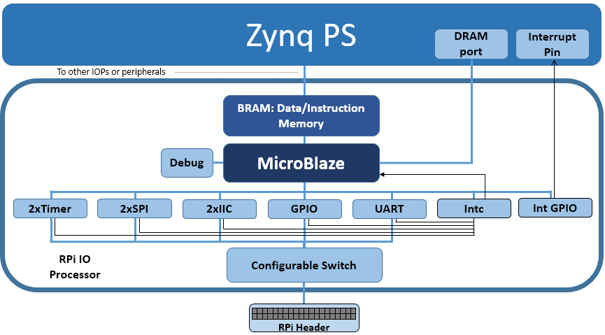

.. _rpi:

RPi
===

The `rpi` subpackage is a collection of drivers for controlling
peripherals attached to a RPi (Raspberry Pi) interface.

The RPi connector can be used to connect to Raspberry Pi compatible peripherals to
PL pins. Remember that appropriate controllers must be implemented in an
overlay and connected to the corresponding pins before a shield can be
used. The RPi pins can also be used as general purpose pins to connect to custom
hardware using wires.

Block Diagram
-------------

The RPi PYNQ MicroBlaze is available to control the RPi interface. 

As indicated in the diagram, the RPi PYNQ MicroBlaze has a PYNQ MicroBlaze 
Subsystem, a configurable switch, and the following AXI controllers:

* 2x AXI I2C

  * Frequency: 100KHz
  * Address mode: 7 bit

* 2x AXI SPI

  * Master mode
  * Transaction Width: 8
  * SCK Frequency: 6.25 MHz
  * FIFO Depth: 16

.. note:: One SPI controller is connected to the Arduino interface dedicated SPI pins.
   
* 1x AXI GPIO

  * 28 Input/Output pins total

* 2x AXI Timer

  * 32 bits    
  * 1 Generate Output
  * 1 PWM Output

* 1x AXI UART

  * 115200 Baud

* AXI Interrupt controller

  Manages the interrupts of peripherals in the MicroBlaze subsystem. 
  
* Interrupt GPIO

  An additional AXI GPIO is used to signal interrupt requests to the PS
  
* Configurable Switch
  
  Allows routing of signals from dedicated peripherals to the external interface. 
  

More information about the RPi subpackage, its components, and its API can be
found in the :ref:`pynq-lib-rpi` section.

For more examples, see the notebooks in the following directory on the PYNQ-Z2
board: 

.. code-block:: console

   <Jupyter Dashboard>/base/rpi/

