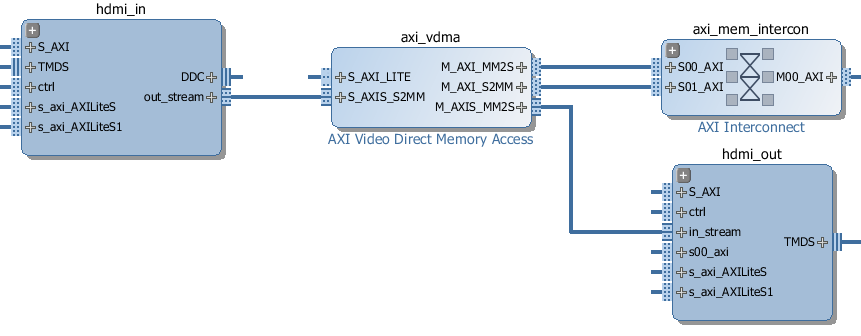

Video
=====

The Video subpackage contains a collection of drivers for reading from the
HDMI-In port, writing to the HDMI-Out port, transferring data, setting
interrupts and manipulating video frames.

The Video hardware subsystem consists of a HDMI-In block, a HDMI-Out block, and
a Video DMA. The HDMI-In and HDMI-Out blocks also support color space
conversions, e.g. from YCrCb to RGB and back, and changing the number of
channels in each pixel.

Video data can be captured from the HDMI-In, and streamed to DRAM using the
Video DMA, or streamed from DRAM to the HDMI-Out.

Block Diagram
-------------

HDMI-In
^^^^^^^
   
.. image:: ../images/hdmi_in_subsystem.png
   :align: center

The Pixel Unpack and the Color Convert block allow conversion between different
color spaces at runtime. 

HDMI-Out
^^^^^^^^
   
.. image:: ../images/hdmi_out_subsystem.png
   :align: center

The HDMI-Out is similar to HDMI-In. It has a Pixel Pack block (instead of the
*Unpack* block for HDMI-In) and a Color Convert block.

Processing Options
------------------

There are 3 main ways that some processing could be carried out on a Video pipeline. 

1. Read, write and process frames in Python on the PS
2. Modify the overlay to insert an IP into the video pipeline
3. Modify the overlay to connect an IP to an available interface in the overlay

Python Processing
^^^^^^^^^^^^^^^^^

Input and output frames are represented as numpy arrays frames are read from the
HDMI input and written to the HDMI output. The HDMI input will return the most
recent complete frame received or block if necessary until the frame is
ready. The HDMI output will continue outputting the last frame written until a
new frame is provided.

As frames are numpy arrays they can be directly used in other Python libraries
including the Python OpenCV libraries.

Examples of using the video API with OpenCV can be found in the video notebooks.

Processing video in the PS will be relatively slow. Where possible low level
processing should be carried out in the PL. The video subsystem supports basic
color space and pixel type conversions in hardware before passing a frame to the
Python environment to improve performance of OpenCV and processing by other
libraries.

Pipeline Processing
^^^^^^^^^^^^^^^^^^^

The HDMI signal blocks are AXI-stream. A custom AXI-stream IP with an input
stream and output stream could be inserted into the video pipeline, either on
the HDMI-In side, or HDMI-Out side. However, usually IP to process the video
stream will assume a fixed color space/pixel format and this will determine
where an IP should be connected in the Video pipeline.

It is usually appropriate to insert the IP after the pixel_pack block on the
HDMI-In block, or before the pixel_unpack block on the HDMI-Out side. This gives
flexibility to use the video subsystem color space conversion blocks before and
after the custom IP.

Batch Processing
^^^^^^^^^^^^^^^^

An IP block can be added to an overlay and connected to an available
interface. Usually a DMA would be used to stream the input frame buffer to the
IP, and send the processed data back to the output frame buffer in DRAM.

Note that the DRAM is likely to be a bottleneck for video processing. The Video
data is written to DRAM, then read from DRAM and send to the custom IP and is
written back to DRAM, where it is read by the HDMI out.

For the PYNQ-Z1 which has a 16-bit DRAM, up to 1080p cwgraysc (8-bits per pixel)
can be processed at ~60fps alongside the framebuffer memory bandwidth, but this
is very close to the total memory bandwidth of the system.

Examples
--------

More information about the Video subpackage, its components, and its their APIs
can be found in the :ref:`pynq-lib-video` section.

For more examples, see the Video Notebooks folder on the Pynq-Z1 board in the
following directory:

.. code-block:: console

   <Jupyter Home>/base/video
   
Initialization
^^^^^^^^^^^^^^
Set up an instance of the HDMI-in, and HDMI-out. 

.. code-block:: Python

    from pynq import Overlay
    from pynq.lib.video import * 
		
    base = Overlay('base.bit')
    hdmi_in = base.video.hdmi_in
    hdmi_out = base.video.hdmi_out

Configuration
^^^^^^^^^^^^^    
The HDMI-in interface is enabled using the ``configure`` function which can
optionally take a colorspace parameter. If no colorspace is specified then
24-bit BGR is used by default. The HDMI-in *mode* can be used to configure the
HDMI-out block. This specifies the output color space and resolution.

.. code-block:: Python

    hdmi_in.configure()
    hdmi_out.configure(hdmi_in.mode)

Execution
^^^^^^^^^

Once the HDMI controllers have been configured, they can be started:

.. code-block:: Python

    hdmi_in.start()
    hdmi_out.start()

To connect a simple stream from HDMI-in to HDMI-out, the two streams can be tied together.  

.. code-block:: Python

    hdmi_in.tie(hdmi_out)

This takes the unmodified input stream and passes it directly to the
output. While the input and output are tied frames can still be read from the
input but any call to ``hdmi_out.writeframe`` will end the tie.

.. code-block:: Python

    frame = hdmi_in.readframe()
    ...
    hdmi_out.writeframe(frame)
    
This would allow some processing to be carried out on the HDMI-in *frame*
before writing it to the HDMI-out.

Color Space Conversion
^^^^^^^^^^^^^^^^^^^^^^

The video subsystem supports general color space conversions so that frames in
DRAM are in a format appropriate for any subsequent processing. The default
color space is BGR(24-bit) with RGB (24-bit), RGBA (32-bit), BGR (24-bit), YCbCr
(24-bit), and grayscale (8-bit) provided as built-in options.

The colorspace converter operates on each pixel independently using a 3x4 matrix
to transform the pixels. The converter is programmed with a list of twelve
coefficients in the following order:

======= === === === ===
Channel in1 in2 in3  1 
======= === === === ===
out1    c1  c2  c3  c10
out2    c4  c5  c6  c11
out3    c7  c8  c9  c12
======= === === === ===

Each coefficient should be a floating point number between -2 and +2.

The pixels to and from the HDMI frontends are in BGR order so a list of
coefficients to convert from the input format to RGB would be:

.. code-block:: Python

    [0, 0, 1,
     0, 1, 0,
     1, 0, 0,
     0, 0, 0]

reversing the order of the channels and not adding any bias.
 
The driver for the colorspace converters has a single property that contains the
list of coefficients.

.. code-block:: Python

    colorspace_in = base.video.hdmi_in.color_convert
    colorspace_out = base.video.hdmi_out.color_convert

    bgr2rgb = [0, 0, 1,
               0, 1, 0, 
               1, 0, 0,
               0, 0, 0]

    colorspace_in.colorspace = bgr2rgb
    colorspace_out.colorspace = bgr2rgb

Pixel Format
^^^^^^^^^^^^

The default pixel format for the HDMI frontends is 24-bit - that is three 8-bit
channels. This can be converted to 8, 16, 24 or 32 bits.

8-bit mode selects the first channel in the pixel (and drops the other two)
16-bit mode can either select the first two channels or select the first and
performs chroma resampling of the other two resulting in 4:2:2 formatted frames.
24-bit mode is pass-through, and doesn't change the format 32-bit mode pads the
stream with additional 8-bits.

.. code-block:: Python

    pixel_in = base.video.hdmi_in.pixel_pack
    pixel_out = base.video.hdmi_out.pixel_unpack

    pixel_in.bits_per_pixel = 8
    pixel_out.bits_per_pixel = 16
    pixel_out.resample = False

Video Pipeline
^^^^^^^^^^^^^^

As the ``hdmi_in.readframe`` and ``hdmi_out.writeframe`` functions may
potentially block if a complete frame has not yet been read or written,
``_async`` versions of these functions also exist. One use for the asynchronous
versions is if frames are being transferred to a separate accelerator using a
DMA engine. The DMA driver is also asyncio aware so the computation can be
written as two tasks. One to retrieve frames from the Video DMA and forward them
to the accelerator and a second task to bring frames back from the accelerator.

.. code-block:: Python

    async def readframes():
        while True:
            frame = await hdmi_in.readframe_async()
            dma.sendchannel.transfer(frame)
            await dma.sendchannel.wait_async()
            frame.freebuffer()

    async def writeframes():
        while True:
            frame = hdmi_out.newframe()
            dma.recvchannel.transfer(frame)
            await dma.recvchannel.wait()
            await hdmi_out.writeframe_async(frame)
