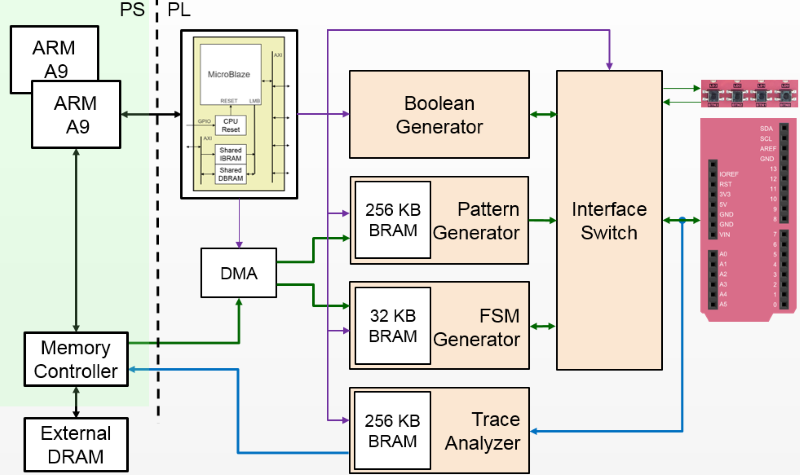

Logictools Overlay
==================

The logictools overlay consists of programmable hardware blocks to connect to
external digital logic circuits. Finite state machines, Boolean logic functions
and digital patterns can be generated from Python. A programmable switch
connects the inputs and outputs from the hardware blocks to external IO
pins. The logictools overlay can also has a trace analyzer to capture data from
the IO interface for analysis and debug.

PYNQ-Z1 Block Diagram
---------------------

The logictools overlay on PYNQ-Z1 includes four main hardware blocks:

* Pattern Generator
* FSM Generator
* Boolean Generator
* Trace Analyzer

Each block is configured using a textual description specified in Python. 
No compilation of the configuration is required. This means a configuration can 
be loaded directly to the generator and run immediately.

Pattern Generator
-----------------

The *Pattern Generator* can be configured to generate and stream arbitrary 
digital patterns to the external IO pins. The Pattern Generator can be used as a
stimulus to test or control an external circuit.

Finite State Machine (FSM) Generator
------------------------------------

The *FSM Generator* can create a finite state machine from a Python
description. The inputs and outputs and states of the FSM can be connected to
external IO pins.

Boolean Generator
-----------------

The *Boolean Generator* can create independent combinatorial Boolean logic
functions. The external IO pins are used as inputs and outputs to the Boolean
functions.

Trace Analyzer
--------------

The *Trace Analyzer* can capture IO signals and stream the data to the PS DRAM
for analysis in the Python environment. The Trace Analyzer can be used
standalone to capture external IO signals, or used in combination with the other
three logictools functions to monitor data to and from the other blocks.
E.g. the trace analyzer can be used with the pattern generator to verify the
data sent to the external pins, or with the FSM to check the input, output or
states to verify or debug a design.

PYNQ MicroBlaze
---------------

A PYNQ MicroBlaze is used to control all the generators and analyzers. The
PYNQ MicroBlaze subsystem on logictools overlay also manages contiguous memory
buffers, configures the clock frequency, and keeps track of the generator 
status. For more information, please see :ref:`pynq-libraries`. 

Python API
----------

The API for the logictools generators and trace analyzer can be found in 
:ref:`pynq-libraries`.

Rebuilding the Overlay
----------------------

The process to rebuild the logictools overlay is similar to the base overlay. 

All source code for the hardware blocks is provided. Each block can also be
reused standalone in a custom overlay.

The source files for the logictools IP can be found in:

.. code-block:: console

   <PYNQ Repository>/boards/ip

The project files for the logictools overlay can be found here:

.. code-block:: console

   <PYNQ Repository>/boards/<board_name>/logictools

Linux
^^^^^
To rebuild the overlay, source the Xilinx tools first. Then assuming PYNQ has 
been cloned: 

.. code-block:: console

   cd <PYNQ Repository>/boards/Pynq-Z1/logictools
   make 

Windows
^^^^^^^

To rebuild from the Vivado GUI, open Vivado. In the Vivado Tcl command line 
window, change to the correct directory, and source the Tcl files as 
indicated below. 

Assuming PYNQ has been cloned:
 
.. code-block:: console

   cd <PYNQ Repository>/boards/Pynq-Z1/logictools
   source ./build_logictools_ip.tcl
   source ./logictools.tcl

To build from the command line, open the Vivado 2016.1 Tcl Shell, and run the 
following:

.. code-block:: console

   cd <PYNQ Repository>/boards/Pynq-Z1/logictools
   vivado -mode batch -source build_logictools_ip.tcl
   vivado -mode batch -source logictools.tcl
   
Note that you must change to the overlay directory, as the .tcl files has 
relative paths that will break if sourced from a different location.

