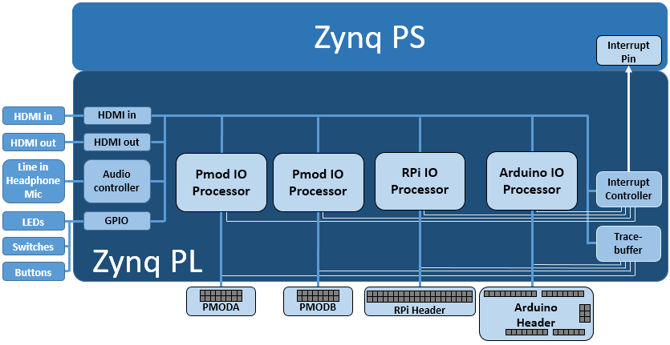

.. _pynqz2-base-overlay:

Base Overlay
============

The purpose of the base overlay design is to allow PYNQ to use peripherals on a
board out-of-the-box. The design includes hardware IP to control peripherals on
the target board, and connects these IP blocks to the Zynq PS. If a base
overlay is available for a board, peripherals can be used from the Python
environment immediately after the system boots.

Board peripherals typically include GPIO devices (LEDs, Switches, Buttons),
Video, Audio, and other custom interfaces. 

As the base overlay includes IP for the peripherals on a board, it can also be
used as a reference design for creating new customized overlays.

In the case of general purpose interfaces, for example Pmod or Arduino headers,
the base overlay may include a PYNQ MicroBlaze. A PYNQ MicroBlaze allows
control of devices with different interfaces and protocols on the same port
without requiring a change to the programmable logic design. 

See :ref:`pynq-libraries` for more information on PYNQ MicroBlazes.

PYNQ-Z2 Block Diagram
---------------------

The base overlay on PYNQ-Z2 includes the following hardware:

    * HDMI (Input and Output)
    * Audio codec
    * User LEDs, Switches, Pushbuttons
    * 2x Pmod PYNQ MicroBlaze
    * Arduino PYNQ MicroBlaze
    * RPi (Raspberry Pi) PYNQ MicroBlaze
    * 4x Trace Analyzer (PMODA, PMODB, ARDUINO, RASPBERRYPI)

HDMI 
----

The PYNQ-Z2 has HDMI in and HDMI out ports. The HDMI interfaces are connected
directly to PL pins. i.e. There is no external HDMI circuitry on the board. The
HDMI interfaces are controlled by HDMI IP in the programmable logic.

The HDMI IP is connected to PS DRAM. Video can be streamed from the
HDMI *in* to memory, and from memory to HDMI *out*. This allows processing of
video data from python, or writing an image or Video stream from Python to the
HDMI out.

Note that while Jupyter notebook supports embedded video, video captured from
the HDMI will be in raw format and would not be suitable for playback in a
notebook without appropriate encoding.

HDMI In
^^^^^^^

The HDMI in IP can capture standard HDMI resolutions. After a HDMI source has
been connected, and the HDMI controller for the IP is started, it will
automatically detect the incoming data. The resolution can be read from the HDMI
Python class, and the image data can be streamed to the PS DRAM.

HDMI Out
^^^^^^^^

The HDMI out IP supports the following resolutions:

    * 640x480  
    * 800x600 
    * 1280x720 (720p)
    * 1280x1024
    * 1920x1080 (1080p)\*

\*While the Pynq-Z2 cannot meet the official HDMI specification for 1080p, some
HDMI devices at this resolution may work.

Data can be streamed from the PS DRAM to the HDMI output. The HDMI Out
controller contains framebuffers to allow for smooth display of video data.

See example video notebooks in the ``<Jupyter Dashboard>/base/video`` directory 
on the board.

Audio
-----

The PYNQ-Z2 base overlay supports line in, and Headphones out/Mic. The audio
source can be selected, either line-in or Mic, and the audio in to the board
can be either recorded to file, or played out on the headphone output. 

User IO
-------

The PYNQ-Z2 board includes two tri-color LEDs, 2 switches, 4 push buttons, and 4
individual LEDs. These IO are connected directly to Zynq PL pins. In the PYNQ-Z2
base overlay, these IO are routed to the PS GPIO, and can be controlled directly
from Python.

PYNQ MicroBlaze
---------------

PYNQ MicroBlazes are dedicated MicroBlaze soft-processor
subsystems that allow peripherals with different IO standards to be connected to
the system on demand. This allows a software programmer to use a wide range of
peripherals with different interfaces and protocols. By using a PYNQ MicroBlaze, 
the same overlay can be used to support different peripheral without requiring a
different overlay for each peripheral.

The PYNQ-Z2 has three types of PYNQ MicroBlaze: *Pmod*, *Arduino*, and *RPi*
(Raspberry Pi), connecting to each type of corresponding interface. There is
one instance of the Arduino, and one instance of the RPi PYNQ MicroBlaze, and
two instances of the Pmod PYNQ MicroBlaze in the base overlay. 

Each physical interface has a different number of pins and can support 
different sets of peripherals. Each PYNQ MicroBlaze has the same core
architecture, but can have different IP configurations to support the different
sets of peripheral and interface pins.

Note that because the 8 data pins of PmodA are shared with the lower 8 data
pins of the RPi header, the ``base.select_pmoda()`` function must be called
before loading an application on PmodA, and ``base.select_pmoda()`` must be
called before loading an application on the RPi PYNQ MicroBlaze.

PYNQ MicroBlaze block diagram and examples can be found in 
:ref:`pynq-microblaze-subsystem`. 

Trace Analyzer
--------------

Trace analyzer blocks are connected to the interface pins for the two Pmod 
PYNQ MicroBlazes, the Arduino and RPi PYNQ MicroBlazes. The trace analyzer can 
capture IO signals and stream the data to the PS DRAM for analysis in the 
Python environment.

Using the Python Wavedrom package, the signals from the trace analyzer can be 
displayed as waveforms in a Jupyter notebook. 

On the base overlay, the trace analyzers are controlled by PS directly. In 
fact, on other overlays, the trace analyzers can also be controlled by PYNQ 
MicroBlaze.

See the example notebook in the ``<Jupyter Dashboard>/base/trace`` 
directory on the board.

Python API
----------

The Python API for the peripherals in the base overlay is covered in 
:ref:`pynq-libraries`. Example notebooks are also provided on the board to 
show how to use the base overlay.

Rebuilding the Overlay
----------------------

The project files for the overlays can be found here:

.. code-block:: console

   <PYNQ repository>/boards/<board>/base

Linux
^^^^^
A Makefile is provided to rebuild the base overlay in Linux. The Makefile calls 
two tcl files. The first Tcl files compiles any HLS IP used in the design. The 
second Tcl builds the overlay. 

To rebuild the overlay, source the Xilinx tools first. Then assuming PYNQ has 
been cloned: 

.. code-block:: console

   cd <PYNQ repository>/boards/Pynq-Z2/base
   make 

Windows
^^^^^^^
In Windows, the two Tcl files can be sourced in Vivado to rebuild the overlay. 
The Tcl files to rebuild the overlay can be sourced from the Vivado GUI, or 
from the Vivado Tcl Shell (command line). 

To rebuild from the Vivado GUI, open Vivado. In the Vivado Tcl command line 
window change to the correct directory, and source the Tcl files as indicated 
below. 

Assuming PYNQ has been cloned:
 
.. code-block:: console

   cd <PYNQ repository>/boards/Pynq-Z2/base
   source ./build_base_ip.tcl
   source ./base.tcl

To build from the command line, open the Vivado 2017.4 Tcl Shell, and run the 
following:

.. code-block:: console

   cd <PYNQ repository>/boards/Pynq-Z2/base
   vivado -mode batch -source build_base_ip.tcl
   vivado -mode batch -source base.tcl
   
Note that you must change to the overlay directory, as the tcl files has 
relative paths that will break if sourced from a different location.
