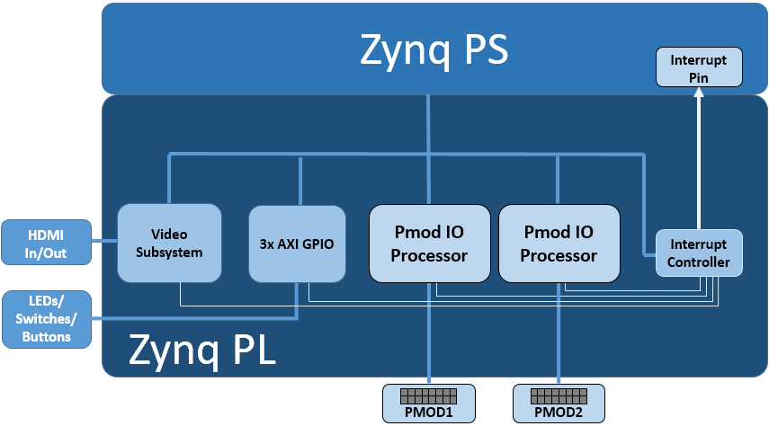

.. _ZCU104-base-overlay:

Base Overlay
============

The purpose of the *base* overlay design for any PYNQ supported board is to 
allow peripherals on a board to be used out-of-the-box. 

The design includes hardware IP to control peripherals on
the target board, and connects these IP blocks to the Zynq PS. If a base
overlay is available for a board, peripherals can be used from the Python
environment immediately after the system boots.

Board peripherals typically include GPIO devices (LEDs, Switches, Buttons),
Video, and other custom interfaces. 

As the base overlay includes IP for the peripherals on a board, it can also be
used as a reference design for creating new customized overlays.

In the case of general purpose interfaces, for example Pmod or Arduino headers,
the base overlay may include a PYNQ MicroBlaze. A PYNQ MicroBlaze allows
control of devices with different interfaces and protocols on the same port
without requiring a change to the programmable logic design. 

See :ref:`pynq-libraries` for more information on PYNQ MicroBlazes.

ZCU104 Block Diagram
--------------------

The base overlay on ZCU104 includes the following hardware:

    * DisplayPort & HDMI (Input and Output)
    * User LEDs, Switches, Pushbuttons
    * 2x Pmod PYNQ MicroBlaze

HDMI 
----

The ZCU104 has 2x HDMI ports supporting HDMI 2.0 video input and output. The
HDMI interfaces are controlled by HDMI IP in the programmable logic.

The HDMI IP is connected through a video DMA to PS DRAM. Video can be streamed 
from the
HDMI *in* to memory, and from memory to HDMI *out*. This allows processing of
video data from python, or writing an image or Video stream from Python to the
HDMI out.

Note that the ZCU104 also has a DisplayPort connected to the PS. While the 
Display port is not part of the Overlay (as it is always connected) video data
can be streamed from the HDMI PL sources
to the DisplayPort.

Note that while Jupyter notebook supports embedded video, video captured from
the HDMI will be in raw format and would not be suitable for playback in a
notebook without appropriate encoding.

HDMI In
^^^^^^^

The HDMI in IP can capture standard HDMI resolutions. After a HDMI source has
been connected, and the HDMI controller for the IP is started, it will
automatically detect the incoming data. The resolution can be read from the HDMI
Python class, and the image data can be streamed to the PS DRAM.

HDMI Out
^^^^^^^^

Data can be streamed from the PS DRAM to the HDMI output. The HDMI Out
controller contains framebuffers to allow for smooth display of video data.

See example video notebooks in the ``<Jupyter Dashboard>/base/video`` directory 
on the board.

User IO
-------

The board has 4x user LEDs, 4x dip-switches, 4x push buttons. These IO are
controlled via AXI GPIO controllers in the PL.
In the ZCU104 base overlay, these IO are routed to the PS GPIO, and can be
controlled directly from Python.

PYNQ MicroBlaze
---------------

PYNQ MicroBlazes are dedicated MicroBlaze soft-processor
subsystems that allow peripherals with different IO standards to be connected to
the system on demand. This allows a software programmer to use a wide range of
peripherals with different interfaces and protocols. By using a PYNQ MicroBlaze, 
the same overlay can be used to support different peripheral without requiring a
different overlay for each peripheral.

The ZCU has 2x Pmod PYNQ MicroBlaze, one connected to PMOD 0, and the other to PMOD 1. connecting to each type of corresponding interface.
Note that PMOD 2 is connected to the PS I2C and is not available as a general purpose Pmod port. 

PYNQ MicroBlaze block diagram and examples can be found in 
:ref:`pynq-microblaze-subsystem`. 

Python API
----------

The Python API for the peripherals in the base overlay is covered in 
:ref:`pynq-libraries`. Example notebooks are also provided on the board to 
show how to use the base overlay.

Rebuilding the Overlay
----------------------

The project files for the overlays can be found here:

.. code-block:: console

   <PYNQ repository>/boards/<board>/base

Linux
^^^^^
A Makefile is provided to rebuild the base overlay in Linux. The Makefile calls 
two tcl files. The first Tcl files compiles any HLS IP used in the design. The 
second Tcl builds the overlay. 

To rebuild the overlay, source the Xilinx tools first. Then assuming PYNQ has 
been cloned: 

.. code-block:: console

   cd <PYNQ repository>/boards/ZCU104/base
   make 

Windows
^^^^^^^
In Windows, the two Tcl files can be sourced in Vivado to rebuild the overlay. 
The Tcl files to rebuild the overlay can be sourced from the Vivado GUI, or 
from the Vivado Tcl Shell (command line). 

To rebuild from the Vivado GUI, open Vivado. In the Vivado Tcl command line 
window change to the correct directory, and source the Tcl files as indicated 
below. 

Assuming PYNQ has been cloned:
 
.. code-block:: console

   cd <PYNQ repository>/boards/ZCU104/base
   source ./build_base_ip.tcl
   source ./base.tcl

To build from the command line, open the Vivado Tcl Shell, and run the 
following:

.. code-block:: console

   cd <PYNQ repository>/boards/ZCU104/base
   vivado -mode batch -source build_base_ip.tcl
   vivado -mode batch -source base.tcl
   
Note that you must change to the overlay directory, as the tcl files has 
relative paths that will break if sourced from a different location.
