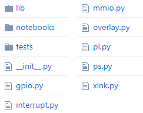

*********************
``pynq`` Package
*********************

All PYNQ code is contained in the *pynq* Python package and is can be found on
the board at /home/xilinx/pynq.  This package is derived from the Github
repository ``<GitHub repository>/pynq``.

The pynq folder contains the Python source code for the PYNQ package and is
organised as follows:

Subpackages:

* lib - contains pmod, arduino and logictools modules, and modules for various
  peripherals and IP (GPIO, DMA, Video, Audio)
* notebooks - example Jupyter notebooks
* tests - contains 

To learn more about Python package structures, please refer to the `official
python documentation
<https://docs.python.org/3.5/tutorial/modules.html#packages>`_.

Foundational modules:

* ps.py - supports reading and writing of PS registers
* pl.py - supports management of PL and includes generation of dictionaries from
  overlay Tcl and download of overlays
* overlay.py - used for management of overlays. This includes checking status,
  loading overlays, and assignment of drivers

The PS module allows the Zynq PS control and status register to be read and set
at runtime. Reading of the ARM CPU clock, and setting of the PL clocks is
currently supported.

The PL module is used to manage the PL, including downloading of the overlay
file. It acts as a singleton for the Overlay class. The overlay Tcl file is
parsed by the PL module to generate the IP, GPIO, Interrupt, and interrupt pin
dictionaries.

The overlay module inherits from the PL module and is used to manage the state
and contents of a single overlay file. The Overlay module adds additional
functionality to the PL module. For example, the PL module contains the method
to download the overlay file. The Overlay module checks the required PL clock
and sets them before calling the PL download() method.

Interrupt class:

* interrupt.py - PYNQ asyncio interrupt implementation

Data movement classes:

* mmio.py
* xlnk.py 
* gpio.py

.. toctree::
   :maxdepth: 4

   pynq_package/pynq
