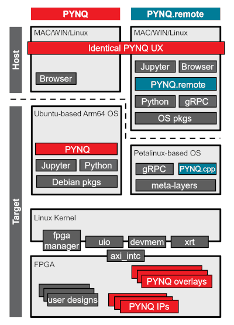

.. _pynq_remote:

PYNQ.remote 
===========

.. toctree::
   :maxdepth: 1
   :caption: Contents

   pynq_remote/quickstart
   pynq_remote/image_build
   pynq_remote/remote_device
   pynq_remote/cppindex
   pynq_remote/env_variables
   pynq_remote/roadmap

PYNQ.remote is an extension to the PYNQ framework that enables remote control of AMD's FPGA-based devices. By moving the Python API to the host and communicating with the target device via gRPC, PYNQ.remote brings powerful new deployment, integration, and scalability features to PYNQ users, while preserving the familiar PYNQ user experience.

**Introducing PYNQ.remote**

PYNQ.remote provides two key benefits to PYNQ. First, by moving the Python API to the host machine we create opportunities to integrate PYNQ into host-based hardware and software workflows. This allows users to take full advantage of the Python ecosystem on the host, while still controlling AMD's adaptive SoC devices remotely. This is particularly useful for applications that require high-performance computing, such as AI inference, data processing, or real-time visualisations. This allows the host to handle complex computations, while the FPGA can focus on specialised tasks. 

Second, by using a minimal Petalinux image the target device software requirements are reduced to a PYNQ meta-layer and a minimal root file system. Additionally, we have implemented a PYNQ C++ API called `PYNQ.cpp` that runs on the target device, which provides a low-level interface to the hardware. Together, this provides a greatly reduced image size (small enough to fit on a RAM disk) and allows deployment with minimal software footprint while maintaining full-features Python API on the host. This is ideal for when resources are constrained, such as edge computing or IoT applications.

The diagram below illustrates the key differences between Classic PYNQ and PYNQ.remote. 

**Key Features**

* Offload the Python API to your host machine, reducing on-target resource requirements.
* Target-side C++ implementation (`PYNQ.cpp`) for boosting on-device performance.
* Lightweight Petalinux images: shrink SD card images from ~7GB to under 200MB (small enough for a RAM disk).
* PYNQ API compatibility: classic PYNQ code and Jupyter notebooks run remotely, with minimal or no changes.
* Extend with custom remote APIs using Protobuf definitions.

**Who Should Use PYNQ.remote?**

* Developers who want to deploy PYNQ-based applications with a minimal software footprint on the target.
* Users needing hybrid workflows, such as host-based AI acceleration, design tool integration, or cloud offload.
* Anyone wanting to scale across multiple devices, or integrate with host-side tools and workflows.

**Getting Started**

To get started with PYNQ.remote, follow the quickstart guide in :ref:`quickstart`. This will walk you through setting up your environment, deploying the remote image, and running your first remote application.

.. note::
      PYNQ.remote is currently in **beta**. Active development is ongoing, and some PYNQ features may have limited support. The API is subject to change in future releases. For more information on currently supported functionality and our development roadmap, see the :ref:`roadmap`.