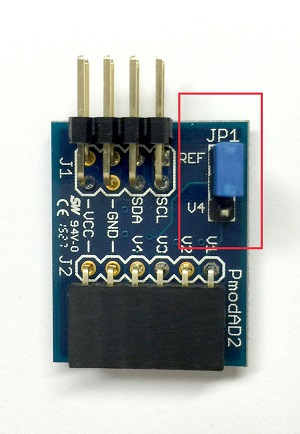
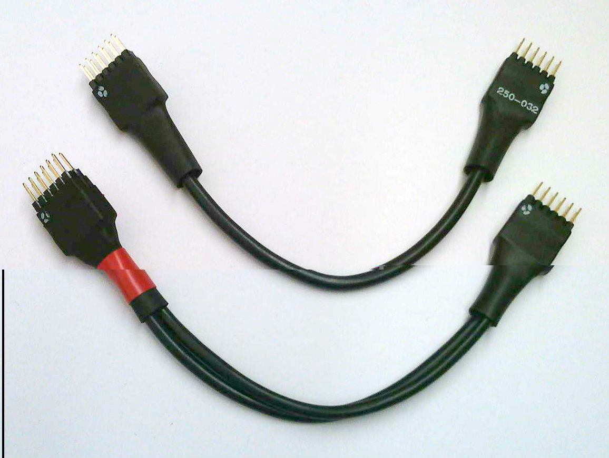

************
Verification
************

.. contents:: Table of Contents
   :depth: 2
 
This section documents the test infrastructure supplied with the `pynq` package. It is organized as follows:

* *Running Tests* : describes how to run the pytest.
* *Writing Tests* : explains how to write tests.
* *Miscellaneous* : covers additional information relating to tests. 

Running Tests
=============

The *pynq* package provides tests for most python modules.

To run all the tests together, pytest can be run in a Linux terminal on the board. All the tests will be automatically collected in the current directory and child directories.

.. note::  

   The pytests have to be run as root 

.. code-block:: console

   cd /home/xilinx/pynq
   sudo py.test –vsrw

For a complete list of pytest options, please refer to `Usage and Invocations - Pytest <http://pytest.org/latest/usage.html>`_. 

Collection Phase
----------------
During this phase, the pytest will collect all the test modules in the current directory and all of its child directories. The user will be asked if a Pmod is connected, and to which port it is connected. 

For example:

.. code-block:: console

   Pmod OLED attached to the board? ([yes]/no)>>> yes
   Type in the interface ID of the Pmod OLED (A or B):

For the answer to the first question, "yes", "YES", "Yes", "y", and "Y" are acceptable; the same applies for "no" as an answer. You can also press *Enter*; this is equivalent to "yes".

Type "A" (for PMODA) or "B" (for PMODB).

Answering "No" will skip the corresponding test(s) during the testing phase.

Testing Phase
-------------
The test suite will guide the user through all the tests implemented in the pynq package. As part of the tests, the user will be prompted for confirmation that the tests have passed, for example:

.. code-block:: console

   test_led0 ...
   Onboard LED 0 on? ([yes]/no)>>>

Again press "Enter", or type "yes", "no" etc.

At the end of the testing phase, a summary will be given to show users how many tests are passed / skipped / failed.

Writing Tests
=============
This section follows the guide available on `Pytest Usages and Examples <http://doc.pytest.org/en/latest/example>`_. You can write a test class with assertions on inputs and outputs to allow automatic testing. The names of the test modules *must* start with `test_`; all the methods for tests in any test module *must* also begin with `test_`. One reason to enforce this is to ensure the tests will be collected properly. See the `Full pytest documentation <http://doc.pytest.org/en/latest/index.html>`_ for more details.

Step 1
------
First of all, the pytest package has to be imported:

.. code-block:: python

   import pytest
   
Step 2
------
Decorators can be specified directly above the methods. For example, you can specify (1) the order of this test in the entire pytest process, and (2) the condition to skip the corresponding test. More information on decorators can be found in `Marking test functions with attributes - Pytest <http://doc.pytest.org/en/latest/mark.html>`_.

.. code-block:: python

   @pytest.mark.run(order=26) 
   @pytest.mark.skipif(not flag, reason="need both ADC and DAC attached")

Step 3
------
Directly below decorators, you can write some assertions/tests. See the example below:

.. code-block:: python

    @pytest.mark.run(order=26) 
    @pytest.mark.skipif(not flag, reason="need both ADC and DAC attached")
    def test_loop_single():
        """Test for writing a single value via the loop.
        
        First check whether read() correctly returns a string. Then ask the users 
        to write a voltage on the DAC, read from the ADC, and compares the two 
        voltages.
        
        The exception is raised when the difference is more than 10% and more than
        0.1V.
        
        Note
        ----
        Users can use a straight cable (instead of wires) to do this test.
        For the 6-pin DAC Pmod, it has to be plugged into the upper row of the 
        Pmod interface.
        
        """
        global dac,adc
        dac = Pmod_DAC(dac_id)
        adc = Pmod_ADC(adc_id)
    
        value = float(input("\nInsert a voltage in the range of [0.00, 2.00]: "))
        assert value<=2.00, 'Input voltage should not be higher than 2.00V.'
        assert value>=0.00, 'Input voltage should not be lower than 0.00V.'
        dac.write(value)
        sleep(0.05)
        assert round(abs(value-adc.read()[0]),2)<max(0.1, 0.1*value), \
                'Read value != write value.'

Note the `assert` statements specify the desired condition, and raise exceptions whenever that condition is not met. A customized exception message can be attached at the end of the `assert` methods, as shown in the example above.

Miscellaneous Test Setup
========================

ADC Jumper
----------

In our tests and demos, we have used a Pmod ADC. In order to make it work properly with the testing environment, you need to set a jumper **JP1** to **REF** on the Pmod ADC. This will allow the ADC to use the correct reference voltage.
 

Cable Type
----------

Two types of cables can be used with the tests in the pynq package, a "straight" cable, and a "loopback" cable:

 
*  *Straight cable* (upper one in the image): The internal wires between the two ends are straight. This cable is intended for use as an extension cable.
*  *Loopback cable* (lower one in the image, with red ribbon): The internal wires are twisted. This cable is intended for testing.

There are marks on the connectors at each end of the cable to indicate the orientation and wiring of the cable. 

.. note::  

   You must not short VCC and GND as it may damage the board. It is good practice to align the pins with the dot marks to VCC of the Pmod interfaces. 
   
.. note::  
   For testing, there is only one connection type (mapping) allowed for each cable type. Otherwise VCC and GND could be shorted, damaging the board.
