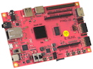
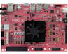
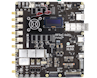
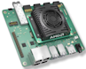
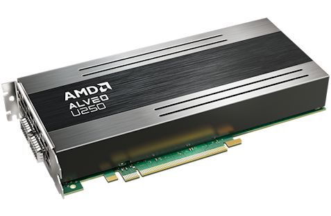

# What is PYNQ?

    <video width="100%" height="auto" autoplay loop muted>
        <source src="./assets/videos/pynq_animation.mp4" type="video/mp4">
    </video>

PYNQ&#8482; is an open-source project from AMD&#174; that makes it easier to use Adaptive Computing platforms.

Using the Python language, Jupyter notebooks, and the huge ecosystem of Python libraries, designers can exploit the benefits of programmable logic and microprocessors to build more capable and exciting electronic systems.

PYNQ can be used to create high performance applications with:

* parallel hardware execution
* high frame-rate video processing
* hardware accelerated algorithms
* real-time signal processing
* high bandwidth IO
* low latency control

# Explore PYNQ

Learn about PYNQ with our brief video overview.

<iframe width="560" height="315" style="margin: auto;" src="https://www.youtube.com/embed/IRjrLm8_KB4?si=k6WQaoGRrUmZarvR" title="YouTube video player" frameborder="0" allow="accelerometer; autoplay; clipboard-write; encrypted-media; gyroscope; picture-in-picture; web-share" allowfullscreen></iframe>

# Who is PYNQ for?

PYNQ is intended to be used by a wide range of designers and developers including:

* Software developers who want to take advantage of the capabilities of Adaptive Computing platforms without having to use ASIC-style design tools to design hardware.
* System architects who want an easy software interface and framework for rapid prototyping and development of their Zynq, Alveo and AWS-F1 design.
* Hardware designers who want their designs to be used by the widest possible audience.

# What AMD devices and boards are supported?

PYNQ can be used with Zynq&#8482;, Zynq UltraScale+&#8482;, Kria&#8482;, Zynq RFSoC, Alveo&#8482; accelerator boards and AWS-F1.

PYNQ can be delivered in two ways; as a bootable Linux image for a Zynq board, which includes the pynq Python package, and other open-source packages, or as a Python package for Kria, or an Alveo or AWS-F1 host computer. 
Find out about <a href="./boards.html">PYNQ supported boards</a>.

# Key technologies

 

[Jupyter Notebook](http://jupyter.org/) is a browser based interactive computing environment. Jupyter notebook documents can be created that include live code, interactive widgets, plots, explanatory text, equations, images and video. 

A PYNQ enabled board can be easily programmed in Jupyter Notebook using Python.

Using Python, developers can use hardware libraries and overlays on the programmable logic. Hardware libraries, or overlays, can speed up software running on a Zynq or Alveo board, and customize the hardware platform and interfaces. 

# What software do I need?

Jupyter notebook runs in a web browser. Only a [compatible web browser](https://jupyter-notebook.readthedocs.io/en/latest/notebook.html#browser-compatibility) is needed to start programming PYNQ with Python.

For higher performance, you can also use C/C++ with Python and PYNQ. The [AMD Vitis software development environment](https://www.xilinx.com/products/design-tools/vitis/vitis-platform.html) is available for free. You can also use third party software development tools.

New hardware libraries and overlays can be created using standard AMD and third party hardware design tools.

The [free WebPACK version of AMD Vivado](https://www.xilinx.com/products/design-tools/vivado.html) can be used with a wide range of Zynq boards. 

[Vitis](https://www.xilinx.com/products/design-tools/vitis/vitis-platform.html) and [Vitis open-source Accelerated Libraries](https://github.com/Xilinx/Vitis_Libraries) are also free, and can be used for Alveo/AWS-F1. 

# How do I get started with PYNQ?

   
   

   Check the <a href="http://pynq.readthedocs.io/en/latest/getting_started.html">PYNQ Getting Started guide</a>
   

   
   

   Find out about <a href="./boards.html">supported boards</a>
   

   
   

   Read the <a href="http://pynq.readthedocs.io">PYNQ documentation</a>
   

   
   

   Try the <a href="https://github.com/Xilinx/PYNQ_Workshop">PYNQ tutorial</a>
   

 

# Get involved

The full source code for the PYNQ project is available the [PYNQ GitHub](https://github.com/Xilinx/Pynq).

If you would like to get involved or contact the PYNQ team, you can post a message on the [PYNQ support forum](https://discuss.pynq.io/).

